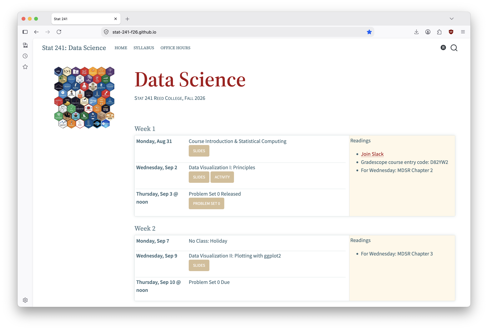
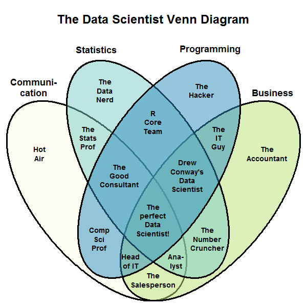
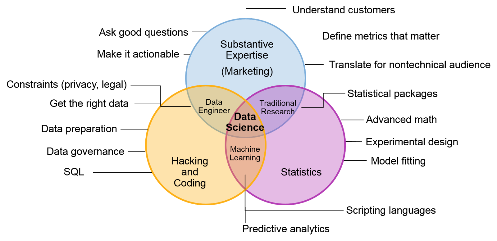
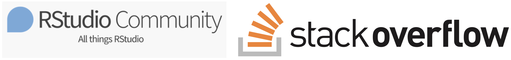

```{r}
#| include: false
#| warning: false
#| message: false

knitr::opts_chunk$set(echo = TRUE, warning = FALSE, message = FALSE, 
                      fig.retina = 3, fig.align = 'center')
library(knitr)
library(tidyverse)
```

::::: columns
::: {.column .center width="60%"}
{width="90%"}
:::

::: {.column .center width="40%"}
<br>

[Data Science]{.custom-title}

<br> <br> <br> <br> <br> <br> <br>

[Grayson White]{.custom-subtitle}

[Stat 241 <br> Week 1 \| Fall 2026]{.custom-subtitle}
:::
:::::

------------------------------------------------------------------------


## Goals for Today (and next time)

:::: {.columns}

::: {.column width='50%'}

::: {.nonincremental .fragment}

**Today:**

-   Getting started in Stat 241
    - Course structure and technologies
    - Where to find resources 
    - Course expectations

:::

:::

::: {.column width='50%'}

::: {.nonincremental .fragment}

**Wednesday:**

-   Decomposing graphics


:::

:::

::::


# But first, let me quickly introduce myself...

...and after that I'll have each of you introduce yourselves `r emo::ji("smile")`

## My info {.center}

<br>

::: {.fragment .fade-up .midi .nonincremental}


- **Name**: Grayson White (he/him), you can call me 'Grayson'

- **Email**: [gwhite@reed.edu](mailto:gwhite@reed.edu)

- **Office**: Library 386

- **Office hours**: TBD, please fill out the [office hours survey](https://whenisgood.net/y2zt3a2) ASAP for your availability to be considered.
    -   This week, I'll hold office hours on Tuesday 1pm - 3pm and Friday 9am - 10:30am, or by appointment. 


:::


------------------------------------------------------------------------


### Let's start with my path (back) to Reed...

```{r, echo = FALSE, dev.args = list(bg = 'transparent'), fig.asp = .6, out.width = '80%'}
library(tidyverse)
library(shadowtext)

MainStates <- map_data("state")

ggplot() +
  geom_polygon(
    data = MainStates,
    aes(x = long, y = lat, group = group),
    
    color = "white",
    fill = "#7E8A65",
    size = 1.25
  ) +
  theme_void() +
  geom_shadowtext(
    aes(
      x = -111.8881,
      y = 40.7606,
      label = "Forest Service"
    ),
    color = "white",
    size = 5,
    bg.color = "#7E8A65"
  ) +
  geom_shadowtext(
    aes(
      y = 45.523064 - 0.5,
      x = -122.676483 + 1,
      label = "Reed College"
    ),
    color = "white",
    size = 5,
    bg.color = "#7E8A65"
  ) +
  geom_shadowtext(
    aes(
      y = 42.7336,
      x = -84.5539,
      label = "Michigan State\nUniversity"
    ),
    color = "white",
    size = 5,
    bg.color = "#7E8A65"
  ) + 
  geom_segment(aes(x = -122.676483 + 1, y = 45.523064 - 0.5,
                   xend = -111.8881, yend = 41.5),
               color = "red", arrow.fill = "red",
    arrow = arrow(type = "closed")) +
    geom_segment(aes(xend = -116.5, yend = 45.523064 - 0.5,
                   x = -90, y = 42.7),
               color = "red", arrow.fill = "red",
    arrow = arrow(type = "closed")) +
    geom_segment(aes(xend = -90, yend = 42.7,
                   x = -106, y = 40.7606),
               color = "red", arrow.fill = "red",
    arrow = arrow(type = "closed")) +
  theme(legend.position = "none")
```

------------------------------------------------------------------------

## Research Interests {.center}

::: {.fragment .fade-up .midi}

#### Statistical modeling with environmental applications 


:::

------------------------------------------------------------------------

## Research Interests {.center}

#### Advising Undergraduate Forestry Data Science Research

::: {.fragment .fade-up .midi}

{width=60%}

:::


# Introductions!

Would love to hear: your name, pronouns, major, what you're excited about in this class, and a fun fact! 


## Getting Started in Stat 241


#### Course website

:::: {.columns}

::: {.column width="70%"}



:::


::: {.column width="30%"}

-   The course website, [stat-241-f26.github.io](https://stat-241-f26.github.io/), will be the central location for all our course materials. 

-   We'll also use some other technologies and resources for collaboration, dissemination, and communication.

:::

::::


------------------------------------------------------------------------

## Getting Started in Stat 241

#### Other Resources 

<br>

::: {.fragment .fade-up .midi}

Reed's **RStudio Server** or a **local installation of RStudio**, for completing coursework,

:::

<br>

::: {.fragment .fade-up .midi}

A course-wide **Slack** workspace, for course communication,

:::

<br>

::: {.fragment .fade-up .midi}

**Gradescope**, for turning in assignments and exams, and

:::

<br>

::: {.fragment .fade-up .midi}

**Our course GitHub organization**, for collaboration, portfolio-building, and dissemination of work. 

:::


# Let's take a look at the course website...

**[stat-241-f26.github.io](https://stat-241-f26.github.io/)**


# What's this course about?

::: {.fragment .fade-up .midi}

And what even is *data science*?

:::


## What is data science?

* How is **data science** not the same thing as **statistics**?


::: {.fragment .nonincremental}

* Wikipedia says: 

> "Data science is an inter-disciplinary field that uses scientific methods, processes, algorithms and systems to **extract knowledge** and insights from structured and unstructured **data**."

:::

* But isn't statistics the field of extracting knowledge from data?

------------------------------------------------------------------------

### Data Science: The Original Venn Diagram Definition


```{r  out.width = "50%", echo=FALSE, fig.cap = "Drew Conway (2012)", fig.align='center'}
library(knitr)
include_graphics("img/Data_Science_VD1.png") 
```

------------------------------------------------------------------------

### Data Science: And the Chorus of Follow-up Venn Diagrams

```{r  out.width = "45%", echo=FALSE, fig.cap = "Stephan Kolassa  (2015)", fig.align='center'}
library(knitr)
 
```

------------------------------------------------------------------------

### Data Science: And the Chorus of Follow-up Venn Diagrams

```{r  out.width = "90%", echo=FALSE, fig.cap = "Gartner (2016)", fig.align='center'}
library(knitr)
 
```

------------------------------------------------------------------------

### Defining Data Science through the Data Analysis Workflow

:::: .columns

::: {.column width='60%'}

```{r  out.width = "60%", echo=FALSE, fig.align='center'}
library(knitr)
include_graphics("img/DAW.png") 
```

:::

::: {.column width='40%'}

<br> <br> <br> <br> <br> <br> 

* Is the data analysis workflow different for data scientists than it is for statisticians?

:::

::::

::: {.blockquote .fragment}

"A data scientist is a statistician with a MacBook Pro."

:::


# Learning Goals

------------------------------------------------------------------------

## Goal: Wrangle and interact with a variety of data types {.smaller}


Requires expanding our understanding of **data structures** in `R`.


::: {.nonincremental}

* Most common data structure = `data.frame`/data set/spreadsheet

* Example: Portland Biketown bike rental data.

:::

```{r, eval = TRUE, echo = FALSE}
library(tidyverse)
biketown <- read_csv("data/biketown.csv")
biketown %>%
  select(BikeID, Duration, PaymentPlan, StartTime, EndTime) %>%
  as.data.frame()
```

::: {.fragment}

:::: {.columns}

::: {.column width="50%"}

* Rows = observations
* Columns = variables
    * Two types: categorical and quantitative

:::

::: {.column width="50%"}

-   What variables **don't** fit neatly into these two types?
-   What other **data structures** are there?

:::

::::

:::

------------------------------------------------------------------------

## Variable types: Dates and Times {.smaller}

:::: {.columns}

::: {.column width="50%"}

* Are dates and times categorical or quantitative?

:::

::: {.column width="50%"}

::: {.fragment}

* What makes dates and times different?

:::

:::

::::

::: {.fragment}

```{r}
biketown %>%
  select(StartTime, EndTime) %>%
  as.data.frame()
```

:::

::: {.fragment}

{width="10%" style="float:left; padding:25px"}

<br> 
<br>

* Will learn to use the `lubridate` package to wrangle dates and times.

:::

------------------------------------------------------------------------

## Variable types: Factors and Characters {.small}

* `R` typically stores categorical variables as one of two types: `factor` or `character`.

::: {.fragment}

```{r}
head(biketown$PaymentPlan)
class(biketown$PaymentPlan)
```

:::

::: {.fragment}

* Why do we need two different types??

:::

::: {.fragment}

:::: {.columns}

::: {.column width="50%" .nonincremental .fragment}

{width="20%" style="float:left; padding:25px"}

<br> 
<br>

* Will learn to use the `forcats` package to wrangle `factor`s.

:::

::: {.column width="50%" .nonincremental .fragment}

{width="20%" style="float:left; padding:25px"}

<br> 
<br>

* Will learn to use the `stringr` package to wrangle `character`s/strings/text.
    + Note: A character vector stores multiple strings/text.

:::

::::

:::

<!-- ------------------------------------------------------------------------ -->

<!-- ## Wrangling text data -->

<!-- * Semi-structured text are data too! -->

<!-- * Example:  [Taylor Swift lyrics](https://github.com/shaynak/taylor-swift-lyrics) -->

<!-- ```{r, echo = FALSE} -->
<!-- ts <- read_csv("https://raw.githubusercontent.com/shaynak/taylor-swift-lyrics/main/lyrics.csv") -->
<!-- ts %>% -->
<!--   select(Song, Album, Lyric) %>% -->
<!--   slice_head(n = 6) -->
<!-- ``` -->

<!-- ::: {.fragment} -->

<!-- * But extracting useful information takes a lot of wrangling!  Will learn to use **regular expressions** to identify patterns in the text. -->

<!-- ::: -->

<!-- ::: {.fragment} -->

<!-- {width="10%" style="float:left; padding:25px"} -->

<!-- <br>  -->
<!-- <br>  -->
<!-- * Will also learn to analyze text with the `tidytext` package. -->

<!-- ::: -->

<!-- ------------------------------------------------------------------------ -->

# What other data structures are there beyond `data.frames`?

------------------------------------------------------------------------

## Data Structures: Spatial Data Frames

::: {.nonincremental}

* [Example: American Community Survey Data](https://walker-data.com/tidycensus/) on median household income for counties in Oregon

::: 

```{r, echo = FALSE}
api_key <- "ff47b8f510c3db70501a7463b61e1298db1db97d"

library(tidycensus)
options(tigris_use_cache = TRUE)
or <- get_acs(state = "OR",  geography = "county", 
                  variables = "B19013_001", geometry = TRUE, 
              key = api_key) 
or %>%
  slice_head(n = 6)
```

------------------------------------------------------------------------

## Data Structures: Spatial Data Frames {.small}

::: {.nonincremental}

* [Example: American Community Survey Data](https://walker-data.com/tidycensus/)

:::

```{r, echo = FALSE, fig.width= 6}
options(scipen = 999)
ggplot(data = or, mapping = aes(geometry = geometry,
                                fill = estimate)) + 
  geom_sf() +
  coord_sf() +
  scale_fill_viridis_c() + theme_void()
```


{width="13%" style="float:left; padding:25px"}

<br> 
<br>

::: {.nonincremental}

* Will learn to use the `sf` package for wrangling spatial data

:::

------------------------------------------------------------------------

## Data Structures: Lists {.small}

```{r, echo = FALSE}
library(purrr)
library(repurrrsive)
got <- list(got_chars[[1]][3:5], got_chars[[2]][3:5])
```

:::: {.columns}

::: {.column width="50%"}

`List`s are a more flexible structure for storing data!

```{r}
got
```

:::

::: {.column width="50%"}

* From a data analysis perspective, they are hard to work with!


::: {.fragment .nonincremental}


{width="20%"}

* Will learn to use the `purrr` package to converting nested `list`s into `data.frame`s.


:::


:::

::::

<br>

::: {.fragment}

```{r}
map_dfr(got, `[`, c("name", "gender", "culture")) 
```

:::


# Learning Goals: Data Viz

## Goal: Create **static** data visualizations of multivariate data with `ggplot2`

{width="10%" style="float:left; padding:25px"}

```{r, echo = FALSE, fig.width= 9, fig.asp= .6}
library(babynames)
babynames_stat108 <- babynames %>%
  filter(name %in% c("Grayson", "Michael", "Megan",
                     "Lenny")) %>%
  group_by(year, name) %>%
  summarize(n = sum(n))

p <- ggplot(data = babynames_stat108, 
       mapping = aes(x = year, y = n)) +
  geom_line(aes(color = name), size = 2) + 
  theme(legend.position = "bottom", text = element_text(size=20)) +
  guides(color = guide_legend(nrow = 2)) +
  labs(y = "Number of Births", x = "Year", color = "Baby Name")
p
```

------------------------------------------------------------------------

## Goal: Create **animated** data visualizations of multivariate data with `gganimate`

```{r, echo = FALSE, fig.width= 9, fig.asp= .6}
library(gganimate)
p_animate <- p +
  transition_reveal(along = year)
animate(p_animate, fps = 5, end_pause = 20, height = 4,
  width = 6.5, units = "in", res = 100)
```

------------------------------------------------------------------------

## Goal: Create **interactive** data visualizations of multivariate data with `plotly` and `shiny`

{width="30%" style="float:left; padding:25px"}

```{r, echo= FALSE}
library(plotly)
ggplotly(p)
```

-  Also follow **best practices** in data viz, which is Wednesday's lecture topic!


# Learning Goals: Disseminating your work and reproducible workflow


##  Example: [US Forest Inventory and Analysis Program](https://www.fia.fs.fed.us/about/about_us/) {.small}

:::: {.columns}

::: {.column width="25%"}

{width="45%"}

:::

::: {.column width="75%"}

> Mission: "Make and keep current a comprehensive inventory and analysis of the present and prospective conditions of and requirements for the renewable resources of the forest and rangelands of the US."

:::

::::

<br>

:::: {.columns}

::: {.column width="45%" .fragment}


:::

::: {.column width="55%"}

<br> <br> <br> <br>

* Very common now that any FIA work I do also includes a [corresponding dashboard](https://ncasi-shiny-tools.shinyapps.io/Counties/)

:::

::::


------------------------------------------------------------------------

## Goal: Create interactive dashboards with `shiny` for Project 1

{width="15%" style="float:left; padding:10px"}

<br>

{width="50%"}

------------------------------------------------------------------------

### Goal: Learn to create an `R` package with `devtools` for Project 2

{width="15%" style="float:left; padding:10px"}

<br> <br>

::: {.fragment .nonincremental}

I have a few `R` packages on the [Comprehensive R Archival Network](https://cran.r-project.org/):

* `gglm`: Produces diagnostic plots for linear models with the `ggplot2` package as its back-end.
* `forested`: A data package that contains US Forest Service data in Washington state.

:::: {.columns}

::: {.column width="50%" .fragment}

{width="30%"}

:::

::: {.column width="50%" .fragment}

{width="30%"}

:::

::::


:::

------------------------------------------------------------------------

## Goal: Develop a collaborative, version controlled workflow using git and GitHub


:::: {.columns}

::: {.column width="50%"}

{width="30%"}

* Will use git and GitHub for both of the projects.
* Will also be given a personal GitHub repository for practice and storing course materials.
* GitHub is a great place to share code, R packages, and data work!

:::

::: {.column width="50%" .fragment}

{width="50%"}

:::

::::

------------------------------------------------------------------------

## Goal: Learn how to create a website with `quarto`


{width="60%" fig-align="center"}

------------------------------------------------------------------------

## Goal: Utilize a reproducible workflow for all `R` work!

:::: {.columns}

::: {.column width="50%"}

::: {.fragment .nonincremental}

* Store `R` work in `R` scripts and `Quarto` documents.

{width="50%"}

:::

:::

::: {.column width="50%"}

::: {.fragment .nonincremental}

* Create reproducible coding examples so it is easy to ask and answer coding questions.

{width="50%"}

:::

:::

::::


# Now, let's discuss course structure and policies

## Course assistant info {.center}

<br>

::: {.fragment .fade-up .midi .nonincremental}


- **Name**: Fae Monahan (they/them)

- **Email**: [fionamonahan@reed.edu](mailto:fionamonahan@reed.edu)

- **Office**: ETC 105B

- **Office hours**: TBD


:::

------------------------------------------------------------------------

## A typical week in Stat 241 

- **Lectures**: Monday and Wednesday, 1:10pm - 2:30pm

- **Problem Sets**: Typically assigned on Tuesdays, and due the following Tuesday.
    - Except for Problem Set 0! 

------------------------------------------------------------------------


## Assignments and projects {.smaller}


::: {.nonincremental}

:::: {.columns}

::: {.column width="45%"}

::: {.fragment .fade-up}

-   **Problem sets (*weekly-ish*)**
    - Assigned Tuesday at noon.
    - Due the following Tuesday at noon.
    - Assigned on weeks where you are not actively working on projects.
    - Planning on 7 problem sets, including problem set 0. Subject to change by $\pm$ 1 problem set.
    
:::

::: {.fragment .fade-up}

-   **Projects (*two of them*)**
    - To be completed in groups!
    - Project 1 will be assigned during Week 7 and due during Week 10.
    - Project 1 presentation on the Wednesday before spring break.
    - Project 2 will be assigned during Week 12 and due during Finals Week (i.e. "Week 15").
    
:::

:::

::: {.column width="10%"}

:::

::: {.column width="45%"}

::: {.fragment .fade-up}

-   **In-class activities (*semi-regular*)**
    - Individual activities.
    - Group activities.
    
:::

::: {.fragment .fade-up}


-   **Attendance and active participation**
    - Is key to your learning! 
    - Please participate in class and in Slack. 
    - And will be considered in your final grade. 
    - Let me know if you cannot make it to class for health reasons or otherwise! If you are experiencing extenuating circumstances that inhibit your ability to attend I will work with you to help you succeed in the class. Communication is key. 
    
:::

:::


::::

:::


## Problem Set Assessment

Problem sets will be graded for **completion**, **effort** (via what is turned in), and **understanding** and **correctness** (via code reviews). 

That means...

- You will get detailed feedback about your problem set, but no numeric score. 

- We will also engage in 15-minute **code reviews** for problem sets 1 - 6. 

::: {.fade-up .midi .fragment .center}     

What's a code review???

::: 

## Code Reviews

- What's a code review? 
     - Commonly used in industry and research, a **code review** consists of a conversation about the approach you took on the tasks you were given. 
     - Topics of discussion during code reviews may consist of: your approach to the problem, other possible approaches, function usage, code style and correctness, and much more. 
     
    
- We will have individual code reviews for each project and problem set (except problem set 0). These are an opportunity for you to improve your verbal communication skills, and to learn about how code is reviewed in industry. 

     
::: {.fade-up .midi .fragment .center}     
     
My goals with code reviews: (1) improve your **understanding** of the material through live feedback, (2) prepare you for typical industry practices, and (3) assess your work for understanding and correctness. 

:::


## Late Work

::: {.nonincremental}

:::{.fragment .fade-up}

-   **Problem sets**: up to 4 extensions days can be used throughout the semester.
    - e.g., 1 additional day for 4 labs, 4 additional days for 1 lab, ...
    - rounding days up
    
:::

:::{.fragment .fade-up}

-   **Projects**: no late projects are accepted.

:::

:::{.fragment .fade-up}

-   **In-class assignments**: cannot be made up.

:::

:::


## Course Climate 

::: blockquote

We expect everyone in this class to strive to foster a learning environment that is equitable, inclusive, and welcoming. If you experience any barriers to learning, please come to Professor Grayson White or a college administrator with your concerns.

<br>

**Code of Conduct**:


We expect all members of Stat 241 to make participation a harassment-free experience for everyone, regardless of age, body size, visible or invisible disability, ethnicity, sex characteristics, gender identity and expression, level of experience, education, socio-economic status, nationality, personal appearance, race, religion, or sexual identity and orientation.

We expect everyone to act and interact in ways that contribute to an open, welcoming, inclusive, and healthy community of learners. You can contribute to a positive learning environment by demonstrating empathy and kindness, being respectful of differing viewpoints and experiences, and giving and gracefully accepting constructive feedback.[^1]

[^1]: This Code of Conduct is adapted from the [Contributor Covenant](https://www.contributor-covenant.org/version/2/0/code_of_conduct.html), version 2.0.

:::

```{r}
#| echo: false
countdown::countdown(1)
```


## Engagement

::::: columns
::: {.column width="50%"}
<br> <br>

{width="90%" fig-align="center"}

-   Being **actively present** is key.
:::

::: {.column width="50%"}
-   During lecture and lab, remove distractions.
    -   When we are on our computers, close email, social media, news, etc.
    -   Hide your phone.
-   I have high expectations but know that all of you (regardless of your stats, math, or computing background) have the ability to meet them.
:::
:::::


## Artificial Intelligence (AI) Policy


::: blockquote

Artificial intelligence (AI) tools, such as ChatGPT, Claude, Co-Pilot, Gemini, and others are being used to generate code, analyze data, write, and much more (and they are getting quite good at many of these tasks!). On the other hand, learning to think critically about a problem at hand, and engaging with your peers, tutors, and instructors when not understanding a concept or question are integral components of a liberal arts education. This dichotomy puts Stat 241 in a interesting position as a course which aims to provide a cutting edge data science education at a liberal arts college. One of my main goals as the instructor of this course is to turn each of you into high quality data scientists who have a deep understanding of the R programming language and the ability to communicate insights about data on your own. Because of this, we will take a nuanced approach to engaging with AI tools in this course.
:::

```{r}
#| echo: false
countdown::countdown(1)
```


- Well, what's the policy??


## Artificial Intelligence (AI) Policy


**For all course content[^2]**: The use of generative AI tools, such as ChatGPT and others, are strictly prohibited in any stage of the work process for this course.

[^2]: Except for content directly related to AI, LLMs, or coding agents. This content will occur towards the end of the semester and will be clearly marked. If you have any questions about what content you are allowed / supposed to use AI on, reach out to the instructor. Note that you may **never** use AI tools in the writing process for this course.

-   Always, if you have questions about whether a tool is allowed for this course or if the way you plan to engage with a tool is allowed, ask the instructor before using it.


## Why this policy?

::: {.fragment}

In today's job market, understanding generative AI tools and being able to engage with them is a key skill for data scientists and software engineers. However, relying too heavily on AI tools to write your code and think for you prohibits understanding of the core concepts that make you a good programmer and data scientist. Therefore, I want to help build you a strong base of understanding early in the course so that you can use that base understanding throughout the times in your life where you engage with data.


:::

::: {.fragment}

**My goal:** Make you a strong programmer with a substantial base of understanding early in the course so that you can use that base to...

  - independently engage with data and do data science,
  - utilize and critique generative AI output, and
  - continue to embrace and engage in the very human aspects of data science.

:::

# Questions? 

About the syllabus, AI, the course, etc.?


## Learning to be a Coder {.small}

Many of the assignments will provide opportunities to stretch yourself and learn code **not** covered directly in class.  Why?

::: {.fragment}

### (Another) Goal: Develop our abilities to effectively search for and evaluate potential solutions and then adapt the code to our situation.

{width="80%"}

:::

::: {.fragment}

**Potential Erroneous Side Effect:** Concluding that you are bad at coding because you can't solve the problem "on your own" or because you find the answers on StackOverflow confusing/unhelpful. 

:::


::: {.fragment}

**Why aren't I allowing you to use AI for this?:** AI is generally much too quick to provide an answer and takes much of the learning out of the process. Also, it is often the case that generative AI will produce a much too complex solution to a problem that can be solved elegantly. Once you develop your strong coding base, you'll be able to use AI and critique its output.  

:::

------------------------------------------------------------------------

## (Another) Goal: Develop our abilities to effectively search for and evaluate potential solutions and then adapt the code to our situation

I encourage employing the following strategy for solving coding questions:

::: {.fragment}

→ Try the problem.

:::

::: {.fragment}

→ If and when you get stuck, look to the internet for potential solutions.

:::

::: {.fragment}

→ If you find some promising ideas, try them out.  

:::

::: {.fragment}

→  For the code that seems most helpful, spend time figuring out what each line does.  

:::

::: {.fragment}

→  If the code doesn't exactly solve your problem, adapt it.  Even if it does, still consider whether or not modifications should be made.

:::

::: {.fragment}

→ If still stuck, post your question on our class Slack and/or come to office hours.  **Don't just stay stuck.**

:::

::: {.fragment}

**Key:** Try to find the right balance between independent learning and supported learning.

+ And, get help **before** the frustration sets in!

:::


## Next time

We'll start **decomposing** graphics and discussing **best practices** for creating graphics! 


