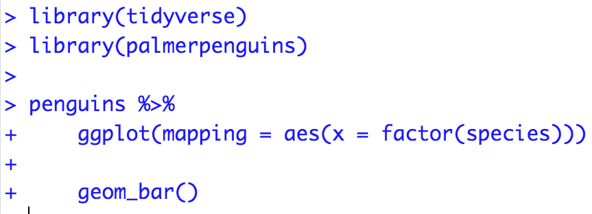

```{r}
#| include: false
#| warning: false
#| message: false

knitr::opts_chunk$set(echo = TRUE, warning = FALSE, message = FALSE,
                      fig.retina = 3, fig.align = 'center',
                      fig.asp = 0.75, fig.width = 8)
library(knitr)
library(tidyverse)
# 
# options(htmltools.preserve.raw = FALSE)
theme_update(text = element_text(size = 20))
```

::::: columns
::: {.column .center width="60%"}
{width="90%"}
:::

::: {.column .center width="40%"}
<br>

[More `ggplot2`]{.custom-title}

<br> <br> <br> <br> <br>

[Grayson White]{.custom-subtitle}

[Stat 241 <br> Week 2 \| Fall 2026]{.custom-subtitle}
:::
:::::

------------------------------------------------------------------------

## Announcements

::: {.nonincremental}

* [Office Hours Schedule](https://reed-data-science.github.io/office_hours.html)
* P-Set 1 available now.
    + Will discuss how to access the p-sets today!
    + Due at 9am the following Thursday
* My [Undergraduate Forestry Data Science summer research program](https://ufds-lab.com/) application deadline is **THIS FRIDAY!**

:::

------------------------------------------------------------------------


## Week 2 Goals

:::: {.columns}

::: {.column width='50%' .nonincremental .fragment}

**Mon Lecture**

* Basics of `ggplot2`

* Explore several `geoms`.

* And a little data wrangling with `dplyr` as needed!

:::

::: {.column width='50%' .nonincremental .fragment}

**Wed Lecture**

* GitHub workflow overview
* Learn how to ask coding questions well.
* Graphing context!
    + Labels
    + Highlighting 
    + Useful text
* Look at more `geom`s.
* Explore further customizations.
    + Color
    + Themes

:::

::::


## P-set tips

- Start on your problem sets **early**, and **ask questions** (in Slack, office hours, the internet) when you get stuck!
- Problem sets are meant to be engaged with over multiple days. It is a lot less effective for your learning if you try to sprint through it the day before it is due. 
- If/when you get stuck, it can be helpful to take a break! Some things to try:
    - Go onto another problem, solving it may give you ideas as to how to solve the one you are stuck on. 
    - Think about the problem as you are brushing your teeth or laying in bed. 
    - Time where you are "bored"/giving your brain time to wander can be helpful for problem solving. 


# Now: GitHub workflow demo


## Recap Data: Births2015

```{r}
# Load libraries
library(mosaicData)
library(tidyverse)


# Grab data
data(Births2015)

# Inspect data
glimpse(Births2015)
```


------------------------------------------------------------------------


## Recap Data: Births2015

```{r birthss1}
#| output-location: column
ggplot(data = Births2015,
       mapping = aes(x = date, y = births,
                     color = wday)) + 
  geom_point()
```

* Let's think more about the **scales**.
* Let's add more **context**!

------------------------------------------------------------------------


## Scales

```{r birthss2}
#| output-location: column
ggplot(data = Births2015,
       mapping = aes(x = date, y = births,
                     color = wday)) + 
  geom_point() +
  scale_x_date(date_labels = "%b",
               date_breaks = "1 month") +
  scale_y_continuous(breaks = seq(6000,
                            14000, by = 500)) +
  scale_color_brewer(type = "qual",
                     palette = 1)
```

* Maybe we want to change the default settings of a scale.
* Maybe we want a different scale than the default.

------------------------------------------------------------------------


## Context: Labels

```{r birthss3}
#| output-location: column
ggplot(data = Births2015,
       mapping = aes(x = date, y = births,
                     color = wday)) + 
  geom_point() +
  labs(
    x = "Date",
    y = "Number of Births in US",
    title = "Trend of Births in 2015",
    subtitle = "Data: National Vital Statistics System",
    color = "Week Days"
  )
```

* Prefer citing the data at the bottom?

------------------------------------------------------------------------


## Context: Labels {.smaller}

```{r birthss4}
#| output-location: column
ggplot(data = Births2015,
       mapping = aes(x = date, y = births,
                     color = wday)) + 
  geom_point() +
  labs(
    x = "Date",
    y = "Number of Births in US",
    title = "Trend of Births in 2015",
    caption = "Data: National Vital Statistics System",
    color = "Week Days"
  )
```

* Prefer citing the data at the bottom?

* For slide space, I will neglect my labeling in the for the rest of the slides.

* Now we want to add even more context to help the reader understand whether or not birth rates on national holidays behave like weekends.

  


------------------------------------------------------------------------


## Context: Adding Holidays


```{r}
library(lubridate)
holidays <- 
  data.frame(date = ymd("2015-01-01","2015-05-25", "2015-07-04",
                        "2015-12-25", "2015-11-26", "2015-12-24",
                        "2015-09-07"), 
            occasion = c("New Year", "Memorial Day", 
                         "Independence Day", "Christmas",
                         "Thanksgiving", "Christmas Eve", 
                         "Labor Day"),
            emoji = c("1f389", "1f396", "1f386", "1f384", 
                      "1f983", "1f381", "1f477"))

holidays <- left_join(holidays, Births2015)


```


------------------------------------------------------------------------


## Context: Adding Holidays

```{r}
glimpse(holidays)
```

* Let's add some context.


------------------------------------------------------------------------


## Context: Adding Holidays

```{r birthss5}
#| output-location: column
ggplot(data = Births2015,
       mapping = aes(x = date, y = births,
                     color = wday)) + 
  geom_point() + 
  geom_point(data = holidays, 
             mapping = aes(x = date, y = births), 
             color = "black", size = 3)
```

------------------------------------------------------------------------


## Context: Adding Holidays

```{r birthss6}
#| output-location: column
ggplot(data = Births2015,
       mapping = aes(x = date, y = births,
                     color = wday)) + 
  geom_point() + 
  geom_text(data = holidays,
            mapping = aes(label = occasion))
```

* Problems?

------------------------------------------------------------------------


## Context: Adding Holidays


```{r birthss7}
#| output-location: column
ggplot(data = Births2015,
       mapping = aes(x = date, y = births,
                     color = wday)) + 
  geom_point() + 
  geom_text(data = holidays,
            mapping = aes(label = occasion), 
            show.legend = FALSE)
```

------------------------------------------------------------------------


## Context: Adding Holidays


```{r birthss8}
#| output-location: column
library(ggrepel)
ggplot(data = Births2015,
       mapping = aes(x = date, y = births,
                     color = wday)) + 
  geom_point() + 
  geom_text_repel(data = holidays,
            mapping = aes(label = occasion), 
            show.legend = FALSE)
```

------------------------------------------------------------------------


## Context: Adding Holidays


```{r birthss9}
#| output-location: column
ggplot(data = Births2015,
       mapping = aes(x = date, y = births,
                     color = wday)) + 
  geom_point(size = 6, color = "black",
             data = holidays) + 
  geom_point(size = 5, color = "grey90",
             data = holidays) + 
  geom_point()
```

------------------------------------------------------------------------


## Context: Adding Holidays


```{r birthss10}
#| output-location: column
ggplot(data = Births2015,
       mapping = aes(x = date, y = births,
                     color = wday)) + 
  geom_point(size = 6, color = "black",
             data = holidays) + 
  geom_point(size = 5, color = "grey90",
             data = holidays) + 
  geom_point() + 
  annotate("text", x = as_date("2015-09-01"),
           y = 7500, label = "Holidays",
           color="black", size=5)
```

------------------------------------------------------------------------


## Context: Adding Holidays


```{r birthss11}
#| output-location: column
ggplot(data = Births2015,
       mapping = aes(x = date, y = births,
                     color = wday)) + 
  geom_point(size = 6, color = "black",
             data = holidays) + 
  geom_point(size = 5, color = "grey90",
             data = holidays) + 
  geom_point() + 
  annotate("segment", colour = "black",
           x = as_date("2015-09-01"), 
           xend = holidays$date,
           y = 6800, yend = holidays$births, 
           size = 1, alpha = 0.2, arrow = arrow())+ 
  annotate("text", x = as_date("2015-09-01"),
           y = 7500, label = "Holidays",
           color="black", size=5)
```

------------------------------------------------------------------------


## Context: Adding Holidays

```{r}
# Create a story label
label_data <- data.frame(
  date = ymd("2015-01-01"),
  births = max(Births2015$births),
  label = "The frequency of births on holidays \nfollows weekend \ntrends."
)
```

- What do you think "\\n" does? 


------------------------------------------------------------------------


## Context: Adding Holidays

```{r birthss12}
#| output-location: column
ggplot(data = Births2015,
       mapping = aes(x = date, y = births,
                     color = wday)) +
  geom_point() +
  geom_text(mapping = aes(label = label),
            data = label_data, 
            color = "black", vjust = "top",
            hjust = "left")
```

------------------------------------------------------------------------


## Context: Adding Holidays


```{r birthss14}
#| output-location: column
# devtools::install_github("dill/emoGG")
library(emoGG)
ggplot(data = Births2015,
       mapping = aes(x = date, y = births,
                     color = wday)) +
  geom_point() +
  geom_text(mapping = aes(label = label),
            data = label_data, 
            color = "black", vjust = "top",
            hjust = "left") + 
  geom_emoji(data = holidays,
             mapping = aes(emoji = emoji, 
                           x = date,
                           y = births))
```

------------------------------------------------------------------------


### Context

:::: {.columns}

::: {.column width='50%'}

And there are lots more ways to annotate your graph (shaded regions, other context...).  


A few notes:

* Don't over do it!
* Like with selecting a `geom` or a `mapping` or a `scale`, try several out first.

:::

::: {.column width='50%'}

```{r, echo = FALSE}
ggplot(data = Births2015, mapping = aes(x = date, y = births, 
                                        color = wday)) + 
  geom_point() + 
  geom_emoji(data = holidays, mapping = aes(emoji = emoji, 
                                            x = date, 
                                            y = births),
             inherit.aes = FALSE)  +
  geom_text(mapping = aes(label = label), data = label_data, 
            color = "black", vjust = "top", hjust = "left")
```

:::

::::

------------------------------------------------------------------------


## Handling Over-plotting


Let's return to the US Forest Inventory and Analysis Program Idaho data


```{r fia1}
#| output-location: column
dat <- readRDS("data/IDdata.rds")
idaho_plots <- dat$pltassgn
ggplot(data = idaho_plots,
       mapping = aes(x = elev,
                     y = BA_TPA_ADJ)) +
  geom_point() 
```

------------------------------------------------------------------------


## Handling Over-plotting


```{r fia2}
#| output-location: column
ggplot(data = idaho_plots,
       mapping = aes(x = elev,
                     y = BA_TPA_ADJ)) +
  geom_jitter() 
```

------------------------------------------------------------------------


## Handling Over-plotting


```{r fia3}
#| output-location: column
ggplot(data = idaho_plots,
       mapping = aes(x = elev,
                     y = BA_TPA_ADJ)) +
  geom_point(alpha = 0.2) 
```

------------------------------------------------------------------------


## Handling Over-plotting


```{r fia4}
#| output-location: column
ggplot(data = idaho_plots,
       mapping = aes(x = elev,
                     y = BA_TPA_ADJ)) +
  geom_bin2d()
```

------------------------------------------------------------------------


## Handling Transformations


```{r fia6}
#| output-location: column
ggplot(data = idaho_plots,
       mapping = aes(x = elev,
                     y = log10(BA_TPA_ADJ))) +
  geom_bin2d()
```

::: {.nonincremental}

* Transform variables directly.

:::

------------------------------------------------------------------------


## Handling Transformations


```{r fia7}
#| output-location: column
ggplot(data = idaho_plots,
       mapping = aes(x = elev,
                     y = BA_TPA_ADJ)) +
  geom_bin2d() +
  scale_y_log10()

```

::: {.nonincremental}

* Transform scale.

:::

------------------------------------------------------------------------


## ColorBrewer

```{r, fig.height = 7}
RColorBrewer::display.brewer.all()
```


------------------------------------------------------------------------


## Color Options: Saturation


```{r fia8}
#| output-location: column
ggplot(data = idaho_plots,
       mapping = aes(x = elev,
                     y = log10(COUNT_TPA_ADJ))) +
  geom_bin2d() + 
  scale_fill_distiller(palette = "Purples")
```

------------------------------------------------------------------------


## Color Options: Saturation


```{r fia8.2}
#| output-location: column
ggplot(data = idaho_plots,
       mapping = aes(x = elev,
                     y = log10(COUNT_TPA_ADJ))) +
  geom_bin2d() + 
  scale_fill_distiller(palette = "Purples", 
                       direction = 1)
```

------------------------------------------------------------------------


## ColorBrewer YlGn palette

```{r fia9}
#| output-location: column
ggplot(data = idaho_plots,
       mapping = aes(x = elev,
                     y = log10(COUNT_TPA_ADJ))) +
  geom_bin2d() +
  scale_fill_distiller(palette = "YlGn",
                       direction = 1)
```

------------------------------------------------------------------------


## [Viridis Palette](https://cran.r-project.org/web/packages/viridis/vignettes/intro-to-viridis.html)

```{r fia10}
#| output-location: column
library(viridis)
ggplot(data = idaho_plots,
       mapping = aes(x = elev,
                     y = log10(COUNT_TPA_ADJ))) +
  geom_bin2d() +
  scale_fill_viridis_c(direction = -1,
                       option = "A")
```

------------------------------------------------------------------------


## [Viridis Palette](https://cran.r-project.org/web/packages/viridis/vignettes/intro-to-viridis.html)

```{r fia11}
#| output-location: column
library(viridis)
ggplot(data = idaho_plots,
       mapping = aes(x = elev,
                     y = log10(COUNT_TPA_ADJ))) +
  geom_bin2d() +
  scale_fill_viridis_c(direction = -1,
                       option = "C")
```

------------------------------------------------------------------------


## [Viridis Palette](https://cran.r-project.org/web/packages/viridis/vignettes/intro-to-viridis.html)

```{r fia12}
#| output-location: column
library(viridis)
ggplot(data = idaho_plots,
       mapping = aes(x = elev,
                     y = log10(COUNT_TPA_ADJ))) +
  geom_bin2d() +
  scale_fill_viridis_c(direction = -1,
                       option = "D")
```

------------------------------------------------------------------------


## Color Options: Hue

```{r}
colors()
```


------------------------------------------------------------------------


## Color Options: Hue

```{r birthss15}
#| output-location: column
ggplot(data = Births2015,
       mapping = aes(x = date, y = births,
                     color = wday)) + 
  geom_point() + 
  scale_color_manual(values = 
                       sample(colors(), 7))
```

------------------------------------------------------------------------


## Color Options: [Hue](http://www.colourlovers.com/palette/694737/Thought_Provoking)


```{r birthss16}
#| output-location: column
ggplot(data = Births2015,
       mapping = aes(x = date, y = births,
                     color = wday)) + 
  geom_point() + 
  scale_color_manual(values=
                       c("#ECD078", "#D95B43",
                         "#C02942", "#8A9B0F",
                         "#542437", "#53777A", 
                         "#6A4A3C"))
```

------------------------------------------------------------------------


## ColorBrewer Hue


```{r birthss17}
#| output-location: column
ggplot(data = Births2015,
       mapping = aes(x = date, y = births,
                     color = wday)) + 
  geom_point() + 
  scale_color_brewer(palette = "Dark2")
```

------------------------------------------------------------------------


## Themes

```{r}
# ?theme
```

* Can override specific aspects of the theme
    + EX: `+ theme(legend.position = "bottom")`
* Can globally set theme options:

::: {.fragment}

```{r, eval = FALSE}
theme_update(text = element_text(size = 20))
```


:::


------------------------------------------------------------------------


## Themes

```{r birthss18}
#| output-location: column
ggplot(data = Births2015,
       mapping = aes(x = date, y = births,
                     color = wday)) + 
  geom_point()  +
  theme(axis.title.x = 
        element_text(color = "#C1D82F", size = 20), 
        axis.title.y = 
        element_text(color = "#00857D", size = 25),
        axis.text.x = 
        element_text(color = "#C1D82F", size = 12),
        axis.text.y = 
        element_text(color = "#FF7401", size = 18)) 
```

------------------------------------------------------------------------


### [Built-in Themes](https://ggplot2.tidyverse.org/reference/ggtheme.html)

```{r birthss19}
#| output-location: column
ggplot(data = Births2015,
       mapping = aes(x = date, y = births,
                     color = wday)) + 
  geom_point()  + 
  theme_bw()
```

------------------------------------------------------------------------


### Built-in Themes

```{r birthss20}
#| output-location: column
ggplot(data = Births2015,
       mapping = aes(x = date, y = births,
                     color = wday)) + 
  geom_point()  + 
  theme_dark()
```

------------------------------------------------------------------------


### Built-in Themes

```{r birthss21}
#| output-location: column
ggplot(data = Births2015,
       mapping = aes(x = date, y = births,
                     color = wday)) + 
  geom_point()  + 
  theme_void()
```

* Useful for maps and pie charts!

------------------------------------------------------------------------


### Additional Themes Package: [ggthemes](https://yutannihilation.github.io/allYourFigureAreBelongToUs/ggthemes/)


```{r birthss22}
#| output-location: column 
library(ggthemes)
ggplot(data = Births2015,
       mapping = aes(x = date, y = births,
                     color = wday)) + 
  geom_point()  + 
  theme_economist()
```

------------------------------------------------------------------------


### Additional Themes Package

```{r birthss23}
#| output-location: column
ggplot(data = Births2015,
       mapping = aes(x = date, y = births,
                     color = wday)) + 
  geom_point()  + 
  theme_wsj()
```

------------------------------------------------------------------------


### Saving/exporting your figures

```{r birthss24}
#| output-location: column
p1 <- ggplot(data = Births2015,
       mapping = aes(x = date, y = births,
                     color = wday)) + 
  geom_point() + 
  theme_bw()

p1
```


::: {.fragment}

```{r}
#| eval: false
ggsave(filename = "my_nice_figure.png", 
       plot = p1, 
       width = 10, 
       height = 6, 
       units = "in")
```

:::


------------------------------------------------------------------------


## Reproducible Workflow

* One where if you shared your data and work with someone else, they could reproduce your results.

* Not the same as **replication**: Where someone collects new data following your same design to see if they get the same results.


:::: {.columns}

::: {.column width="60%" .nonincremental .fragment}

* `Quarto` documents allow us to include our `R` code, output, and narrative in the same place. 
    + Load the **raw** data.
    + Be transparent about all the analysis steps.
    + Even if you don't showcase the `R` code in the output file, it is contained in the `qmd` file.

:::

::: {.column width="40%" .fragment}


```{r  out.width = "40%", echo=FALSE, fig.align='center'}
include_graphics("img/quarto.png") 
```

:::

::::

------------------------------------------------------------------------


## Creating `repr`oducible `ex`amples with `reprex`

```{r, echo = FALSE, out.width= "15%"}
knitr::include_graphics("img/reprex.png")
``` 


::: {.fragment}

#### Why do I need to learn to create reproducible technical examples?


- So that you can ask and answer questions in our class Slack Workspace or Stack Overflow or other `R` help sites!

:::


# First, let's take a look at some bad examples!


## What is wrong with this coding question?

<br>

I am trying to create a plot and I can't get the bars to do what I want them to.  Help?!


------------------------------------------------------------------------


## What is wrong with this coding question?

<br>


I want to do the following but it isn't working:

thing <- read.csv("long/file/path/thing.csv")

ggplot(thing, aes(x = factor(that))) + geom_bar()


Help?!


------------------------------------------------------------------------


## What is wrong with this coding question?

<br>


I want to reorder the bars of my plot but can't get it working.  Help!

```{r}
#| output: false
library(tidyverse)
library(palmerpenguins)

penguins <- penguins %>%
  group_by(species) %>%
  mutate(mean_flipper = mean(flipper_length_mm)) %>%
  ungroup() %>%
  mutate(long = case_when(flipper_length_mm < mean(flipper_length_mm) ~ "no",
                           flipper_length_mm >= mean(flipper_length_mm) ~ "yes"))  

penguins %>%
  ggplot(mapping = aes(x = factor(species))) +
  geom_bar()

penguins %>%
  count(species)
```


------------------------------------------------------------------------


## What is wrong with this coding question?

<br>


I want to reorder the bars of my plot but can't get it working.  Help!

```{r, eval = FALSE}
rm(list = ls())

library(tidyverse)
library(palmerpenguins)

penguins %>%
  ggplot(mapping = aes(x = factor(species))) +
  geom_bar()

```


------------------------------------------------------------------------


## [What makes a good coding question?](https://stackoverflow.com/questions/5963269/how-to-make-a-great-r-reproducible-example)


* It uses a **minimal** dataset to reproduce the issue.

* It includes the **shortest** amount of  **runnable** code necessary to reproduce the issue.

* It doesn't wreak havoc on other people's computers.

* It includes code **and output** so that others don't have to run it!

::: {.fragment .nonincremental}

* It includes any necessary information on the used packages, R version, system, etc.
    + Should not be a concern for our class Slack since we are all on the same RStudio Server.
    + Can use `packageVersion("tidyverse")` or `sessionInfo()` to find this information.

:::

------------------------------------------------------------------------


## Minimal Dataset: two good options

::: {.fragment}

Create a toy data frame.

```{r}
dat <- data.frame(animal = c("cat", "dog", "mouse"), 
                  weight = c(5, 10, 0.5))
dat
```

:::


::: {.fragment}
    
Use a built-in dataset or a dataset from a particular package.

```{r}
library(palmerpenguins)
penguins
```

:::

------------------------------------------------------------------------


## Minimal Code

Include the **necessary** libraries.

Test run the code in a restarted R session to make sure it is runnable!

```{r, fig.width = 5}
library(tidyverse)
library(palmerpenguins)

penguins %>%
  ggplot(mapping = aes(x = factor(species))) +
  geom_bar()
```


------------------------------------------------------------------------


## Make sure your code is copy-and-paste-able!

Don't copy from the console.

```{r, eval = FALSE}
> library(tidyverse)
> library(palmerpenguins)
> 
> penguins %>%
+     ggplot(mapping = aes(x = factor(species))) +
+     geom_bar()
```


------------------------------------------------------------------------


## Make sure your code is copy-and-paste-able!





------------------------------------------------------------------------


## Now we have our reproducible example:


::: {.fragment}

How can I reorder the bars in the ggplot to go from the most frequent to the least frequent category?

```{r, fig.width = 4}
#| output-location: column
library(tidyverse)
library(palmerpenguins)

penguins %>%
  ggplot(mapping = aes(x = factor(species))) +
  geom_bar()
```

:::


::: {.fragment}

**How can we easily share it?**

* Using the `reprex()` function in the `reprex` package.

:::

------------------------------------------------------------------------


## `reprex` Practice Time!


But first: **Q**: What is an R script file?


::: {.fragment}

* A text file for entering R commands.

:::


::: {.fragment}

**Q**: How is an R script file different from a Quarto or RMarkdown document?

:::


::: {.fragment}

* You only put code in an `R` script.  
* If you add any text you must comment it out with `#`.
* Think of it as a single `R` chunk that you won't knit into an output document.
* Useful when writing a lot of code and want to compartmentalize.


:::

------------------------------------------------------------------------


## `reprex` Practice Time!


::: {.nonincremental}

(1) In **Session**, select "Clear Workspace" and then "Restart R".

(2) Open a script file and include in the top line:

```{r}
library(reprex)
```


(3) Put the code you want to use in the script file and make sure it runs.  

```{r, eval = FALSE}
library(tidyverse)
library(palmerpenguins)

penguins %>%
  ggplot(mapping = aes(x = factor(species))) +
  geom_bar()
```


(4) Surround the code with `reprex({ ... }, venue = "slack")` and run it.

(5) An md file will pop up. Copy all the contents of that file.  

(6) Head over to the `#coding-qa` channel and paste in the contents as a reply to the `reprex` practice message.  A text box will pop-up and select "Apply". 

(7) Above your code, type your question.  Then hit "Send".

:::

------------------------------------------------------------------------


### Next week


::: {.nonincremental}


* Learn to make animated figures!

* Hone our data wrangling skills

* P-set 1 due on Thursday 2/12


:::
