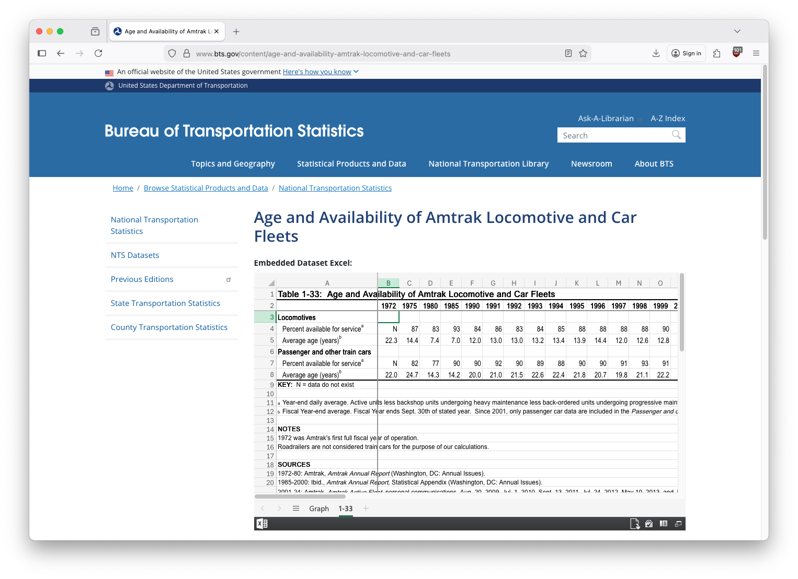
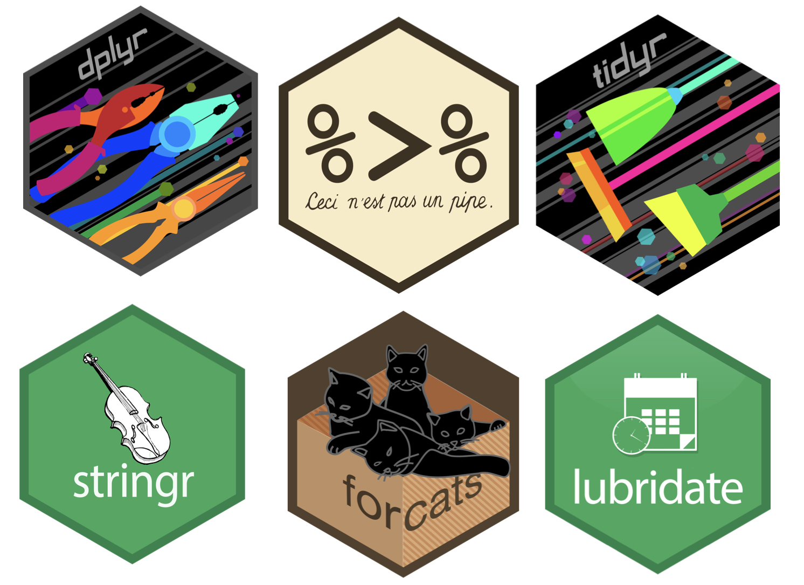

```{r}
#| include: false
#| warning: false
#| message: false

knitr::opts_chunk$set(echo = TRUE, warning = FALSE, message = FALSE,
                      fig.retina = 3, fig.align = 'center',
                      fig.asp = 0.75, fig.width = 8)
library(knitr)
library(tidyverse)
# 
# options(htmltools.preserve.raw = FALSE)
theme_update(text = element_text(size = 20))
```

::::: columns
::: {.column .center width="60%"}
{width="90%"}
:::

::: {.column .center width="40%"}
<br>

[Data Wrangling]{.custom-title}

<br> <br> <br> <br> <br>

[Grayson White]{.custom-subtitle}

[Math 241 <br> Week 3 \| Spring 2026]{.custom-subtitle}
:::
:::::

------------------------------------------------------------------------

## Announcements

::: {.nonincremental}

* [Office Hours Schedule](https://reed-data-science.github.io/office_hours.html)
    - Problem Set 1 due Thursday 9am.

:::

------------------------------------------------------------------------


## Week 3 Goals

:::: {.columns}

::: {.column width='50%' .nonincremental .fragment}

**Mon Lecture**

* Think about reproducibility and learn how to ask coding questions well.

* Motivate and work on data wrangling.

:::

::: {.column width='50%' .nonincremental .fragment}

**Wed Lecture**

* Plot animation and interactivity.
* GitHub workflow review.


:::

::::

------------------------------------------------------------------------


## Reproducible Workflow

* One where if you shared your data and work with someone else, they could reproduce your results.

* Not the same as **replication**: Where someone collects new data following your same design to see if they get the same results.


:::: {.columns}

::: {.column width="60%" .nonincremental .fragment}

* `Quarto` documents allow us to include our `R` code, output, and narrative in the same place. 
    + Load the **raw** data.
    + Be transparent about all the analysis steps.
    + Even if you don't showcase the `R` code in the output file, it is contained in the `qmd` file.

:::

::: {.column width="40%" .fragment}


```{r  out.width = "40%", echo=FALSE, fig.align='center'}
include_graphics("img/quarto.png") 
```

:::

::::

------------------------------------------------------------------------


## Creating `repr`oducible `ex`amples with `reprex`

```{r, echo = FALSE, out.width= "15%"}
knitr::include_graphics("img/reprex.png")
``` 


::: {.fragment}

#### Why do I need to learn to create reproducible technical examples?


- So that you can ask and answer questions in our class Slack Workspace or Stack Overflow or other `R` help sites!

:::


# First, let's take a look at some bad examples!


## What is wrong with this coding question?

<br>

I am trying to create a plot and I can't get the bars to do what I want them to.  Help?!


------------------------------------------------------------------------


## What is wrong with this coding question?

<br>


I want to do the following but it isn't working:

thing <- read.csv("long/file/path/thing.csv")

ggplot(thing, aes(x = factor(that))) + geom_bar()


Help?!


------------------------------------------------------------------------


## What is wrong with this coding question?

<br>


I want to reorder the bars of my plot but can't get it working.  Help!

```{r}
#| output: false
library(tidyverse)
library(palmerpenguins)

penguins <- penguins %>%
  group_by(species) %>%
  mutate(mean_flipper = mean(flipper_length_mm)) %>%
  ungroup() %>%
  mutate(long = case_when(flipper_length_mm < mean(flipper_length_mm) ~ "no",
                           flipper_length_mm >= mean(flipper_length_mm) ~ "yes"))  

penguins %>%
  ggplot(mapping = aes(x = factor(species))) +
  geom_bar()

penguins %>%
  count(species)
```


------------------------------------------------------------------------


## What is wrong with this coding question?

<br>


I want to reorder the bars of my plot but can't get it working.  Help!

```{r, eval = FALSE}
rm(list = ls())

library(tidyverse)
library(palmerpenguins)

penguins %>%
  ggplot(mapping = aes(x = factor(species))) +
  geom_bar()

```


------------------------------------------------------------------------


## [What makes a good coding question?](https://stackoverflow.com/questions/5963269/how-to-make-a-great-r-reproducible-example)


* It uses a **minimal** dataset to reproduce the issue.

* It includes the **shortest** amount of  **runnable** code necessary to reproduce the issue.

* It doesn't wreak havoc on other people's computers.

* It includes code **and output** so that others don't have to run it!

::: {.fragment .nonincremental}

* It includes any necessary information on the used packages, R version, system, etc.
    + Can use `packageVersion("tidyverse")` or `sessionInfo()` to find this information.

:::

------------------------------------------------------------------------


## Minimal Dataset: two good options

::: {.fragment}

Create a toy data frame.

```{r}
dat <- data.frame(animal = c("cat", "dog", "mouse"), 
                  weight = c(5, 10, 0.5))
dat
```

:::


::: {.fragment}
    
Use a built-in dataset or a dataset from a particular package.

```{r}
library(palmerpenguins)
penguins
```

:::

------------------------------------------------------------------------


## Minimal Code

Include the **necessary** libraries.

Test run the code in a restarted R session to make sure it is runnable!

```{r, fig.width = 5}
library(tidyverse)
library(palmerpenguins)

penguins %>%
  ggplot(mapping = aes(x = factor(species))) +
  geom_bar()
```


------------------------------------------------------------------------


## Make sure your code is copy-and-paste-able!

Don't copy from the console.

```{r, eval = FALSE}
> library(tidyverse)
> library(palmerpenguins)
> 
> penguins %>%
+     ggplot(mapping = aes(x = factor(species))) +
+     geom_bar()
```


------------------------------------------------------------------------


## Make sure your code is copy-and-paste-able!


------------------------------------------------------------------------


## Now we have our reproducible example:


::: {.fragment}

How can I reorder the bars in the ggplot to go from the most frequent to the least frequent category?

```{r, fig.width = 4}
#| output-location: column
library(tidyverse)
library(palmerpenguins)

penguins %>%
  ggplot(mapping = aes(x = factor(species))) +
  geom_bar()
```

:::


::: {.fragment}

**How can we easily share it?**

* Using the `reprex()` function in the `reprex` package.

:::

------------------------------------------------------------------------


## `reprex` Practice Time!


But first: **Q**: What is an R script file?


::: {.fragment}

* A text file for entering R commands.

:::


::: {.fragment}

**Q**: How is an R script file different from a Quarto or RMarkdown document?

:::


::: {.fragment}

* You only put code in an `R` script.  
* If you add any text you must comment it out with `#`.
* Think of it as a single `R` chunk that you won't knit into an output document.
* Useful when writing a lot of code and want to compartmentalize.


:::

------------------------------------------------------------------------


## `reprex` Practice Time!


::: {.nonincremental}

(1) In **Session**, select "Clear Workspace" and then "Restart R".

(2) Open a script file and include in the top line:

```{r}
library(reprex)
```


(3) Put the code you want to use in the script file and make sure it runs.  

```{r, eval = FALSE}
library(tidyverse)
library(palmerpenguins)

penguins %>%
  ggplot(mapping = aes(x = factor(species))) +
  geom_bar()
```


(4) Surround the code with `reprex({ ... }, venue = "slack")` and run it.

(5) An md file will pop up. Copy all the contents of that file.  

(6) Head over to the `#coding-qa` channel and paste in the contents as a reply to the `reprex` practice message.  A text box will pop-up and select "Apply". 

(7) Above your code, type your question.  Then hit "Send".

:::


# Data Wrangling

## Data Wrangling

- So far, we've focused primarily on **data visualization**! 

::: {.fragment .nonincremental}

- However, in order to make **beautiful** graphics, sometimes we have to go from 

**messy** data `r emo::ji("right arrow")` **beautiful, wrangled, and cleaned** data

:::


## Example: [Data In the Wild](https://www.bts.gov/content/age-and-availability-amtrak-locomotive-and-car-fleets)

Many datasets on the internet are often in **Display Format**, not **Analysis Format**.

:::: {.columns}

::: {.column width='60%'}

```{r, echo=FALSE, out.width='100%'}

```

:::

::: {.column width='40%'}

- And, sometimes we'd like to modify a dataset to help us answer a specific question, or display the data in a particular way. 

- Many of you have already needed to do some data wrangling in Problem Set 1. 

:::

::::

------------------------------------------------------------------------

## Recall this visualization from Week 1, Day 1

```{r}
#| echo: false
library(babynames)
babynames_stat108 <- babynames %>%
  filter(name %in% c("Grayson", "Michael", "Megan",
                     "Lenny")) %>%
  group_by(year, name) %>%
  summarize(n = sum(n))

p <- ggplot(data = babynames_stat108, 
       mapping = aes(x = year, y = n)) +
  geom_line(aes(color = name), size = 2) + 
  theme(legend.position = "bottom", text = element_text(size=20)) +
  guides(color = guide_legend(nrow = 2)) +
  labs(y = "Number of Births", x = "Year", color = "Baby Name")
p
```

- We need to be able to wrangle the data to make this visualization!


------------------------------------------------------------------------


## Recall this visualization from Week 1, Day 1

```{r, echo = FALSE, fig.width= 9, fig.asp= .6}
library(gganimate)
p_animate <- p +
  transition_reveal(along = year)
animate(p_animate, fps = 5, end_pause = 20, height = 4,
  width = 6.5, units = "in", res = 100)
```


::: {.nonincremental}

- And to make the **animated** version!

:::

- In order to make these visualizations, we have to learn how to **wrangle data**! 


------------------------------------------------------------------------


## Data Wrangling

* What is it?
    + Any processing you have to do to the data to summarize, visualize, model it.

    
::: {.nonincremental .fragment}
* Examples: 
    + Recoding 999 as "NA"
    + Removing rows
    + Creating new variables
    + Recoding category variables
    + Fixing variable types
    + Reshaping data into a format that satisfies the tidy data principles
        
:::


------------------------------------------------------------------------


## Data Wrangling

:::: {.columns}

::: {.column width='50%' .nonincremental}

* We are going to learn **several** packages to help us wrangle data.

* We'll learn the core of `dplyr` right now!

:::

::: {.column width='50%'}

```{r, echo = FALSE, out.width= '100%'}

```

:::

::::

------------------------------------------------------------------------

## Math 241 `dplyr` Experience

```{r, echo=FALSE, out.width='60%'}
math241_form <- read_csv("data/Background Survey for Math 241_ Data Science (Responses) - Form Responses 1.csv") %>%
  rename(ggplot2 = `For each R package or activity, rate what you think your proficiency level is. (For many of these, I am guessing the answer is "No experience" and that is completely fine!) [ggplot2]`,
         dplyr = `For each R package or activity, rate what you think your proficiency level is. (For many of these, I am guessing the answer is "No experience" and that is completely fine!) [dplyr]`,
         tidyr = `For each R package or activity, rate what you think your proficiency level is. (For many of these, I am guessing the answer is "No experience" and that is completely fine!) [tidyr]`) %>%
  mutate(ggplot2 = forcats::fct_relevel(ggplot2,
                                        "No experience",
                                        "Limited experience",
                                        "Moderate experience",
                                        "Expert")) %>%
  mutate(dplyr = forcats::fct_relevel(dplyr,
                                        "No experience",
                                        "Limited experience",
                                        "Moderate experience",
                                        "Expert"))

ggplot(data = math241_form, mapping = aes(x = dplyr)) +
  geom_bar(fill = "#A71F69", color = "white") +
  labs(x = "dplyr Experience",
       y = "Number of students") +
  coord_flip()
```


------------------------------------------------------------------------

## `dplyr` core functions

:::: {.columns}

::: {.column width='50%'}

### dplyr for Data Wrangling

* Common wrangling verbs:
    + `select()`
    + `mutate()`
    + `filter()`
    + `arrange()`
    + `summarize()`
    + `drop_na()`
    + `count()`
    
* One action:
    + `group_by()`
    
:::

::: {.column width='50%'}
    
### Pipe for chaining together commands

* `magrittr` pipe: `%>%`
* New base `R` (native) pipe: `|>`
    + Less flexible in some scenarios, but...
    + Don't need to load a package to use it

:::

::::


------------------------------------------------------------------------


## New data: `babynames`

```{r}
library(babynames)
head(babynames)
```

- What does each row represent? 

------------------------------------------------------------------------

### Wrangling `babynames`

#### What wrangling do we need to do to get from raw data to wrangled data?

:::: {.columns}

::: {.column width='50%'}

```{r}
library(babynames)
data("babynames")
head(babynames)

```

:::

::: {.column width='50%'}

```{r}
#| echo: false
babynames_math241 <- babynames %>%
  filter(name %in% c("Grayson", "Michael", "Megan",
                     "Lenny")) %>%
  group_by(year, name) %>%
  summarize(n = sum(n)) %>%
  arrange(desc(year))
```


```{r}
head(babynames_math241)
```

:::

::::

------------------------------------------------------------------------


### Wrangling `babynames`

`filter()`: Subset rows based on logic statements.

```{r}
babynames_math241 <- filter(babynames, 
                            name %in% c("Grayson", "Michael", 
                                        "Megan", "Lenny"))
babynames_math241
```


------------------------------------------------------------------------


### Wrangling `babynames`

`%>%` (the pipe): Inserts current line as first argument in the next line.

```{r}
babynames_math241 <- filter(babynames, 
                            name %in% c("Grayson", "Michael",
                                        "Megan", "Lenny"))

babynames_math241
```


------------------------------------------------------------------------

### Wrangling `babynames`

`%>%` (the pipe): Inserts current line as first argument in the next line.

```{r}
babynames_math241 <- filter(babynames, 
                            name %in% c("Grayson", "Michael",
                                        "Megan", "Lenny"))

# this operation does exactly the same thing as above
babynames_math241 <- babynames %>%
  filter(name %in% c("Grayson", "Michael",
                     "Megan", "Lenny"))

babynames_math241
```


------------------------------------------------------------------------


### Wrangling `babynames`

`summarize()`: Compute an aggregation measure (e.g., mean, standard deviation).


```{r}
babynames_math241 <- babynames %>%
  filter(name %in% c("Grayson", "Michael",
                     "Megan", "Lenny")) %>%
  summarize(n = sum(n))

babynames_math241
```


------------------------------------------------------------------------


### Wrangling `babynames`

`group_by()`: Create groups for how future operations should be computed.

```{r}
babynames_math241 <- babynames %>%
  filter(name %in% c("Grayson", "Michael",
                     "Megan", "Lenny")) %>%
  group_by(name) %>%
  summarize(n = sum(n))

babynames_math241
```

* What are we missing?


------------------------------------------------------------------------


### Wrangling `babynames`

`group_by()`: Create groups for how future operations should be computed.

```{r}
babynames_math241 <- babynames %>%
  filter(name %in% c("Grayson", "Michael",
                     "Megan", "Lenny")) %>%
  group_by(year, name) %>%
  summarize(n = sum(n)) 

babynames_math241
```


------------------------------------------------------------------------


### Wrangling `babynames`

`group_by()`: Create groups for how future operations should be computed.

```{r}
babynames_math241 <- babynames %>%
  filter(name %in% c("Grayson", "Michael",
                     "Megan", "Lenny")) %>%
  group_by(year, name) %>%
  summarize(n = sum(n)) %>%
  ungroup()

babynames_math241
```


- What did `ungroup()` do?


------------------------------------------------------------------------


### Wrangling `babynames`

`arrange()`: Order the rows by variable(s).

```{r}
babynames_math241 <- babynames %>%
  filter(name %in% c("Grayson", "Michael",
                     "Megan", "Lenny")) %>%
  group_by(year, name) %>%
  summarize(n = sum(n)) %>%
  ungroup() %>%
  arrange(desc(year))

babynames_math241
```


------------------------------------------------------------------------


## New data: pets I've had

```{r}
my_pets <- data.frame(
  name = c("Dude", "Pickle", "Kyle", "Nubs"),
  type = c("dog", "cat", "cat", "cat"),
  age = c(8, 6, 4, NA),
  birthplace = c("Washington", NA, "Utah", NA)
)

my_pets
```

------------------------------------------------------------------------


### Wrangling `my_pets`

`select()`: retain particular columns. 


```{r}
my_pets %>%
  select(name, type, age)
```

------------------------------------------------------------------------


### Wrangling `my_pets`

`select()`: retain particular columns. 


```{r}
my_pets %>%
  select(-birthplace)
```

------------------------------------------------------------------------


### Wrangling `my_pets`

`drop_na()`: Remove any row that has a missing value for particular variables.

```{r}
my_pets %>%
  drop_na(birthplace)
```


------------------------------------------------------------------------


### Wrangling `my_pets`

`mutate()`: Create new variables or modify existing variables

-   **Use case**: pet years! 
    - 8 for large dog, 7 for cats
    - (I'm not an animal scientist)
    
::: {.fragment}

```{r}
my_pets <- my_pets %>%
  # bad solution
  mutate(age_pet_years = age * 7.5)

my_pets
```


:::


------------------------------------------------------------------------

### Wrangling `my_pets`

`mutate()`: Create new variables or modify existing variables

::: {.nonincremental}

-   **Use case**: pet years! 
    - 8 for large dog, 7 for cats
    - (I'm not an animal scientist)
    
:::

Better solution: use `case_when()`

```{r}
my_pets <- my_pets %>%
  mutate(age_pet_years = case_when(
    type == "dog" ~ 8 * age,
    type == "cat" ~ 7 * age
    ))

my_pets
```


------------------------------------------------------------------------


### Wrangling `my_pets`

More `filter()`ing


```{r}
pets_who_can_drink <- my_pets %>%
  filter(age_pet_years > 21)

pets_who_can_drink
```


------------------------------------------------------------------------


### Wrangling `my_pets`

More `filter()`ing: Nubs seemed like he was pretty old

```{r}
pets_who_can_drink <- my_pets %>%
  filter(age_pet_years > 21 & is.na(age_pet_years))

pets_who_can_drink
```

-   What went wrong here???

-   Logical operators: `&` means 'and'


------------------------------------------------------------------------


### Wrangling `my_pets`

More `filter()`ing: Nubs seemed like he was pretty old

```{r}
pets_who_can_drink <- my_pets %>%
  filter(age_pet_years > 21 | is.na(age_pet_years))

pets_who_can_drink
```

-   Logical operators: `|` means 'or'


------------------------------------------------------------------------


### Wrangling `my_pets`

More `filter()`ing

```{r}
old_cats <- my_pets %>%
  filter(age_pet_years > 30, type == "dog")

old_cats
```

- In a `filter()`, the comma implicitly means `&`


------------------------------------------------------------------------


### Wrangling `my_pets`

`%in%` vs. `==`

```{r}
my_pets %>%
  filter(name == c("Dude", "Kyle"))
```

- What went wrong here?


------------------------------------------------------------------------


### Wrangling `my_pets`

`%in%` vs. `==`

```{r}
my_pets %>%
  filter(name %in% c("Dude", "Kyle"))
```


# Activity

```{r}
#| echo: false
countdown::countdown(15)
```


## Next time

- Use some of our data wrangling skills to make **animated** and **interactive** graphics!