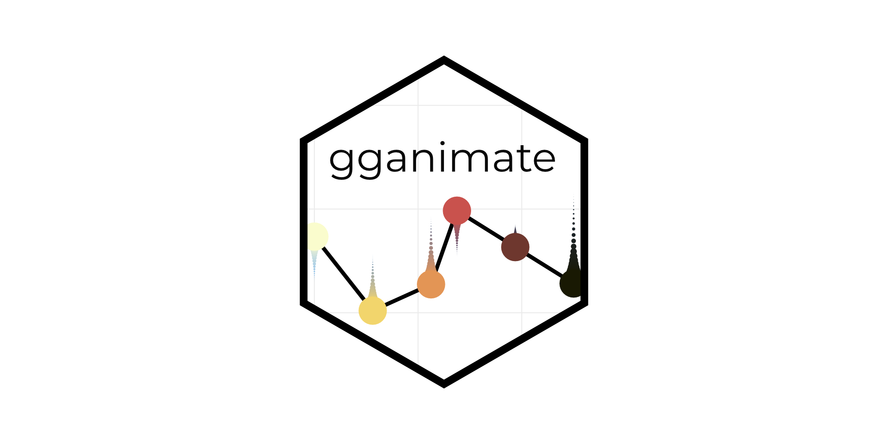
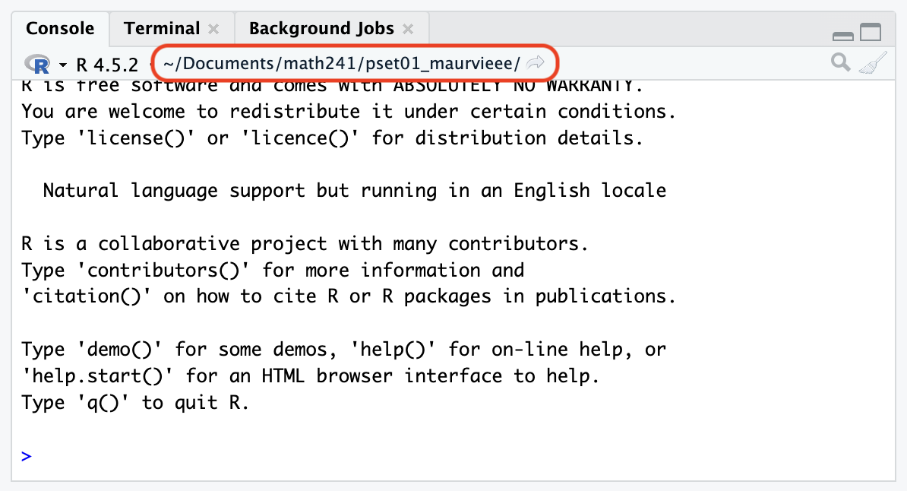

```{r}
#| include: false
#| warning: false
#| message: false

knitr::opts_chunk$set(echo = TRUE, warning = FALSE, message = FALSE,
                      fig.retina = 3, fig.align = 'center',
                      fig.asp = 0.75, fig.width = 8)
library(knitr)
library(tidyverse)
# 
# options(htmltools.preserve.raw = FALSE)
theme_update(text = element_text(size = 20))
```

::::: columns
::: {.column .center width="60%"}
{width="90%"}
:::

::: {.column .center width="40%"}
<br>

[Animation and Interactivity]{.custom-title}

<br> <br> 

[Grayson White]{.custom-subtitle}

[Stat 241 <br> Week 3 \| Fall 2026]{.custom-subtitle}
:::
:::::

------------------------------------------------------------------------

## Announcements

::: {.nonincremental}

* [Office Hours Schedule](https://reed-data-science.github.io/office_hours.html)
    - This week, my Friday office hours have been moved to Thursday. 
    
* Problem Set 1 due **tomorrow** at 9am.

:::

------------------------------------------------------------------------


## Week 3 Goals

:::: {.columns}

::: {.column width='50%' .nonincremental .fragment}

**Mon Lecture**

* Think about reproducibility and learn how to ask coding questions well.

* Motivate and work on data wrangling.

:::

::: {.column width='50%' .nonincremental .fragment}

**Wed Lecture**

* Recall some ideas about inheriting aesthetics.
* Plot animation and interactivity.
* Formalize some ideas about GitHub workflow and RStudio Projects / Positron folders.


:::

::::


# First up: some further discussion of inheriting aesthetics

## Inheriting `aes` from `ggplot()`

```{r, echo = FALSE}
# Load libraries
library(mosaicData)
library(tidyverse)
library(lubridate)


# Grab data
data(Births2015)

holidays <- 
  data.frame(date = as_date(c("2015-01-01","2015-05-25", "2015-07-04",
                        "2015-12-25", "2015-11-26", "2015-12-24",
                        "2015-09-07")), 
            occasion = c("New Year", "Memorial Day", 
                         "Independence Day", "Christmas",
                         "Thanksgiving", "Christmas Eve", 
                         "Labor Day"))

holidays <- left_join(holidays, Births2015)
```

```{r aesPlot}
#| output-location: column
ggplot(data = Births2015, 
       mapping = aes(x = date, y = births,
                     color = wday)) + 
  geom_point() +
  geom_point(data = holidays, size = 3,
             color = "black")
```

* What `aes`thetics did the second `geom_point()` inherit?  What didn't it inherit?


------------------------------------------------------------------------


```{r}
glimpse(Births2015)
glimpse(holidays)
```


------------------------------------------------------------------------


## Inheriting `aes` from `ggplot()`

::: {.nonincremental}

* What `aes`thetics did the second `geom_point()` inherit?  What didn't it inherit?

:::

```{r, error = TRUE}
holidays <- rename(holidays, Dates = date)

ggplot(data = Births2015, 
       mapping = aes(x = date, y = births,
                     color = wday)) + 
  geom_point() +
  geom_point(data = holidays, size = 3,
             color = "black")
```


------------------------------------------------------------------------


## Inheriting `aes` from `ggplot()`

```{r aesPlot2}
#| output-location: column
ggplot(data = Births2015, 
       mapping = aes(x = date, y = births,
                     color = wday)) + 
  geom_point() +
  geom_point(data = holidays, size = 3,
             color = "black", 
             mapping = aes(x = Dates))
```

::: {.nonincremental}

* What `aes`thetics did the second `geom_point()` inherit?  What didn't it inherit?

:::

------------------------------------------------------------------------


## Inheriting `aes` from `ggplot()`


```{r aesPlot3, error = TRUE}
ggplot(data = Births2015, 
       mapping = aes(x = date, y = births,
                     color = wday)) + 
  geom_point() +
  geom_point(data = holidays, size = 3,
             color = "black", 
             mapping = aes(x = Dates),
             inherit.aes = FALSE)
```

::: {.nonincremental}

* What `aes`thetics did the second `geom_point()` inherit?  What didn't it inherit?

:::


------------------------------------------------------------------------


## Inheriting `aes` from `ggplot()`


```{r aesPlot4}
#| output-location: column
#| error: true
ggplot(data = Births2015, 
       mapping = aes(x = date, y = births,
                     color = wday)) + 
  geom_point() +
  geom_point(data = holidays, size = 3,
             color = "black", 
             mapping = aes(x = Dates,
                           y = births),
             inherit.aes = FALSE)
```

::: {.nonincremental}

* What `aes`thetics did the second `geom_point()` inherit?  What didn't it inherit?

:::


------------------------------------------------------------------------


## Inheriting `aes` from `ggplot()`


```{r aesPlot5, error = TRUE}
#Add a box around Thanksgiving to Christmas
holidays_season <- 
  data.frame(start = as_date("2015-11-26"), 
             end = as_date("2015-12-24"))

ggplot(data = Births2015, 
       mapping = aes(x = date, y = births,
                     color = wday)) +
  geom_rect(data = holidays_season,
            mapping = aes(xmin = start,
                          xmax = end,
                          ymin = 6000,
                          ymax = 14000)) + 
  geom_point()
```


* Problem: non-matching `aes` arguments


------------------------------------------------------------------------


## Inheriting `aes` from `ggplot()`


```{r aesPlot6}
#| output-location: column
#| error: true
ggplot(data = Births2015, 
       mapping = aes(x = date, y = births,
                     color = wday)) +
  geom_rect(data = holidays_season,
            mapping = aes(xmin = start,
                          xmax = end,
                          ymin = 6000,
                          ymax = 14000),
             inherit.aes = FALSE) + 
  geom_point()
```

::: {.nonincremental}

* Problem: non-matching `aes` arguments

* One solution: set `inherit.aes = FALSE`

:::


------------------------------------------------------------------------


## Safe Play: Put the mappings in the individual `geoms`


```{r aesPlot7}
#| output-location: column
#| error: true
ggplot(data = Births2015) +
  geom_rect(data = holidays_season,
            mapping = aes(xmin = start,
                          xmax = end,
                          ymin = 6000,
                          ymax = 14000),
             inherit.aes = FALSE) + 
  geom_point(mapping = aes(x = date,
                           y = births,
                           color = wday))
```

::: {.nonincremental}

* Problem: non-matching `aes` arguments

* Safer solution.


:::


# Now: plot animation and interactivity

------------------------------------------------------------------------


## Plot animation and interactivity

:::: {.columns}

::: {.column width='50%'}

#### Plot animation


We'll use `gganimate` to make animated data viz

```{r}
#| echo: false

```


:::

::: {.column width='50%'}


#### Plot interactivity

We'll use `plotly` to make interactive data viz


```{r}
#| echo: false

```


:::


::::


# First up: animation


------------------------------------------------------------------------

## `gganimate` basics

* Core functions:
    + `transition_*()`: Defining the variables that control the change and how they control the change
    + `enter/exit*()`: Determining how data enters and exits
    + `view_*()`: Changing axes    
    + `shadow_*()`: Giving the animation memory
    + `animate()`: Tuning the gif speed and size


## Recall the `babynames` dataset

```{r}
library(babynames)
head(babynames)
```


------------------------------------------------------------------------

## And our data wrangling 

```{r}
babynames_math241 <- babynames %>%
  filter(name %in% c("Grayson", "Michael",
                     "Megan", "Lenny")) %>%
  group_by(year, name) %>%
  summarize(n = sum(n)) %>%
  ungroup() %>%
  arrange(desc(year))

babynames_math241
```


------------------------------------------------------------------------

## Now let's make a plot

```{r}
#| output-location: column
ggplot(data = babynames_math241, 
       mapping = aes(x = year, y = n)) +
  geom_line(aes(color = name), size = 2) + 
  theme(legend.position = "bottom", 
        text = element_text(size = 20)) +
  guides(color = guide_legend(nrow = 2)) +
  labs(y = "Number of Births",
       x = "Year", 
       color = "Baby Name")
```

------------------------------------------------------------------------


## Sidebar: saving plots to your computer


Here, I have an empty folder called "my_plots" in my working directory.

```{r}
list.files("my_plots")
```

<br>

::: {.fragment}

Now, I save the plot **in my `R` environment** as the object `p`

```{r}
p <- ggplot(data = babynames_math241, 
       mapping = aes(x = year, y = n)) +
  geom_line(aes(color = name), size = 2) + 
  theme(legend.position = "bottom", 
        text = element_text(size = 20)) +
  guides(color = guide_legend(nrow = 2)) +
  labs(y = "Number of Births",
       x = "Year", 
       color = "Baby Name")
```

:::

<br>

:::: {.columns}

::: {.fragment .column width = "45%"}

Finally, I use `ggsave()` to save the object to my computer

```{r}
ggsave(filename = "my_plots/stats_names.png", 
       width = 10, 
       height = 6)
```

:::

::: {.column width="10%"}

:::

::: {.fragment .column width="45%"}

Checking for files in "my_plots" directory

```{r}
list.files("my_plots")
```

:::


::::

```{r}
#| echo: false
#| include: false
file.remove("my_plots/stats_names.png")
```


------------------------------------------------------------------------


## Back to animation

We'd like to animate this plot

```{r}
p
```


------------------------------------------------------------------------

## Back to animation

`transition_reveal()`: reveal the graph along a variable in the plot

```{r anim1}
#| output-location: column-fragment
#| cache: true
library(gganimate)
p_animate <- p +
  transition_reveal(along = year)
animate(p_animate, 
        fps = 5, 
        end_pause = 40, 
        height = 4, width = 6.5,
        units = "in", 
        res = 100)
```

-   Add the `transition_reveal()` function just like another ggplot layer.
    - Set the `along` parameter to the variable you'd like to reveal over. 


------------------------------------------------------------------------


## Other `transition_***()` functions

Static graph by island

```{r}
#| output-location: column
library(palmerpenguins)
ggplot(penguins,
       aes(x = bill_length_mm, 
           y = body_mass_g, 
           color = sex)) + 
  geom_point() + 
  facet_wrap(~island)
```


------------------------------------------------------------------------

## Other `transition_***()` functions

`transition_states()`: display graph for each category of a variable

```{r anim2}
#| output-location: column-fragment
#| cache: true
p2_anim <- ggplot(penguins, 
                  aes(x = bill_length_mm,
                      y = body_mass_g,
                      color = sex)) + 
  geom_point() + 
  transition_states(
    states = island, wrap = TRUE
  ) + 
  enter_fade() +
  exit_shrink()

animate(p2_anim) 
```


------------------------------------------------------------------------


## Other `transition_***()` functions

`transition_states()`: display graph for each category of a variable

```{r anim3}
#| output-location: column
#| cache: true
p2_anim <- ggplot(penguins, aes(x = bill_length_mm, y = body_mass_g, color = sex)) + 
  geom_point() + 
  labs(title = "Island: {closest_state}") + 
  transition_states(
    states = island, wrap = TRUE
  ) +
  enter_fade() +
  exit_shrink()

animate(p2_anim) 
```


------------------------------------------------------------------------


## Other `transition_***()` functions

`transition_filter()`: display graph for multiple filtering conditions

```{r anim4}
#| output-location: column
#| cache: true
stats_profs_anim <- p + 
  transition_filter(
    Lenny = name == "Lenny",
    Grayson = name == "Grayson",
    Michael = name == "Michael",
    Megan = name == "Megan",
  ) +
  enter_fade() +
  exit_fade()

animate(stats_profs_anim) 
```


------------------------------------------------------------------------

## Other `transition_***()` functions

`view_follow()`: let's us adjust the axis as we view 

```{r anim5}
#| output-location: column
#| cache: true
stats_profs_anim <- p + 
  transition_filter(
    Lenny = name == "Lenny",
    Grayson = name == "Grayson",
    Michael = name == "Michael",
    Megan = name == "Megan",
  ) + 
  enter_grow() +
  exit_fade() + 
  view_follow()

animate(stats_profs_anim) 
```


------------------------------------------------------------------------


## How do I save an animation?

```{r}
#| eval: false
anim_save("my_plots/stats_profs_an.gif", animate(stats_profs_anim))
```


------------------------------------------------------------------------


## Why Add Animation to a Graph?


- To engage the viewer
- To accentuate the story
- To add another variable to the plot

::: {.fragment}

But don't add animation just because you can.  Drawbacks?

:::


::: {.fragment}

* Require a higher level of attention
* Can obscure the story

:::

------------------------------------------------------------------------


## Animation: we're just scratching the surface! 

```{r}
#| echo: false
library(gganimate)
```


::: {.nonincremental}

-   There are **tons** of different functions to fine-tune your animated pltos! 

:::

::: {.fragment}

```{r}
apropos("transition_")
```

:::

::: {.fragment}

```{r}
apropos("exit_")
```

:::

::: {.fragment}

```{r}
apropos("^view_")
```

:::


- Check the [documentation for `gganimate`](https://gganimate.com/index.html) for even more excellent examples! 

- And the [`gganimate` cheatsheet](https://rstudio.github.io/cheatsheets/gganimate.pdf) is an excellent resource!


# Now: interactivity


------------------------------------------------------------------------


## Simple Interactivity with `ggplotly`

We can use the `plotly` package to convert a static `ggplot` to an interactive plot.

```{r plotly1}
#| output-location: column
library(mosaicData)
data(Births2015)

p <- ggplot(data = Births2015, 
       mapping = aes(x = date, y = births,
                     color = wday)) + 
  geom_point()
p
```

------------------------------------------------------------------------


## Simple Interactivity with `ggplotly`

We can use the `plotly` package to convert a static `ggplot` to an interactive plot.

:::: {.columns}

::: {.fragment .column width='50%'}

```{r}
library(plotly)
ggplotly(p) 
```

:::

::: {.fragment .column width='50%' .nonincremental}

<br>

<br>


* Conversion isn't always perfect.
    + May need to spend more time tweaking `theme()` beforehand.

* Can also create graphs with `plot_ly()`

:::

::::

------------------------------------------------------------------------


## Simple Interactivity with `ggplotly`


```{r plotly2}
#| output-location: column
ggplotly(p, dynamicTicks = TRUE) %>%
  rangeslider() %>%
  layout(hovermode = "x")
```

* Add a slider and make tick marks dynamic with zooming
* Change the comparisons made when you hover


------------------------------------------------------------------------


## Simple Interactivity with `ggplotly`


```{r}
#| output-location: column
p <- ggplot(data = holidays, 
       mapping = aes(text = occasion)) + 
  geom_point(data = Births2015,
             mapping = aes(x = date,
                           y = births,
                           color = wday),
             inherit.aes = FALSE) +
  geom_point(data = holidays, size = 3,
             color = "black", 
             mapping = aes(x = Dates,
                           y = births))
ggplotly(p, tooltip = "text")
```


------------------------------------------------------------------------


## How do I save / share my interactive plots? 

-   Good question. 

-   In HTML format (website, dashboard, .html file).

-   In Project 1, you'll create a `shiny` dashboard / app, which is one of the best way to share interactive plots and maps!

-   We'll explore interactivity more in Problem Set 2. 


# Workflow

------------------------------------------------------------------------

## Workflow review

-   I'd like to spend a little bit more time discussing workflow with git, RStudio, and Positron

-   And give you some slides to reference

------------------------------------------------------------------------


## RStudio Projects / Positron Folders


:::: {.columns}

::: {.column width='50%' .nonincremental}

* Where does your analysis live?
    + Working directory
        + Where `R` looks for files you ask it to load.
        + Where `R` puts files you ask it to save.

:::

::: {.column width='50%'}

```{r, echo = FALSE, out.width= '60%'}

```

:::

::::

```{r}
getwd()
```


::: {.fragment}

* For a given project, your analyses should live in the folder where you store the files associated with the project.
    + In other words, **working directory = project folder**.

* Common default: Working directory = home directory    

* Can change the working directory with `setwd()` but instead we will use RStudio Projects or Positron Folders.

:::

------------------------------------------------------------------------


## RStudio Projects and Positron Folders

**RStudio Projects** and **Positron Folders**: Feature that helps you organize your work.

* Each problem set will get it's own RStudio Project or Positron Folder
    

* The working directory is the home directory of the project.

::: {.fragment .nonincremental}

* **Question**: My RStudio Project is `Reed-Data-Science.github.io`. Why does the file path end a folder furhter there when I run the following?

```{r}
getwd()
```

:::

* R code executed in Quarto documents gets the working directory where that document lives, not the project directory
    - Confusing! But sometimes nice...


------------------------------------------------------------------------


## Projects and Workflow

* Create an RStudio Project / Positron Folder for each analysis project.
    + We will have nine RStudio Projects / Positron Folders for this course:
        + An RStudio Project / Positron Folders for each of Labs 1 - 6
        + An RStudio Project / Positron Folders for project 1
        + An RStudio Project / Positron Folders for project 2


* Each of these RStudio Projects / Positron Folders will be synced with `git` and GitHub

------------------------------------------------------------------------


## git and GitHub

* **git**: Version control system
    + Think fancier type of *Track Changes*.

* **GitHub**: Hosting service for git projects (which are called repositories)
    + Think fancier type of *DropBox* or *Google Drive*.

* Useful resource when getting started: [https://happygitwithr.com/](https://happygitwithr.com/)


------------------------------------------------------------------------


## Git Real

::: {.fragment .nonincremental}

* Git is a *decentralized* version control system.
    + Each collaborator has a complete version of the repo.
    + Everyone can work offline and simultaneously.
    + GitHub holds the master copy.
    
:::

::: {.fragment .nonincremental}

* git is not friendly and can be frustrating.
      + BUT, the version control and collaborative rewards are big!

:::

::: {.fragment .nonincremental}

* [GitHub.com](GitHub.com) is a great place to develop an online presence.

:::


::: {.fragment .nonincremental}

* If you end up with a mess of errors, then don't worry but come see one of the instructors for help.
    + It happens to [everyone](https://xkcd.com/1597/).
    
:::


------------------------------------------------------------------------


## Main Message: 

### Github Repo = `RStudio` Project or `Positron` Folder

* A **repo**, short for repository, is the folder that contains all of the files for the project on [GitHub.com](GitHub.com).

::: {.fragment .nonincremental}
 
* Under the **Reed-Data-Science** GitHub Organization you currently have 1 repo:
    + `pset01-username`: Just you and the Stat 241 teaching team (me, course assistant, graders) can access
    + Soon, you'll have `pset02-username`
    
:::

* For each repo, you should create an `RStudio` Project or Positron folder (with version control).


------------------------------------------------------------------------


### Next Week

::: {.nonincremental}

-   Big data wrangling week: 
    - **Monday**: reshaping and joining data. 
    - **Wednesday**: learn about different data types in `R` (beyond `data.frames`)
    
:::

<br>


### On the Horizon

::: {.nonincremental}


-   **Week 5**: spatial data

-   **Week 6**: Interactive dashboards with `shiny` (and Project 1 assigned!)


:::
    
