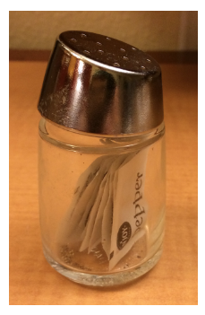
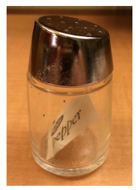
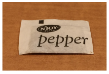
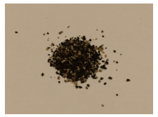

```{r}
#| include: false
#| warning: false
#| message: false

knitr::opts_chunk$set(echo = TRUE, warning = FALSE, message = FALSE,
                      fig.retina = 3, fig.align = 'center',
                      fig.asp = 0.75, fig.width = 8)
library(knitr)
library(tidyverse)
# 
# options(htmltools.preserve.raw = FALSE)
theme_update(text = element_text(size = 20))
```

::::: columns
::: {.column .center width="60%"}
{width="90%"}
:::

::: {.column .center width="40%"}
<br>

[Data Wrangling and Types]{.custom-title}

<br> <br> 

[Grayson White]{.custom-subtitle}

[Stat 241 <br> Week 4 \| Fall 2026]{.custom-subtitle}
:::
:::::

------------------------------------------------------------------------

## Announcements

::: {.nonincremental}

* Welcome to the newly admitted students!

* [Office hours](https://reed-data-science.github.io/office_hours.html) time change going forward.

:::

::: {.fragment .nonincremental}

* [Course Interest Form](https://forms.gle/kUti3ERaBfU4qCyd7)


{fig-align='center' width='30%'}

```{r}
#| echo: false
countdown::countdown(4)
```

:::
------------------------------------------------------------------------


## Week 4 Goals

:::: {.columns}

::: {.column width='50%' .nonincremental .fragment}

**Mon Lecture**

* Different types of data in `R`
    - atomic and generic vectors
    - subsetting objects
    
* Talk more about logical statements

* More practice with `dplyr` verbs and data wrangling

:::

::: {.column width='50%' .nonincremental .fragment}

**Wed Lecture**

* Joining multiple data frames
* "Tidy" data
* Reshaping data frames


:::

::::


------------------------------------------------------------------------


### Looking Ahead to Project 1


**Goal**: Create interactive dashboards with `shinydashboard` and `flexdashboard`.

:::: {.columns .fragment}

::: {.column width="25%"}

```{r}
#| echo: false

```

:::


::: {.column width="75%"}

```{r}
#| echo: false
knitr::include_graphics("img/fia_dash.png")
```


:::


::::

* [Link to example dashboard](https://ncasi-shiny-tools.shinyapps.io/Counties/)

------------------------------------------------------------------------

## What We Need First

* Need a robust understanding of wrangling data frames.

* Need to explore more **data objects** in `R`.

* Need to learn how to interact with and wrangle these **data objects**.


# `dplyr` review

------------------------------------------------------------------------


## Data: Census 2000 (from `openintro`)

```{r}
library(openintro)
data(census)
census %>% head(n = 5)
```

------------------------------------------------------------------------

## `select()`

Use `select()` to grab only the variables/columns we want

```{r}
census %>%
  select(census_year, age, sex, marital_status)
```

------------------------------------------------------------------------

## `select()`

Or you can add **minus signs** to *delete* columns from the dataset.

```{r}
census %>%
  select(-census_year, -age, -sex, -marital_status)
```

------------------------------------------------------------------------

## `mutate()`

`mutate()` can add new columns that are functions of existing columns:

```{r}
census %>%
  mutate(age_decade = (age %/% 10)) %>%
  select(census_year, state_fips_code, total_family_income, age, age_decade)
```

- New operator: `%/%` does integer division

------------------------------------------------------------------------

## `filter()`

`filter()` only keeps rows/observations that match certain criteria

```{r}
census %>%
  filter(age < 25, sex == 'Female')
```

------------------------------------------------------------------------

## `arrange()`

`arrange()` sorts the rows by a certain variable (or set of variables)

```{r}
census %>%
  arrange(age)
```

------------------------------------------------------------------------

## `arrange()`

Can do **descending order** too with the `desc()` function!

```{r}
census %>%
  arrange(desc(age))
```

------------------------------------------------------------------------

## `arrange()`

Can arrange by **multiple variables** too:

```{r}
census %>%
  arrange(age, sex)
```

------------------------------------------------------------------------

## `summarize()`

`summarize()` computes summary statistics and collapses data into row(s) that show those summary statistics


```{r}
census %>%
  summarize(mean_income = mean(total_family_income, na.rm = TRUE),
            sd_income = sd(total_family_income, na.rm = TRUE),
            size = n())
```

- Can compute multiple measures


------------------------------------------------------------------------

## `group_by()` + `summarize()`

Add `group_by()` to `summarize()` to calculate summary statistics *by specified grouping variable(s)*

```{r}
census %>%
  group_by(state_fips_code) %>%
  summarize(mean_income = mean(total_family_income, na.rm = TRUE),
            sd_income = sd(total_family_income, na.rm = TRUE),
            size = n()) %>%
  filter(size > 10) %>%
  arrange(mean_income)
```

------------------------------------------------------------------------

## Tip: `count()`

`count()` is a short-cut for `group_by()` + `summarize(n())`

```{r}
census %>% 
  group_by(sex) %>%
  summarize(n())

census %>% count(sex)
```

------------------------------------------------------------------------

## `group_by()` + `mutate()`

Adding `group_by()` allows functions (e.g., `sum()`) to operate on variables *by specified grouping variable(s)*

Let's start with this summary dataset:

```{r}
temp <- census %>%
  count(marital_status, sex)
temp
```

------------------------------------------------------------------------

## `group_by()` + `mutate()`

```{r}
temp %>%
  mutate(p = n / sum(n))
```

**Q:** What is the denominator for the proportions in the new `p` variable?

------------------------------------------------------------------------

## `group_by()` + `mutate()`

```{r}
temp %>%
  group_by(marital_status) %>% # added this!
  mutate(p = n / sum(n))
```

**Q:** *Now* what is the denominator for the proportions in the new `p` variable?


# Now: type of data objects

------------------------------------------------------------------------

## Stat 241 `R` Data Objects So Far:


**Data frames**:

```{r}
crash_data <- read_csv("data/pdx_crash_2018_page1.csv") 
class(crash_data)
```


::: {.fragment}

**(Atomic) Vectors**:

```{r}
pretty_colors <- c("steelblue", "seagreen", "goldenrod")
class(pretty_colors)
```

:::

::: {.fragment}

```{r}
size <- 3
class(size)
```

:::

- The last two are both examples of what are called **atomic vectors**.

------------------------------------------------------------------------

## R Objects: Vectors

* **Vectors** are the fundamental building blocks of data in `R`.  
    + Each column in a data frame is an atomic vector!
    + Come in **2** flavors!

::: {.fragment .nonincremental}

* **Flavor 1:** **Atomic vectors**
    + Homogeneous collections of the same type.
    + Confusingly, people usually just call these *vectors*.

:::

::: {.fragment .nonincremental}

* **Flavor 2:** **Generic vectors**
    + Heterogeneous collections of any type of `R` objects.
    + Commonly called *lists*.

:::

------------------------------------------------------------------------

## Deep Dive into (atomic) vectors

* Let's explore the common types and how to interact with them.

* This will allow us to use vectors to **do useful things**,

* Understand logical statements and `dplyr` more robustly, and

* **debug our code** more effectively!


------------------------------------------------------------------------

### Flavors of Atomic Vectors

:::: {.columns}

::: {.column width='50%' .fragment}

**Logical**: TRUEs and FALSEs

```{r}
happy <- c(TRUE, FALSE, TRUE, TRUE)
class(happy)
```

**Numeric**: Integers, real numbers (double-precision floating point numbers)

```{r}
x <- c(1, 4, 5)
class(x)
x <- c(1L, 4L, 5L)
class(x)
```

:::

::: {.column width='50%' .fragment}

**Character**: Strings (contains 1 or more characters)

```{r}
animals <- c("mountain goat", "lemur", "capybara")
class(animals)
```

**Factors**: Strings with order

```{r}
animals <- as.factor(animals)
class(animals)
```

:::

::::

------------------------------------------------------------------------

### Factors versus Characters

:::: {.columns}

::: {.column width='50%'}

**Character**: Strings (contains 1 or more characters)

```{r}
animals <- c("mountain goat", "lemur", "capybara")
class(animals)
typeof(animals)
str(animals)
```

:::

::: {.column width='50%' .fragment}

**Factors**: Strings with order

```{r}
animals <- as.factor(animals)
class(animals)
typeof(animals)
str(animals)
```

What?!

:::

::::

- If you want to read more about this rabbit hole, [go here](https://developer.r-project.org/Blog/public/2020/02/16/stringsasfactors/index.html).

------------------------------------------------------------------------

### Concatenation

Atomic vectors are created and combined with `c()`.

:::: {.columns}

::: {.column width='50%'}

```{r}
x <- 5
x

y <- c(4, 1, 7)
y
```

:::

::: {.column width='50%' .fragment}

```{r}
z <- c(y, x, c(20))
z

quick <- c(2:5, 13)
quick
```

:::

::::

------------------------------------------------------------------------

### Checking Type

:::: {.columns}

::: {.column width='50%'}

```{r}
is.logical(c(FALSE, TRUE))
is.logical(c(0, 1))
```

:::

::: {.column width='50%' .fragment}

```{r}
is.factor(c("mountain goat", "lemur", "capybara"))
is.character(c("mountain goat", "lemur", "capybara"))
```

:::

::::

------------------------------------------------------------------------

### Checking Type

:::: {.columns}

::: {.column width='50%'}

```{r}
is.integer(1)
is.double(1)
is.numeric(1)
is.atomic(1)
```

:::

::: {.column width='50%' .fragment}

```{r}
is.integer(1L)
is.double(1L)
is.numeric(1L)
is.atomic(1L)
```

:::

::::

------------------------------------------------------------------------

### Type Coercion

* R will often change the type of a vector with no warning.  

* Usually it makes the smart choice.

:::: {.columns}

::: {.column width='50%' .fragment}

```{r}
y <- c(4, 1, 7)
class(y)

z <- c(y, "cat")
class(z)
z

z <- c(y, 3L)
class(z)
z
```

:::

::: {.column width='50%' .fragment}

```{r}
a <- c(FALSE, 4)
class(a)
a

b <- c(NA, 4)
class(b)
b
```

:::

::::

------------------------------------------------------------------------

### Operator Coercion

* Functions and operators (like `+`, `-`, `*`, etc.) will often try to convert a vector to an appropriate type.

* Once we are writing our own functions, we will consider building in tests to ensure the user provided the correct type.

:::: {.columns}

::: {.column width='50%' .fragment}

```{r}
1L + 3.1415

log(TRUE)

sum(c(FALSE, TRUE, TRUE))
```

:::

::: {.column width='50%' .fragment}

```{r}
TRUE & FALSE
TRUE | FALSE
TRUE & 7
FALSE | !7
```

:::

::::

------------------------------------------------------------------------

### Changing Type

* We can also explicitly change the type, for example: 

:::: {.columns}

::: {.column width='50%' .fragment}

```{r}
as.logical(c(0, 6.4, 1))
as.character(c(FALSE, TRUE, TRUE))
as.integer(pi)
```

:::

::: {.column width='50%' .fragment}

```{r}
as.numeric(c(FALSE, TRUE, TRUE))
as.double(c("01", "02", "03"))
as.double(c("one", "two", "three"))
```

:::

::::

------------------------------------------------------------------------

## Vectorized

* R is built to work with vectors.

* Many operations are **vectorized**: will happen component-wise when given a vector as input.

:::: {.columns}

::: {.column width='50%' .fragment}

```{r}
y <- c(4, 1, 7)
y + 4
y * 2
```

:::

::: {.column width='50%' .fragment}

```{r}
x <- c(-4, 0, 2)
y + x

rnorm(n = 3, mean = c(-5, 0, 5))
```

:::

::::

------------------------------------------------------------------------

## Vectorized: Caution

:::: {.columns}

::: {.column width='50%' .nonincremental}

* We need to be careful with vectorization!

```{r}
my_pets <- data.frame(
  name = c("Dude", "Pickle", "Kyle", "Nubs"),
  type = c("dog", "cat", "cat", "cat"),
  age = c(8, 6, 4, NA),
  birthplace = c("Washington", NA, "Utah", NA)
)
my_pets
```

:::

::: {.column width='50%'}

Want the rows where `name` is either Dude or Kyle.

```{r}
library(tidyverse)
my_pets %>%
  filter(name == c("Dude", "Kyle"))
```

* What happened?

:::

::::

------------------------------------------------------------------------

## Recycling

* R recycles vectors if they are not the necessary length.
    + Notice we got NO error but that wasn't what we wanted.
    
    
::: {.fragment}

```{r}
library(tidyverse)
my_pets %>%
  filter(name %in% c("Dude", "Kyle"))
```

:::

------------------------------------------------------------------------

## Indexing a Vector

:::: {.columns}

::: {.column width='50%'}

```{r}
x <- c(4, 6, 9)
x[1]
x[-1]
```

:::

::: {.column width='50%' .fragment}

```{r}
x[c(2, 4)]
a <- c(2, 4)
x[a]
```

:::

::::


# So what about **generic vectors/lists**?

::: {.fragment}

Recall they are heterogeneous collections of any type of `R` objects.

:::

------------------------------------------------------------------------

### Lists

Think of these as the **most general** way to store things.

```{r}
groceries <- list()
groceries$new_seasons <- c("apples", "goat cheese", "pizza slice")
groceries$safeway <- c("black beans", "tortillas")
groceries$peoples_food_coop <- c("squash", "tea", "fresh greens")
groceries$budget <- data.frame(stores = c("new_seasons", "safeway", "peoples_food_coop"), 
                               fund = c(100, 25, 200))
class(groceries)
```

------------------------------------------------------------------------

### Lists

Notice the **nested** structure

```{r}
groceries
```

------------------------------------------------------------------------

```{r}
holidays <- c("Valentine's", "President's")
feb <- list(groceries = groceries, holidays = holidays)
feb
```

------------------------------------------------------------------------

### Indexing lists

Distinguishing between `[ ]` and `[[]]`

::: {.fragment}

```{r}
thing1 <- feb$groceries[3]
thing1
class(thing1)
```

:::

<br>

::: {.fragment}

```{r}
thing2 <- feb$groceries[[3]]
thing2
class(thing2)
```

:::

------------------------------------------------------------------------

## [`[ ]` versus `[[ ]]`](https://r4ds.had.co.nz/vectors.html#lists-of-condiments)

`x` is a list: the pepper shaker containing packets of pepper.

```{r, echo=FALSE, out.width='30%'}

```

------------------------------------------------------------------------

## [`[ ]` versus `[[ ]]`](https://r4ds.had.co.nz/vectors.html#lists-of-condiments)

`x[1]` is a pepper shaker containing the first packet of pepper.

```{r, echo=FALSE, out.width='30%'}

```

------------------------------------------------------------------------

## [`[ ]` versus `[[ ]]`](https://r4ds.had.co.nz/vectors.html#lists-of-condiments)

`x[2]` is what?

::: {.fragment}

```{r, echo=FALSE, out.width='30%'}

```

:::

------------------------------------------------------------------------

## [`[ ]` versus `[[ ]]`](https://r4ds.had.co.nz/vectors.html#lists-of-condiments)

`x[[1]]` is what?

::: {.fragment}

```{r, echo=FALSE, out.width='30%'}

```

:::

------------------------------------------------------------------------

## [`[ ]` versus `[[ ]]`](https://r4ds.had.co.nz/vectors.html#lists-of-condiments)

`x[[1]][[1]]` is what?

::: {.fragment}

```{r, echo=FALSE, out.width='30%'}

```

:::

------------------------------------------------------------------------

## Data Frames

Let's relate `list()`s to our favorite R object: `data.frame()`s!

* `data.frame()`s are `list()`s.
* Each variable of a `data.frame()` is an atomic `vector()`.
* The `vector()`s all have the same length but not necessary the same class.

------------------------------------------------------------------------

## Data Frames

```{r}
my_pets

my_pets$name
```

------------------------------------------------------------------------

## Data Frames

```{r}
str(my_pets[1])

str(my_pets[[1]])

my_pets[1, 2]

my_pets[1, ]
```

------------------------------------------------------------------------

## Thoughts about R data objects

* We can create and interact with (atomic) **vectors** and **lists** (generic vectors).

* When writing and debugging code, it is a good idea to check the `class()` of an object.  

* R will sometimes change the type of an object without telling us (but based on our actions).

* **Vectorization** makes `R` code speedy but also can cause you to do something you didn't mean to do.

* While we will primarily interact with `vector()`s and `data.frame()`s, we will sometimes need `list()`s.

------------------------------------------------------------------------

### Next time


::: {.nonincremental}

-   Joining, reshaping, and tidying data!

:::


### Next Week

::: {.nonincremental}

-   Spatial data in `R`
    
:::


    
