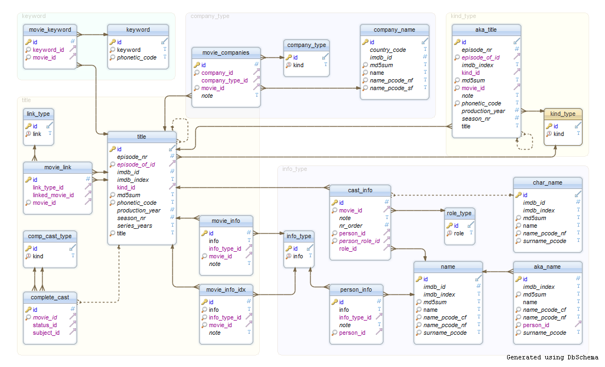
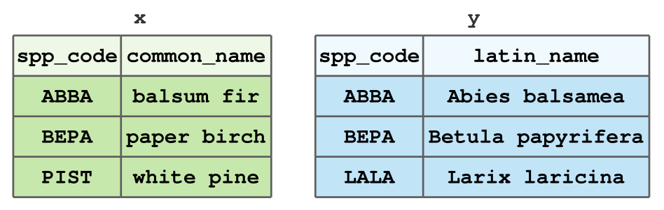
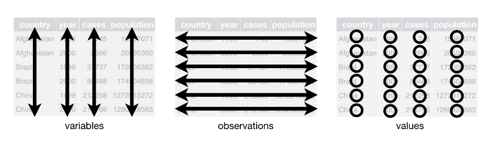

```{r}
#| include: false
#| warning: false
#| message: false

knitr::opts_chunk$set(echo = TRUE, warning = FALSE, message = FALSE,
                      fig.retina = 3, fig.align = 'center',
                      fig.asp = 0.75, fig.width = 8)
library(knitr)
library(tidyverse)
# 
# options(htmltools.preserve.raw = FALSE)
theme_update(text = element_text(size = 20))
```

::::: columns
::: {.column .center width="60%"}
{width="90%"}
:::

::: {.column .center width="40%"}
<br>

[Joining and Reshaping Data]{.custom-title}

<br> <br> 

[Grayson White]{.custom-subtitle}

[Math 241 <br> Week 4 \| Spring 2026]{.custom-subtitle}
:::
:::::

------------------------------------------------------------------------

## Announcements

::: {.nonincremental}

* Problem Set 2 is due **tomorrow** at 9am on Gradescope and Github!

:::


------------------------------------------------------------------------


## Week 4 Goals

:::: {.columns}

::: {.column width='50%' .nonincremental .fragment}

**Mon Lecture**

* Different types of data in `R`
    - atomic and generic vectors
    - subsetting objects
    
* Talk more about logical statements

* More practice with `dplyr` verbs and data wrangling

:::

::: {.column width='50%' .nonincremental .fragment}

**Wed Lecture**

* Joining multiple data frames
* "Tidy" data
* Reshaping data frames


:::

::::

------------------------------------------------------------------------


## First: Coding Style

> "Good coding style is like correct punctuation: you can manage without it, butitsuremakesthingseasiertoread." -- The Tidyverse Style Guide

<br>

<br>

::: {.fragment}

```{r, eval=FALSE}
messy4324 <-select(dataset,thing1,thing2)%>%filter(thing1=="uncool")
```

:::

<br>

<br>

::: {.fragment}

```{r, eval=FALSE}
clean <- select(dataset, thing1, thing2) %>%
  filter(thing1 == "uncool")
```

:::


------------------------------------------------------------------------

## Coding Style

* Part of writing **easily** reproducible code.

* Lots of reasonable coding styles.

* Important piece is **consistency** across all coders on a project.

* Some suggestions:
    + Use spaces liberally.
    + Let `R` help you with the proper indenting.
    + Think carefully about names.

* Check out the [Tidyverse Style Guide](https://style.tidyverse.org/index.html).


------------------------------------------------------------------------

## A cautionary tale: `tibble`()s vs. `data.frame`()s


-   Tibbles are a special type of data frame that come with the `tidyverse`
-   They have nicer printing behavior, and, as mentioned briefly last class, a different subsetting behavior.
-   Let's look at an example:

::: {.fragment}

```{r}
library(tidyverse)
boop <- data.frame(x = 1:3, y = c("cat", "dog", "bird"))
beep <- tibble(x = 1:3, y = c("cat", "dog", "bird"))
```

:::


:::: {.columns .fragment}

::: {.column width="50%"}

```{r}
boop
```


:::

::: {.column width="50%"}

```{r}
beep
```


:::

::::


------------------------------------------------------------------------

## A cautionary tale: `tibble`()s vs. `data.frame`()s


:::: {.columns}

::: {.column width="50%"}

```{r}
boop[2]
class(boop[2])
```


:::

::: {.column width="50%"}

```{r}
beep[2]
class(beep[2])
```


:::

::::

<br>

:::: {.columns .fragment}

::: {.column width="50%"}

```{r}
boop[1, 2]
class(boop[1, 2])
```


:::

::: {.column width="50%"}

```{r}
beep[1, 2]
class(beep[1, 2])
```


:::

::::


<br>

:::: {.columns .fragment}

::: {.column width="50%"}

```{r}
boop[[1, 2]]
```


:::

::: {.column width="50%"}

```{r}
beep[[1, 2]]
```


:::

::::


------------------------------------------------------------------------

## A cautionary tale: `tibble`()s vs. `data.frame`()s

-   `tibble()`s have subsetting behavior that is consistent with `list()`s
-   And even though `data.frame()`s are lists, they do not have this consistent behavior
-   This is frustrating! Be careful. 

------------------------------------------------------------------------

## Relational Data

:::: {.columns}

::: {.column width='50%'}

* Most organizations that have a fair amount of data don't store that data in a **single** table.
    + Think Google, Facebook, LinkedIn, ...

* Instead, they use a **relational database**: collection of linkable tables that are linked together by **keys**.


::: {.fragment}

```{r, echo=FALSE, out.width="100%", fig.align='left'}

```

:::

:::

::: {.column width='50%'}

* Typically use a SQL server for storing and managing that data.

* We are going to learn to how to join relational data in `R` using `dplyr`.
    + Towards the end of the semester, we'll learn some SQL. It is very similar to `dplyr`. 
    
:::

::::


------------------------------------------------------------------------


## Data Joins in `R`

Today, we'll look at a few ways to join the following tables `x` and `y`:

{fig-align='center'}

-   Small dataset of tree types for illustrative purposes. 
-   In Problem Set 3, you'll get good experience joining larger datasets. 


------------------------------------------------------------------------

## Motivating example: forest inventory


-   It is common in forestry, and in particular forest inventory, to have **multiple data frames** where data are stored due to a variety of factors.
-   In order to perform most statistical analyses, you must have the necessary data in **one data frame**.
-   Example: the US Forest Service, Forest Inventory & Analysis stores plot-level, tree-level, subplot-level, ... data in one database. Researchers must combine these data into a singular table to do analyses. 


------------------------------------------------------------------------

## Types of Data Joins

The `dplyr` package, which is part of the `tidyverse`, includes functions for two general types of joins:

-   *Mutating joins*, which combine the **columns** of data frames `x` and `y`, and
-   *Filtering joins*, which match the **rows** of data frames `x` and `y`.

::: {.fragment}

Think of how `mutate()` adds columns to a data frame, while `filter()` removes rows.

:::

------------------------------------------------------------------------

## Example Data

For the following examples of data joins, we will use the data frames from the first slide. We can load this data into `R`:

```{r, echo = TRUE}
library(tidyverse)
x <- data.frame(spp_code = c("ABBA", "BEPA", "PIST"),
                common_name = c("balsum fir", "paper birch", "white pine"))

y <- data.frame(spp_code = c("ABBA", "BEPA", "LALA"),
                latin_name = c("Abies balsamea", 
                               "Betula papyrifera",
                               "Larix laricina"))
```

------------------------------------------------------------------------


## Mutating Joins

`dplyr` contains four mutating joins:

1.  `left_join(x, y)` keeps all rows of `x`, but if a row in `y` does not match to `x`, an `NA` is assigned to that row in the new columns.
2.  `right_join(x, y)` is equivalent to `left_join(y, x)`, except for column order.\
3.  `inner_join(x, y)` keeps only the rows matched between `x` and `y`.
4.  `full_join(x, y)` keeps all rows of both `x` and `y`.

------------------------------------------------------------------------

## Examples: Mutating Joins

Recall our example data

```{r, echo = TRUE}
x
y
```

------------------------------------------------------------------------

## `left_join()`

```{r, echo = TRUE, message = TRUE}
left_join(x, y)
```

------------------------------------------------------------------------

## `left_join()`

```{r, echo = TRUE, message = TRUE}
left_join(x, y)
```

But what's that message about?

```         
"Joining with `by = join_by(spp_code)`"
```

------------------------------------------------------------------------


## We need to specify a *key* `r emo::ji("key")`

A *key* is can just be thought of the name(s) of the column(s) you're joining by. In the `left_join()` from the last slide, `R` assumed we were joining by the column `spp_code` since both `x` and `y` have a column with that name.

- Keys are important, especially when the columns you are joining by have different names, or you are joining by multiple columns.

------------------------------------------------------------------------

## `left_join()`, with a `r emo::ji("key")`

```{r, echo = TRUE, message = TRUE}
left_join(x, y, by = "spp_code")
```

-   Notice that we specify this key with the `by` argument. This is the same for all joins in `dplyr`.

------------------------------------------------------------------------

## `right_join()`

```{r, echo = TRUE, message = TRUE}
right_join(y, x, by = "spp_code")
```

------------------------------------------------------------------------

## `right_join()`

```{r, echo = TRUE, message = TRUE}
right_join(y, x, by = "spp_code")
```

Notice that this is the same as our previous `left_join()`.

What happens if we try switching the order of `x` and `y`?

```{r, output = FALSE, echo = TRUE}
right_join(x, y, by = "spp_code")
```

------------------------------------------------------------------------

## `right_join()`

```{r, echo = TRUE, message = TRUE}
right_join(y, x, by = "spp_code")
```

Notice that this is the same as our previous `left_join()`.

What happens if we try switching the order of `x` and `y`?

```{r, echo = TRUE}
right_join(x, y, by = "spp_code")
```

------------------------------------------------------------------------

## `inner_join()`

How many rows will the output have?

```{r, echo = TRUE, output = FALSE}
inner_join(x, y, by = "spp_code")
```


------------------------------------------------------------------------

## `inner_join()`

How many rows will the output have?

```{r, echo = TRUE}
inner_join(x, y, by = "spp_code")
```

Why is this the result?


------------------------------------------------------------------------

## `full_join()`

How many rows will the output have?

```{r, echo = TRUE, output = FALSE}
full_join(x, y, by = "spp_code")
```

------------------------------------------------------------------------


## `full_join()`

How many rows will the output have?

```{r, echo = TRUE}
full_join(x, y, by = "spp_code")
```

Why is this the result?


------------------------------------------------------------------------

## Filtering Joins

`dplyr` contains two filtering joins:

1.  `semi_join(x, y)` keeps all the rows in `x` that have a match in `y`.
2.  `anti_join(x, y)` removes all the rows in `x` that have a match in `y`.

::: {.fragment}

**Note**: Unlike mutating joins, filtering joins do not add any columns to the data.

:::

------------------------------------------------------------------------

## `semi_join()`

How many rows will this `semi_join` return? How many columns?

```{r, output = F, echo = T}
semi_join(x, y, by = "spp_code")
```

------------------------------------------------------------------------

## `semi_join()`

How many rows will this `semi_join` return? How many columns?

```{r, echo = TRUE}
semi_join(x, y, by = "spp_code")
```

------------------------------------------------------------------------

## `semi_join()`

What about this `semi_join`? Will it be the same as `semi_join(x, y)`?

```{r, echo = T, output = F}
semi_join(y, x, by = "spp_code")
```

------------------------------------------------------------------------

## `semi_join()`

What about this `semi_join`? Will it be the same as `semi_join(x, y)`?

```{r, echo = TRUE}
semi_join(y, x, by = "spp_code")
```

------------------------------------------------------------------------

## `anti_join()`

Let's see what `anti_join` does:

```{r, echo = TRUE, output = F}
anti_join(x, y, by = "spp_code")
```

------------------------------------------------------------------------

## `anti_join()`

Let's see what `anti_join` does:

```{r, echo = TRUE, output = T}
anti_join(x, y, by = "spp_code")
```

Why do we get this output?

------------------------------------------------------------------------

## `anti_join()`

What happens if we switch the order of `x` and `y`?

```{r, echo = TRUE, output = F}
anti_join(y, x, by = "spp_code")
```

------------------------------------------------------------------------

## `anti_join()`

What happens if we switch the order of `x` and `y`?

```{r, echo = TRUE, output = T}
anti_join(y, x, by = "spp_code")
```

------------------------------------------------------------------------

## An Important Subtlety: Column Names

So far, we have joined `x` and `y` by the `spp_code` column.

But what if `y` had the same column named differently:

```{r, echo=T, output=T}
y <- y %>%
  rename(species_code = spp_code)
y
```

------------------------------------------------------------------------

## How Do We Join `x` and `y`?

```{r, output=T, echo=T, error = T}
left_join(x, y)
```

Looks like we need to specify `by` (our `r emo::ji("key")`)

------------------------------------------------------------------------

## How Do We Join `x` and `y`?

```{r, output=T, echo=T, error = T}
left_join(x, y)
```

Looks like we need to specify `by` (our `r emo::ji("key")`)

<br>


```{r, output=T, echo=T, error = T}
left_join(x, y, by = "spp_code")
```

Still not working!


------------------------------------------------------------------------

## How Do We Join `x` and `y`?

```{r, output=T, echo=T, error = T}
left_join(x, y)
```

Looks like we need to specify `by` (our `r emo::ji("key")`)

<br>

```{r, output=T, echo=T, error = T}
left_join(x, y, by = "spp_code")
```

Still not working!

<br>

```{r, output=T, echo=T}
left_join(x, y, by = c("spp_code" = "species_code"))
```


# Now: reshaping data 

------------------------------------------------------------------------


## Data Wrangling in the `tidyverse`

**Question**: Why do we need TWO different data wrangling packages in the `tidyverse`?

::: {.fragment}

**Question**: What does `dplyr` do?

:::


* Performs various data manipulation tasks, such as extracting and summarizing


::: {.fragment}

**Question**: So what is left for `tidyr` to do?

* Reshape data into different formats (e.g. long and wide)

:::

------------------------------------------------------------------------

## Key Idea: Reshape Data to a Tidy Data Format

> "Happy families are all alike; every unhappy family is unhappy in its own way." -- Leo Tolstoy

::: {.fragment}

> "Tidy datasets are all alike, but every messy dataset is messy in its own way." -- Hadley Wickham

:::

* By tidy, we don't mean neat.
* Tidy data satisfy rules that make it easy to work with the data.


------------------------------------------------------------------------

## Tidy Data Rules

```{r, out.width="80%", echo=FALSE}

```

* Each column is a single variable.

* Each row is a unique observation.

* Each value must have its own cell.

* See this [blog post](https://openscapes.org/blog/2020-10-12-tidy-data/) for a cute introduction to "tidy data".

------------------------------------------------------------------------

## Tidy Data

```{r}
x
```

------------------------------------------------------------------------

## Un-Tidy Data

The `face` dataset from [IFDAR](https://www.finley-lab.com/ifdar/overview#face):

```{r}
face <- read_csv("data/FACE_aspen_core_growth.csv") %>%
  select(Rep, Treat, Clone, ID = `ID #`,
        contains(as.character(2001:2005)) & contains("Height"))
glimpse(face)
```

-   Data on tree diameter measurements in a study assessing the effects of different gasses on tree growth. 


## FACE data


```{r}
face
```

::: {.nonincremental}

- What does a row represent? 

- What does a column represent? 

:::

## How do we make this data tidy? `r emo::ji("thinking")`

```{r}
face
```
::: incremental

-   Each row should represent a measurement for a given rep, treatment, clone, and ID. But currently, we have multiple measurements on the same row. 

-   Further, we have multiple columns for the "height" variable.

-   Not tidy! 

:::


## We need to pivot the data into a longer format! 

Enter, `pivot_longer()`. 

`pivot_longer()`, a function from `tidyr` takes four key arguments:

-   `.data`: the data you'd like to pivot, 
-   `cols`: the columns you'd like to pivot,
-   `names_to`: the new column that will be created which takes the column names from `cols` as values, and
-   `values_to`: the new column that will be created which takes the column values from `cols` as values.


## Why the long `face`?

```{r}
face_long <- face %>%
  pivot_longer(
    cols = c("2001_Height", "2002_Height", "2003_Height", 
             "2004_Height", "2005_Height"),
    names_to = "Year_Type",
    values_to = "Height_cm")
```


## Why the long `face`?

```{r}
#| code-line-numbers: 3,4|5|6|3,4
face_long <- face %>%
  pivot_longer(
    cols = c("2001_Height", "2002_Height", "2003_Height", 
             "2004_Height", "2005_Height"),
    names_to = "Year_Type",
    values_to = "Height_cm")
```

## Why the long `face`?

```{r}
#| code-line-numbers: "3"
face_long <- face %>%
  pivot_longer(
    cols = contains("Height"),
    names_to = "Year_Type",
    values_to = "Height_cm")
```

-   A cleaner way to select these columns is to use `dplyr`'s `contains()` function.

## Why the long `face`?

```{r}
face_long
```

-   To get tidy data! 

## Going (back) to wide data


-   Sometimes, we need to "widen" a dataset to get it into tidy format. 
-   For this example, we will just widen the `face_long` dataset back to its original form. 
-   `tidyr` has an aptly named function, `pivot_wider()`.
-   Key arguments of `pivot_wider()`:
    -   `.data`: the data frame to widen,
    -   `names_from`: the column that contains values which will be assigned as the new column names,
    -   `values_from`: the column that contains 


## Pivoting wider

```{r}
face_wide <- face_long %>%
  pivot_wider(names_from = "Year_Type", values_from = "Height_cm")

all_equal(face, face_wide)
```


-   This results in the same data frame that we started with! 


## Other useful `tidyr` functions

-   Sometimes, a column represents multiple variables (or only part of a variable!). 
-   So, `tidyr` has some functions for dealing with that, too:
-   `unite()` for pasteing column values together with specified separators,
-   The `separate_wider_*()` family: for splitting columns into multiple new columns:
    - `separate_wider_delim()`: separate by delimiter
    - `separate_wider_position()`: separate by position
    - `separate_wider_regex()`: separate by regular expression
  


## `unite()`: examples

```{r}
face_long
```


## `unite()`: examples

```{r}
face_long %>%
  unite(col = "Design", Rep, Treat, Clone, sep = "_")
```

## `unite()`: examples

```{r}
face_long_dot <- face_long %>%
  unite(col = "Design", Rep, Treat, Clone, sep = ".")
face_long_dot
```


## `separate_wider_delim()` example

```{r}
face_long_dot %>%
  separate_wider_delim(cols = "Design", 
                       delim = ".",
                       names = c("Rep", "Treat", "Clone"))
```

## Nice trick: remove unnecessary text

```{r}
head(face_long)
```

::: {.fragment}

```{r}
face_long %>%
  separate_wider_delim(cols = "Year_Type", 
                       delim = "_",
                       names = c("Year", NA)) 
```

:::


------------------------------------------------------------------------


### Next Week

::: {.nonincremental}

-   Spatial data in `R`
    
:::


    