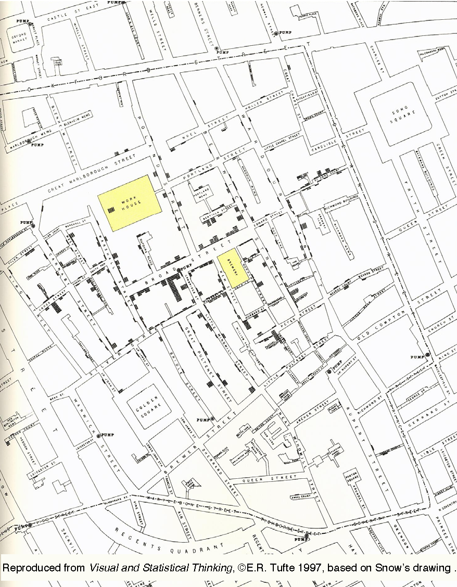
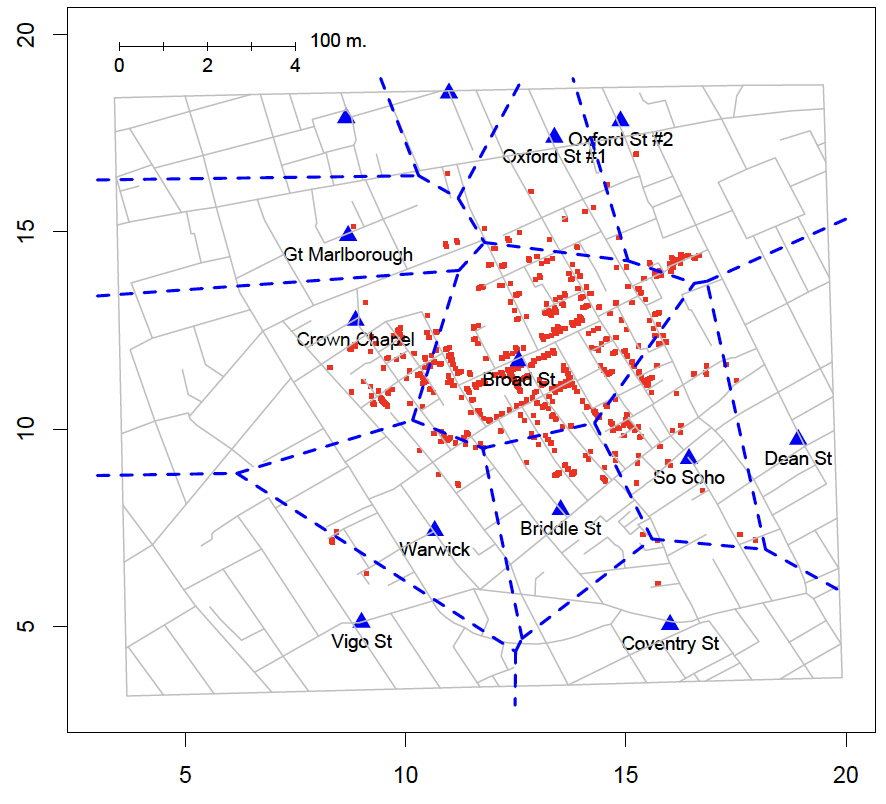
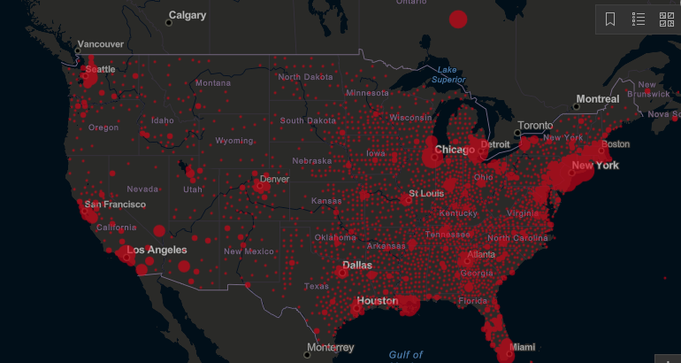
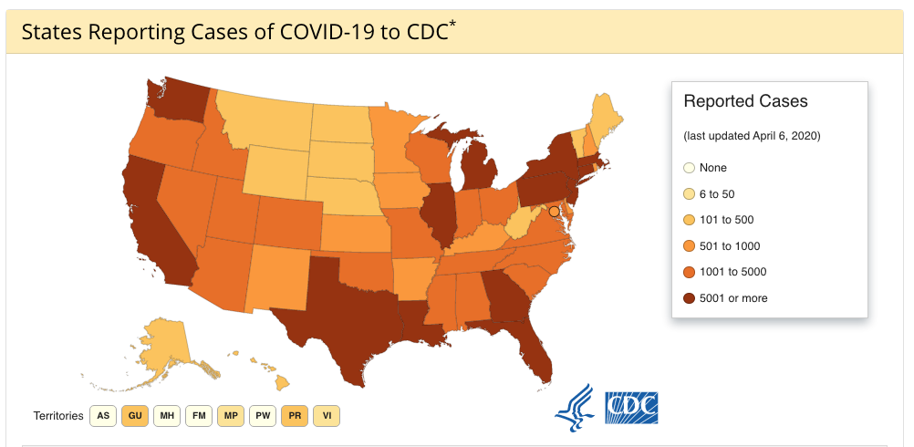
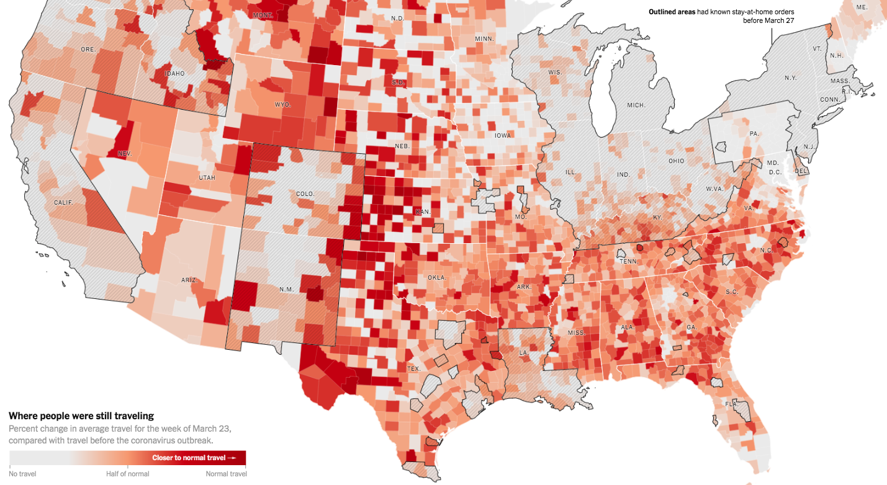
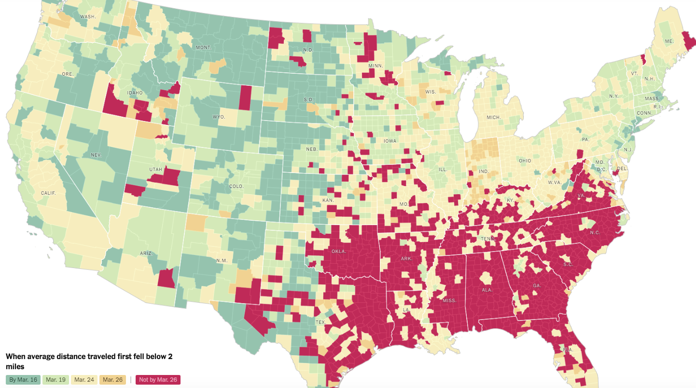
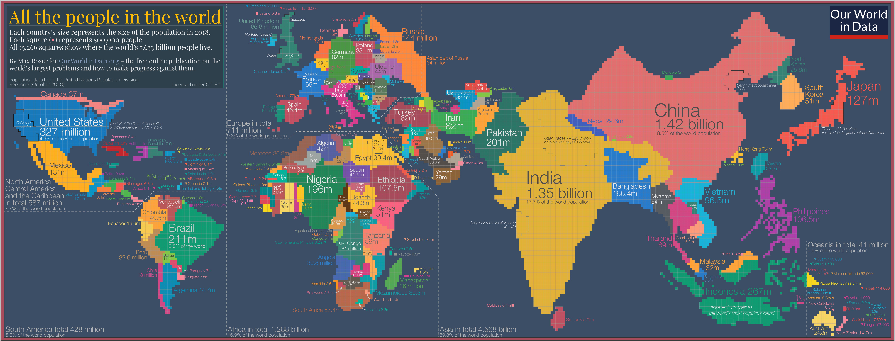
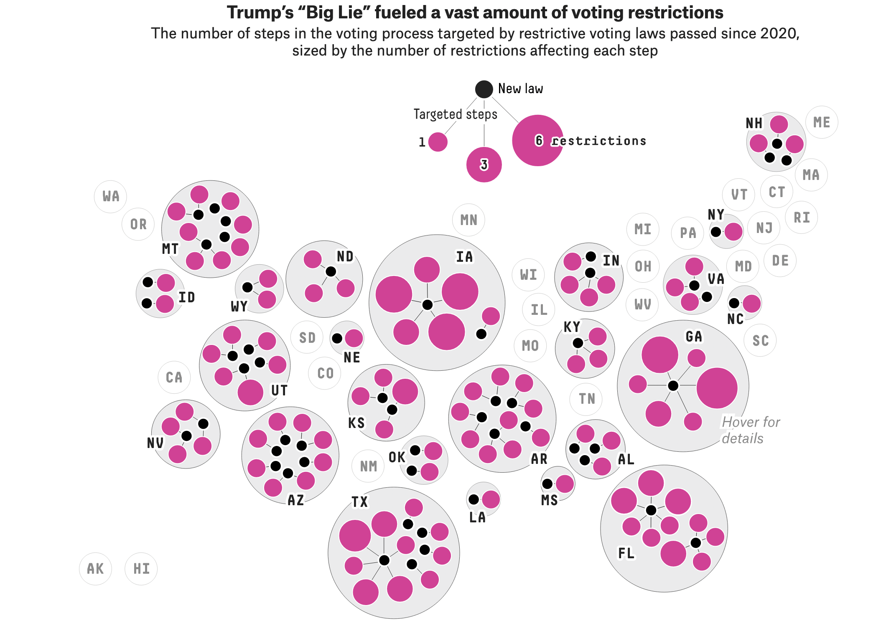
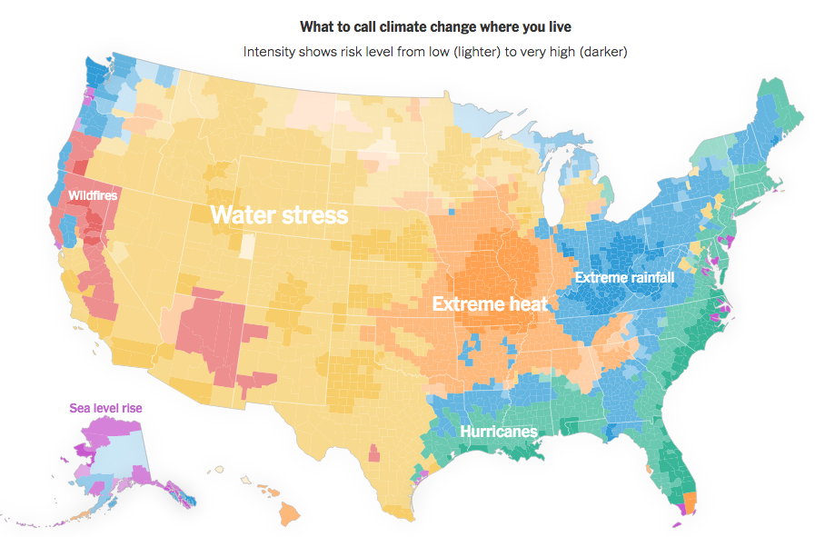
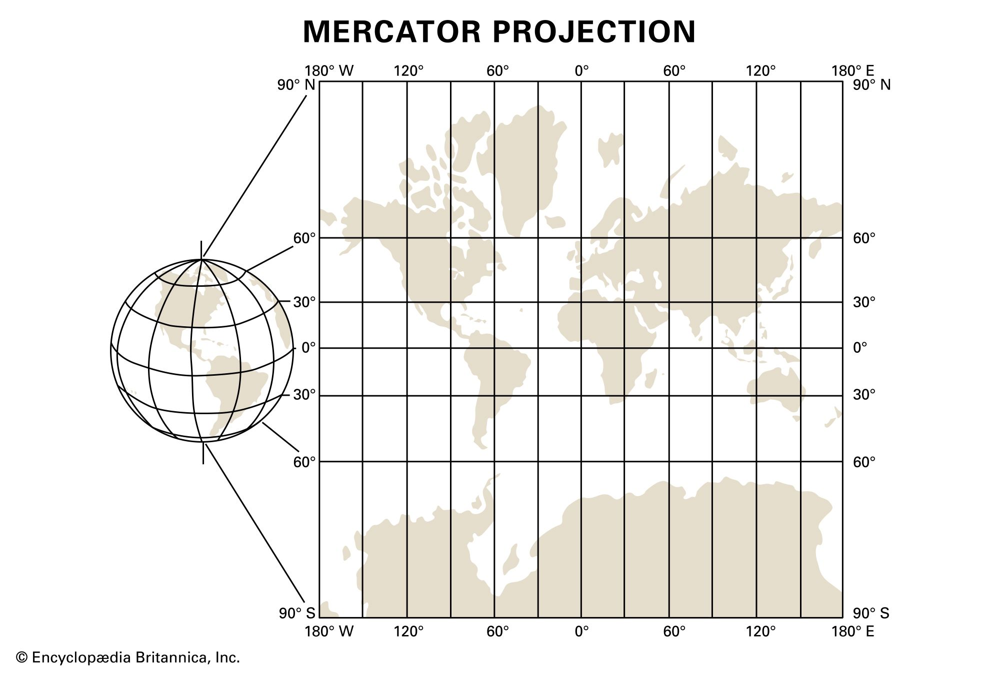

```{r}
#| include: false
#| warning: false
#| message: false

knitr::opts_chunk$set(echo = TRUE, warning = FALSE, message = FALSE,
                      fig.retina = 3, fig.align = 'center',
                      fig.asp = 0.75, fig.width = 8)
library(knitr)
library(tidyverse)
# 
# options(htmltools.preserve.raw = FALSE)
theme_update(text = element_text(size = 20))
```

::::: columns
::: {.column .center width="60%"}
{width="90%"}
:::

::: {.column .center width="40%"}
<br>

[Spatial Data and Mapping]{.custom-title}

<br> <br> 

[Grayson White]{.custom-subtitle}

[Stat 241 <br> Week 5 \| Fall 2026]{.custom-subtitle}
:::
:::::


------------------------------------------------------------------------


## Week 5 Goals

:::: {.columns}

::: {.column width='50%' .nonincremental .fragment}

**Mon Lecture**

* Introduction to spatial data
    - point data
    - polygon data
    
* Static and interactive maps with point and polygon data
    - base layers (almost as good as merino)
    - coordinate reference systems / projections
    - popups and additional context
    - static graphs with `sf` and `ggplot2`
    - interactive graphs with `leaflet`

:::

::: {.column width='50%' .nonincremental .fragment}

**Wed Lecture**

* Geospatial computations
    - distance
    - spatial joins

* Raster data
    - what is it? 
    - extracting values by polygons


:::

::::


------------------------------------------------------------------------


### Spatial Data

* Data that is linked to the physical world.


* **Example**: Crash data in Portland from Problem Sets 2 and 3!

* Visualizing these data on a map (or map-like graph) is a great way to add useful context!

::: {.fragment}

Focus on creating the following types of maps:

:::

:::: {.columns}

::: {.column width='50%' .fragment}

* Point maps

* Choropleth maps

* Cartograms

:::

::: {.column width='50%' .fragment}

* Hexbin maps (cartogram heatmaps)

* Interactive maps

* Raster maps (Wednesday)


:::

::::


------------------------------------------------------------------------

### Spatial Data Example: Cholera Outbreak in 1854

:::: {.columns}

::: {.column width='60%'}

The most famous early analysis of geospatial data was done by physician John Snow in 1854.

::: {.fragment}

Cholera outbreaks were common in 19th century London

- *believed* to be an airborne disease caused by breathing foul air

:::

::: {.fragment}

**Outbreak in 1854:** over 600 deaths in Soho, London

- John Snow collects data, thinks *contaminated water* is the cause

- At the time water was provided by competing private firms *from water pumps*

- Snow recorded locations of (i) deaths and (ii) water pumps

:::

:::

::: {.column width='40%'}

```{r, echo=FALSE, out.width='100%'}

```

:::

::::

------------------------------------------------------------------------

### A simple visual model (Tobler 1994):

:::: {.columns}

::: {.column width='50%' .nonincremental}

This figure:

- **Red Dots:** Cholera cases

- **Blue Triangles:** Pumps

- **Blue Lines:** Closest pump is contained in each section

<br>

**Q:** What pattern do you notice?

**Q:** What are some possible explanations for the "outliers"? (deaths that don't match up with the pattern)

:::

::: {.column width='50%'}

```{r, echo=FALSE, out.width='90%'}

```

:::

::::

::: {.fragment}

**Conclusion**: Visualizing spatial data can help us see key patterns

:::

------------------------------------------------------------------------

### Static Maps

```{r, out.width="80%", echo=FALSE}

```

Source: [JHU](https://coronavirus.jhu.edu/map.html)

------------------------------------------------------------------------

### Choropleth Maps

Source: [The Guardian](https://www.theguardian.com/us-news/2021/feb/18/us-vaccine-distribution-tracker-by-state)


```{r, out.width="50%", echo=FALSE, fig.align='center'}
knitr::include_graphics("img/vaccine_rates.png")
```


------------------------------------------------------------------------

### Choropleth Maps

```{r, out.width="80%", echo=FALSE}

```

Source: [CDC](https://www.cdc.gov/coronavirus/2019-ncov/cases-updates/cases-in-us.html)

------------------------------------------------------------------------

### Choropleth Maps

```{r, out.width="70%", echo=FALSE}

```

Source: [NYtimes.com](https://www.nytimes.com/interactive/2020/04/02/us/coronavirus-social-distancing.html)

------------------------------------------------------------------------

### Choropleth Maps

```{r, out.width="70%", echo=FALSE}

```

Source: [NYtimes.com](https://www.nytimes.com/interactive/2020/04/02/us/coronavirus-social-distancing.html)

------------------------------------------------------------------------

### Cartogram

```{r, out.width="90%", echo=FALSE}

```

Source: [Our World in Data](https://ourworldindata.org/world-population-cartogram)

------------------------------------------------------------------------

### "Hex"bin Maps

```{r, out.width="60%", echo=FALSE}

```

Source: [FiveThirtyEight](https://web.archive.org/web/20220704044408/https://projects.fivethirtyeight.com/voting-restrictions-by-state/)

------------------------------------------------------------------------

### Interactive Maps

```{r, out.width="70%", echo=FALSE}

```

Source: [NYTimes](https://www.nytimes.com/2020/10/15/learning/whats-going-on-in-this-graph-climate-threats.html)

------------------------------------------------------------------------

## Spatial Data Structures

* Often stored in special data structures
    + Ex: Shapefile(s)
    + Consist of geometric objects like points, lines, and polygons

::: {.fragment .nonincremental}

* Visualizing Spatial Data
    + Need to draw the map
    + Add metadata on top of the map
        + Color in regions
        + Dots

:::

------------------------------------------------------------------------

### Let's begin with data from the `forested` R package

```{r}
library(forested)
data(forested)
glimpse(forested)
```


------------------------------------------------------------------------


### What we've done so far:

:::: {.columns}

::: {.column width='50%'}

```{r}
ggplot(forested, aes(x = lon, 
                     y = lat,
                     color = forested)) + 
  geom_point(size = 0.5) + 
  scale_color_manual(
    values = c("forestgreen", "goldenrod3")
    )
```

:::

::: {.column width='50%'}

- x-axis: longitude, y-axis: latitude
- No projection
- No base layer
- Let's improve it!

:::

::::

------------------------------------------------------------------------

### Projections

:::: {.columns}

::: {.column width='50%'}




:::

::: {.column width='50%'}

- We live on a globe. 
- We like to create maps on flat pages. 
- We have to decide how to map things on a globe to a flat page. 
- Enter, projections. 

:::

::::

------------------------------------------------------------------------

### Simple Features Maps

* We'd often like to take spatial data that comes in the lat-long format given in the `forested` package and convert it to a format that accounts for the projection.

* Often use the "simple features" standard produced by the Open Geospatial Consortium
    + R package: `sf` handles this type of data
    + Within `ggplot2`, `geom_sf()` and `coord_sf()` work with `sf`
    
* In reality, this is the lat-long data, but encoded in a way that preserves projection information. 


------------------------------------------------------------------------

### Making `forested` spatial

`sf` R package: **s**imple **f**eatures.

`sf` objects contain projection information and allow us to plot spatial data more accurately. 

```{r}
class(forested)
library(sf)
forested_sf <- forested %>%
  st_as_sf(coords = c("lon", "lat"), # columns in df that correspond to x and y coordinates
           crs = "EPSG:4269") # the projection the coordinates are in
class(forested_sf)
```

------------------------------------------------------------------------

### Making `forested` spatial

```{r}
glimpse(forested_sf)
```

- No longer has `lon` or `lat` columns.
- Has a `geometry` column
    - This is a special type of column. Contains location and projection information. 
  
------------------------------------------------------------------------

### Plotting `forested_sf`

:::: {.columns}

::: {.column width='50%'}

```{r}
ggplot(forested_sf, aes(color = forested)) +
  geom_sf(size = 0.5) + 
  scale_color_manual(values = c("forestgreen", "goldenrod3"))
```

:::


::: {.column width='50%' .fragment}


```{r}
ggplot(forested, aes(x = lon, y = lat, color = forested)) + 
  geom_point(size = 0.5) + 
  scale_color_manual(values = c("forestgreen", "goldenrod3"))
```

:::

::::

- Preserves relative distances, rather than just plotting on the x/y plane. 

------------------------------------------------------------------------

### Plotting `forested_sf`


```{r}
ggplot(forested_sf, aes(color = forested)) +
  geom_sf(size = 0.5) + 
  scale_color_manual(values = c("forestgreen", "goldenrod3"))
```

- Implicitly, `geom_sf()` looks for a geometry column to set its "geometry" aesthetic to.

- How can we add a base layer? 


------------------------------------------------------------------------


### Polygon Maps

:::: {.columns}

::: {.column width='50%'}

* Want to draw various boundaries
    + EXs: Countries, states, counties, etc

* polygon = closed area including the boundaries making up the area

:::

::: {.column width='50%'}

```{r, echo=FALSE}
api_key <- "ff47b8f510c3db70501a7463b61e1298db1db97d"
library(tidycensus)
options(tigris_use_cache = TRUE)
wa <- get_acs(state = "WA",  geography = "county",
              variables = "B19013_001",
              geometry = TRUE, key = api_key) 
ggplot(wa) +
  geom_sf()
```

:::

::::

------------------------------------------------------------------------

### [`tidycensus`](https://walkerke.github.io/tidycensus/articles/spatial-data.html)

* Data from the US Census or American Community Survey
    + Comes in simple features format (using `tigris`)
    + Need to obtain an [API key](https://api.census.gov/data/key_signup.html)

```{r, echo=FALSE}
api_key <- "ff47b8f510c3db70501a7463b61e1298db1db97d"
```

::: {.fragment}

```{r, eval=FALSE}
api_key <- "insert key"
```

```{r}
library(tidycensus)
options(tigris_use_cache = TRUE)
wa <- get_acs(state = "WA",  geography = "county",
              variables = "B19013_001",
              geometry = TRUE, key = api_key) 
```

:::


------------------------------------------------------------------------


### What is the structure of `wa`? 

```{r}
class(wa)
head(wa$geometry)
```

* Row for each polygon
* `geometry` contains the polygon object (borders of the county)

::: {.fragment}

### Compared to `forested_sf`

```{r}
head(forested_sf$geometry)
```

:::

* Row for each point, `geometry` contains the point object (center of the plot)


------------------------------------------------------------------------


### Adding a base layer to our original map

```{r}
#| out-width: '70%'
ggplot() +
  geom_sf(data = wa) + 
  geom_sf(data = forested_sf, aes(color = forested), size = 0.2) + 
  scale_color_manual(values = c("forestgreen", "goldenrod3"))
```

------------------------------------------------------------------------

### What if we'd like to map the proportion of forested plots in each county in WA? 

```{r}
forested_props <- forested %>%
  group_by(county) %>%
  summarize(prop_forested = mean(forested == "Yes"))

forested_props
```

- Want to make a **chloropleth** map. 


------------------------------------------------------------------------

### Need to join with `wa`... `r emo::ji("thinking")`

```{r}
head(forested_props)
head(wa)
```

- Want `by = c("county" = "NAME")`. Why won't this work??


------------------------------------------------------------------------

### Solution: use the `stringr` package!

```{r}
wa <- wa %>%
  mutate(short_name = str_replace_all(NAME, 
                                      pattern = " County, Washington",
                                      replacement = ""))
head(wa$short_name)
```

<br>

::: {.fragment}

```{r}
#| output-location: column
# join
left_join(forested_props,
          wa,
          by = c("county" = "short_name")) %>% 
  # make R remember this is an sf object 
  # (R keeps the class of the primary dataset)
  st_as_sf() %>% 
  ggplot(aes(fill = prop_forested)) + 
  geom_sf() 
```


:::

------------------------------------------------------------------------


### Some mapping suggestions

```{r}
wa <- wa %>%
  mutate(short_name = str_replace_all(NAME, 
                                      pattern = " County, Washington",
                                      replacement = ""))
head(wa$short_name)
```

<br>


```{r}
#| output-location: column
# join
left_join(forested_props,
          wa,
          by = c("county" = "short_name")) %>% 
  # make R remember this is an sf object 
  # (R keeps the class of the primary dataset)
  st_as_sf() %>% 
  ggplot(aes(fill = prop_forested)) + 
  geom_sf() + 
  scale_fill_distiller(type = "seq", 
                       palette = "Greens", 
                       direction = 1) +
  labs(title = "Proportion of forested FIA plots in each county of Washington",
       fill = "") +
  theme_void() +
  theme(legend.position = "right",
        legend.key.height = unit(0.9, "in"))
```


------------------------------------------------------------------------


### Back to [`tidycensus`](https://walkerke.github.io/tidycensus/articles/spatial-data.html)

Recall our call to get county polygons:

```{r, echo=FALSE}
api_key <- "ff47b8f510c3db70501a7463b61e1298db1db97d"
```

```{r, eval=FALSE}
api_key <- "insert key"
```

```{r}
library(tidycensus)
options(tigris_use_cache = TRUE)
wa <- get_acs(state = "WA",  geography = "county",
              variables = "B19013_001",
              geometry = TRUE, key = api_key) 
```

- What is going on with `variables = "B19013_001"`? 

------------------------------------------------------------------------

### Back to [`tidycensus`](https://walkerke.github.io/tidycensus/articles/spatial-data.html)

B19013_001 = Median Household Income

```{r}
vars <- load_variables(2021, "acs5", cache = FALSE)
vars
```

------------------------------------------------------------------------

### Choropleth Map Showing Median Household Income

```{r}
#| output-location: column
ggplot(data = wa, 
       mapping = 
         aes(geometry = geometry,
             fill = estimate)) + 
  geom_sf() +
  scale_fill_distiller(
   name = "Median \nHousehold \nIncome",
   direction = 1, type = "seq", palette = 4) +
  theme_void()
```

------------------------------------------------------------------------

### Choropleth Map

```{r}
#| output-location: column
ggplot(data = wa, 
       mapping = 
         aes(geometry = geometry,
             fill = estimate)) + 
  geom_sf() +
  geom_sf_label(aes(label = NAME)) +
  scale_fill_distiller(
   name = "Median \nHousehold \nIncome",
   direction = 1, type = "seq", palette = 4) +
  theme_void()
```

* How should we modify the code if we don't want the labels to be colored differently?

------------------------------------------------------------------------

### Choropleth Map

```{r}
#| output-location: column
ggplot(data = wa, 
       mapping = 
         aes(geometry = geometry)) + 
  geom_sf(mapping = 
            aes(fill = estimate)) +
  geom_sf_label(aes(label = NAME)) +
  scale_fill_distiller(
   name = "Median \nHousehold \nIncome",
   direction = 1, type = "seq", palette = 4) +
  theme_void()
```

* Fixes for crowding?

------------------------------------------------------------------------

### Again, use the `stringr` Package

This time, for fun, a different function for the same result:

:::: columns

::: {.column width='50%'}

Last time:

```{r}
wa <- wa %>%
  mutate(short_name = 
           str_replace_all(
             NAME, 
             pattern = " County, Washington", 
             replacement = ""
            )
         )
head(wa$short_name)
```

:::

::: {.column width='50%' .fragment}

This time:

```{r}
wa <- wa %>%
  mutate(short_name = 
           str_sub(NAME,
                   start = 1, 
                   end = -20))
head(wa$short_name)
```


:::

::::

------------------------------------------------------------------------

### Choropleth Map

```{r}
#| output-location: column
ggplot(data = wa, 
       mapping = 
         aes(geometry = geometry)) + 
  geom_sf(mapping = 
            aes(fill = estimate)) +
  geom_sf_label(aes(label = short_name)) +
  scale_fill_distiller(
   name = "Median \nHousehold \nIncome",
   direction = 1, type = "seq", palette = 4) +
  theme_void()
```

* Fixes for crowding?

------------------------------------------------------------------------

### Choropleth Map

```{r}
#| output-location: column
#devtools::install_github("yutannihilation/ggsflabel")
library(ggsflabel)
ggplot(data = wa, 
       mapping = 
         aes(geometry = geometry)) + 
  geom_sf(mapping = 
            aes(fill = estimate)) +
  geom_sf_label_repel(aes(label = short_name),
                      force = 40) +
  scale_fill_distiller(
   name = "Median \nHousehold \nIncome",
   direction = 1, type = "seq", palette = 4) +
  theme_void()
```

------------------------------------------------------------------------

### Can Add Information from Another Dataset

```{r}
wa_cities <- data_frame(city = c("Seattle", "Bellingham", 
                                 "Walla Walla", "Spokane"),
                        lat = c(47.6061, 48.7519, 46.0646, 47.6580),
                        long = c(-122.3328, -122.4787,
                                 -118.3430, -117.4235))
wa_cities
```

------------------------------------------------------------------------

### Can Add Information from Another Dataset


```{r}
#| output-location: column
library(ggrepel)
ggplot() + 
  geom_sf(data = wa,
          mapping = 
            aes(geometry = geometry, 
                fill = estimate)) +
  geom_point(data = wa_cities,
             mapping = aes(x = long,
                           y = lat),
             shape = 21,
             fill = "white",
             color = "black") +
  geom_label_repel(data = wa_cities,
                   mapping = 
                     aes(x = long,
                         y = lat,
                         label = city)) +
  scale_fill_distiller(
   name = "Median \nHousehold \nIncome",
   direction = 1, type = "seq", palette = 4) +
  theme_void()
```

------------------------------------------------------------------------

### Coordinate Reference System

Census defaults to NAD 1983 (EPSG: 4269) for its coordinate reference system

```{r}
wa
```

------------------------------------------------------------------------

### Coordinate Reference System

Census defaults to NAD 1983 (EPSG: 4269) for its coordinate reference system

```{r}
library(sf)
st_crs(wa)
```

------------------------------------------------------------------------

### Coordinate Reference System

::: {.nonincremental}

* You can choose a more local coordinate reference system depending on your map extent. 

* Projection EPSG:32610 = UTM zone 10N, good for the PNW. 

:::

::: {.fragment}

```{r}
wa_transf <- sf::st_transform(wa, "EPSG:32610")
wa_transf
```

:::

------------------------------------------------------------------------

### Different CRS -> Different Looking Map

:::: columns

::: {.column width='50%'}

```{r}
ggplot() + 
  geom_sf(data = wa,
          mapping = 
            aes(geometry = geometry, 
                fill = estimate)) +
  coord_sf() +
  scale_fill_distiller(
   name = "Median \nHousehold \nIncome",
   direction = 1, type = "seq", palette = 4) +
  theme_void()
```

:::

::: {.column width='50%' .fragment}

```{r}
ggplot() + 
  geom_sf(data = wa_transf,
          mapping = 
            aes(geometry = geometry, 
                fill = estimate)) +
  coord_sf() +
  scale_fill_distiller(
   name = "Median \nHousehold \nIncome",
   direction = 1, type = "seq", palette = 4) +
  theme_void()
```

:::

::::

------------------------------------------------------------------------

### Cartograms

Scale polygons by a variable. 

```{r}
#| output-location: column-fragment
library(cartogram)
wa_carto <- cartogram_cont(wa_transf, 
                           weight = "estimate")

ggplot() + 
  geom_sf(data = wa_carto,
          mapping = 
            aes(geometry = geometry, 
                fill = estimate)) +
  coord_sf() +
  scale_fill_distiller(
   name = "Median \nHousehold \nIncome",
   direction = 1, type = "seq", palette = 4) +
  theme_void()
```

------------------------------------------------------------------------

### Cartograms

Often scaled by a population size type variable.

```{r}
#| eval: false
wa_pop <- get_decennial(state = "WA", geography = "county",
                        variables = "P001001", year = 2010, api_key = api_key)

wa_transf_pop <- inner_join(wa_transf, wa_pop, by = c("GEOID" = "GEOID"))
wa_transf_pop
```

------------------------------------------------------------------------

### Cartograms

Often scaled by a population size type variable.

```{r}
#| output-location: column-fragment
#| eval: false

wa_transf_pop <- wa_transf_pop %>%
  rename(population_size = value, 
         median_income = estimate)

wa_transf_pop <- cartogram_cont(
  wa_transf_pop,                                 
  weight = "population_size"
  )

ggplot() + 
  geom_sf(data = wa_transf_pop,
          mapping = 
            aes(geometry = geometry, 
                fill = median_income)) +
  coord_sf() +
  scale_fill_distiller(
   name = "Median \nHousehold \nIncome",
   direction = 1, type = "seq", palette = 4) +
  theme_void()
```


------------------------------------------------------------------------

### New Dataset

State Level Information

```{r}
library(Lock5Data)
glimpse(USStates)
```

------------------------------------------------------------------------

### Hexbin Maps

```{r, error=TRUE}
#install.packages("statebins")
library(statebins)
statebins(state_data = USStates,
          state_col = "State",
          value_col = "Insured",
          ggplot2_scale_function =
            ggplot2::scale_fill_distiller,
          direction = 1, type = "seq", palette = 4,
          round = TRUE) +
  theme_statebins()
```

::: {.fragment}

```{r}
class(USStates$State)
USStates <- mutate(USStates,
                   State = as.character(State))
```

:::

------------------------------------------------------------------------

### Hexbin Maps

```{r}
#| output-location: column-fragment
library(statebins)
statebins(state_data = USStates,
          state_col = "State",
          value_col = "Insured",
          ggplot2_scale_function =
            ggplot2::scale_fill_distiller,
          direction = 1, type = "seq", palette = 4,
          round = TRUE) +
  theme_statebins()
```

------------------------------------------------------------------------

### New data: volcano eruptions

```{r}
Eruptions <- read_csv("data/GVP_Eruption_Results.csv")
select(Eruptions, VolcanoName, StartYear, Latitude, Longitude) %>%
  glimpse()

library(rnaturalearth)
world <- rnaturalearth::countries110
world
```

------------------------------------------------------------------------

### Static Maps

```{r}
#| output-location: column-fragment

Eruptions_sf <- Eruptions %>%
  st_as_sf(coords = c("Longitude",
                      "Latitude"),
           crs = "EPSG:4269")

ggplot(data = world) +
  geom_sf(fill = "azure",
          color = "olivedrab4") +
  geom_sf(data = Eruptions_sf,
          color = "orange3",
          size = 0.5) +
  theme_void()
```

- What if we want to zoom in? 

------------------------------------------------------------------------

### Alluetian Islands

```{r}
eruption_count <- count(Eruptions,
                        VolcanoName, 
                        Latitude,
                        Longitude) %>%
  filter(Longitude > -172.164,
         Longitude < -157.1507,
         Latitude > 50.977,
         Latitude < 59.5617) %>%
  arrange(desc(n)) %>%
  st_as_sf(coords = c("Longitude",
                      "Latitude"),
           crs = "EPSG:4269")
eruption_count
```


------------------------------------------------------------------------

### Alluetian Islands

```{r}
#| output-location: column-fragment
ggplot() +
  geom_sf(data = world, 
          fill = "azure",
          color = "olivedrab4") +
  geom_sf(data = eruption_count,
          mapping = aes(size = n),
          color = "orange3") +
  coord_sf(xlim = c(-172.164, -157.1507),
           ylim = c(50.977, 59.5617))
```

- Not a great base layer... 
- What about dynamic zooming and clickable labels? 


------------------------------------------------------------------------

### Interactive Maps with `leaflet`

:::: {.columns}

::: {.column width='50%'}

* Syntax similar to `ggplot2` and `dplyr`
* Interactive zooming
* Embed interactive map into Quarto documents (HTML output)
* Can take lat/lon **or** geometry/`sf` objects

:::

::: {.column width='50%'}

```{r, echo=FALSE}
library(leaflet)
leaflet() %>%
  addTiles() %>%
  addCircleMarkers(data = eruption_count, radius = ~sqrt(n), 
                   stroke = FALSE, fillOpacity = 0.9, color = "orange")
```

:::

::::

------------------------------------------------------------------------

### Interactive Maps with `leaflet`

:::: {.columns}

::: {.column width='50%'}

```{r, eval=FALSE}
library(leaflet)
leaflet() %>%
  addTiles() %>%
  addCircleMarkers(data = eruption_count,
                   radius = ~sqrt(n), 
                   stroke = FALSE,
                   fillOpacity = 0.9,
                   color = "orange")
```

:::

::: {.column width='50%'}

* First Layer: `leaflet()`
    + Creates the map widget

* Second layer: `addTiles()`
    + Creates a base map using [OpenStreetMap](https://www.openstreetmap.org)

* Additional layers: `addMarkers()`, `addPolygons()`

:::

::::

------------------------------------------------------------------------

### Interactive Maps with `leaflet`


```{r}
#| output-location: column
library(leaflet)
leaflet() %>%
  addTiles() %>%
  addCircleMarkers(data = eruption_count,
                   radius = ~sqrt(n), 
                   stroke = FALSE,
                   fillOpacity = 0.9)
```


------------------------------------------------------------------------

### Clusters


```{r}
#| output-location: column
leaflet() %>%
  setView(lng = -160, lat = 55, zoom = 6) %>%
  addTiles() %>%
  addCircleMarkers(data = eruption_count, 
                   clusterOptions =
                     markerClusterOptions())
```


------------------------------------------------------------------------

### Zooming Constraints


```{r}
#| output-location: column
leaflet(options = 
          leafletOptions(minZoom = 3,
                         maxZoom = 7)) %>%
  addTiles() %>%
  addCircleMarkers(data = eruption_count,
                   radius = ~sqrt(n))
```


------------------------------------------------------------------------

### Other Markers


```{r}
#| output-location: column
leaflet() %>% 
  setView(lng = -160, lat = 55, zoom = 4) %>%
  addTiles() %>%
  addMarkers(data = eruption_count, 
             label = ~as.character(n))
```


------------------------------------------------------------------------

### Custom Icons

```{r}
volcano  <- makeIcon(
  iconUrl = "https://raw.githubusercontent.com/Reed-Data-Science/Reed-Data-Science.github.io/refs/heads/main/slides/img/volcano.png",
  iconWidth = 20, iconHeight = 20)
volcano
```

------------------------------------------------------------------------

### Custom Icons


```{r}
#| output-location: column
leaflet() %>% 
  setView(lng = -160, lat = 55, zoom = 4) %>%
  addTiles() %>%
  addMarkers(data = eruption_count, 
             label = ~as.character(n),
             icon = volcano)
```


------------------------------------------------------------------------

### Pop-Ups

```{r}
content <- paste("<b>",
                 eruption_count$VolcanoName, 
                 "</b></br>",
                 "Number of eruptions:",
                 eruption_count$n)
content
```

------------------------------------------------------------------------

### Pop-Ups

```{r}
#| output-location: column
leaflet() %>% 
  setView(lng = -160, lat = 55, zoom = 4) %>%
  addTiles() %>%
  addMarkers(data = eruption_count, 
             popup = content,
             icon = volcano)
```


------------------------------------------------------------------------

### Other Tiles


```{r}
#| output-location: column
library(leaflet.extras)
leaflet() %>% 
  setView(lng = -122.6308,
          lat = 45.4811,
          zoom = 15) %>%     
  addProviderTiles(providers$Stadia.StamenWatercolor)
```


------------------------------------------------------------------------

### Other Tiles


```{r}
#| output-location: column
leaflet() %>% 
  setView(lng = -122.6308,
          lat = 45.4811,
          zoom = 15) %>%     
 addProviderTiles(
   providers$CartoDB.Positron) %>%
  addMiniMap()
```


------------------------------------------------------------------------

### Other Tiles


```{r}
#| output-location: column
leaflet() %>% 
  setView(lng = -122.6308,
          lat = 45.4811,
          zoom = 3) %>%     
  addProviderTiles(
    "NASAGIBS.ViirsEarthAtNight2012") 
```


------------------------------------------------------------------------

### Interactive Choropleth Map

```{r}
pal <- colorNumeric(palette = "GnBu",
                    domain = wa$estimate,
                    reverse = FALSE)
pal(wa$estimate)
```

------------------------------------------------------------------------

### Interactive Choropleth Map


```{r}
#| output-location: column
#| warning: true
wa %>%
  leaflet() %>%
  addTiles() %>%
  addPolygons(popup = ~NAME,
              color = ~pal(estimate),
              stroke = FALSE,
              fillOpacity = 0.9) 
```

* Throws a warning about the projection

------------------------------------------------------------------------

### Interactive Choropleth Map


```{r}
#| output-location: column
wa %>%
  sf::st_transform(crs = "EPSG:4326") %>%    
  leaflet() %>%
  addTiles() %>%
  addPolygons(popup = ~NAME,
              color = ~pal(estimate),
              stroke = FALSE,
              fillOpacity = 0.9) 
```


------------------------------------------------------------------------

### Interactive Choropleth Map


```{r}
#| output-location: column
wa %>%
  sf::st_transform(crs = "EPSG:4326") %>%  
  leaflet() %>%
  addTiles() %>%
  addPolygons(popup = ~NAME,
              color = ~pal(estimate),
              stroke = FALSE,
              fillOpacity = 0.9) %>%
  addLegend("bottomright", pal = pal, 
            values = ~estimate,
            title = "Median Income",
            opacity = 1)
```

------------------------------------------------------------------------

### Next time

::: {.nonincremental}

- More spatial data: 
    - Spatial computations
    - Raster data

:::


::: {.fragment}

### Next Week

::: {.nonincremental}

-   Learn to develop `shiny` dashboards
    - for increased user interactivity!
    - (and for Project 1)

:::

:::


::: {.fragment .nonincremental}

### Resources for learning more about spatial data

* Dig into wrangling spatial data with the `sf` package: [https://github.com/rstudio/cheatsheets/blob/master/sf.pdf](https://github.com/rstudio/cheatsheets/blob/master/sf.pdf)

* All things spatial data in R: [https://geocompr.robinlovelace.net/index.html](https://geocompr.robinlovelace.net/index.html)

:::

    
