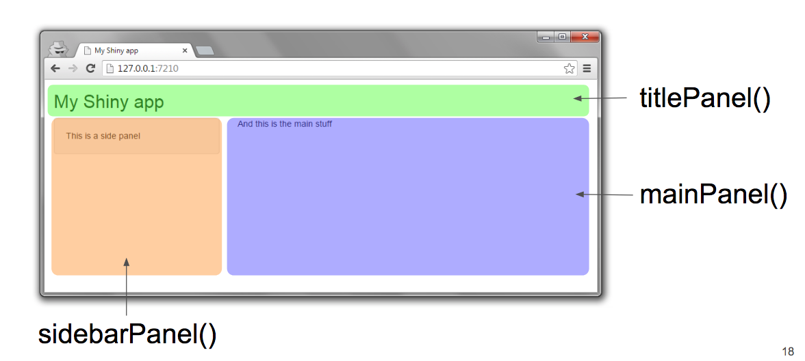

```{r}
#| include: false
#| warning: false
#| message: false

knitr::opts_chunk$set(echo = TRUE, warning = FALSE, message = FALSE,
                      fig.retina = 3, fig.align = 'center',
                      fig.asp = 0.75, fig.width = 8)
library(knitr)
library(tidyverse)
# 
# options(htmltools.preserve.raw = FALSE)
theme_update(text = element_text(size = 20))
```

::::: columns
::: {.column .center width="60%"}
{width="90%"}
:::

::: {.column .center width="40%"}
<br>

[`shiny` Applications]{.custom-title}

<br> <br> <br> <br> <br>

[Grayson White]{.custom-subtitle}

[Stat 241 <br> Week 6 \| Fall 2026]{.custom-subtitle}
:::
:::::


------------------------------------------------------------------------


## Week 6 Goals

:::: {.columns}

::: {.column width='50%' .nonincremental .fragment}

**Mon Lecture**

* Introduction to `shiny` applications
* Get Project 1 group assignments


:::

::: {.column width='50%' .nonincremental .fragment}

**Wed Lecture**

* `shiny` dashboards with Quarto
* Get all the details about Project 1


:::

::::


------------------------------------------------------------------------

### Live Coding... Together

+ You are going to do some live coding with me.
    + If you miss a step, get stuck, or just need some help, raise your hand and Chris will come help, or type your question into the #in-class Slack channel.

* If you do miss anything:
    * I will post the app we create today on Github.

------------------------------------------------------------------------

## Interactivity with `shiny`

`shiny`: Framework for creating web applications

* We will go from R code in a script file to an interactive web page.

* Let's look at some examples!
    + [Forest Service](https://ncasi-shiny-tools.shinyapps.io/Counties/)
    + [Movie Explorer](https://shiny.rstudio.com/gallery/movie-explorer.html)
    + [Oregon Wastewater Treatment Plants](https://graysonwhite.shinyapps.io/oregon-wwtps/)
    + [The app we are going to create today](https://graysonwhite.shinyapps.io/my_first_app/)

------------------------------------------------------------------------

## Main Components

In the example apps, 

- what features of the apps did we interact with? And,
- what changed based on our selections?


:::: .columns

::: {.fragment .nonincremental .column}

* **Inputs**: What user manipulates
    + Text
    + Sliders
    + Dropdown menus
    + Action buttons
    
:::

::: {.fragment .nonincremental .column}

* **Output**: What changes based on user's selections
    + Graphs
    + Maps
    + Tables
    + Text

:::

::::

::: {.fragment .nonincremental}

* Use **reactive programming**
    + Update outputs when inputs change

:::

------------------------------------------------------------------------

## Main Components

* **UI**: User interface
    + Defines how your app **looks**

::: {.fragment}

* **Server function**
    + Defines how your app **works**

:::

::: {.fragment}

```{r, eval=FALSE}
library(shiny)

# User interface
ui <- fluidPage()

# Server function
server <- function(input, output){}

# Creates app
shinyApp(ui = ui, server = server)
```

:::

------------------------------------------------------------------------

## App Building Workflow

Starting a New App:

* For today and Wednesday, clone the repo "Reed-Data-Science/learn-shiny"
* Within the "ShinyApps" folder, there is a folder called "my_first_app".
* You will see a script file (not a .qmd) called "app.r" within the "my_first_app" folder.
* Following this folder and file structure is best practice for creating `shiny` apps. 

:::: .columns

::: {.fragment .column}

**Revising an App:**

* Write some code in "app.r".
* Click "Run App".
    + Notice what happens in the console.
* Experiment with the app.
* Stop the app.
* Repeat.

:::

::: {.fragment .column}

**Good habit early on:**

* Write static code somewhere (in a .r or .qmd) before you start the app.
    + Modify to be reactive when put in "app.r".

::: {.fragment}

**Let's practice together!**

:::

:::

::::

------------------------------------------------------------------------

### First App

We want to create an app where someone can type in names from Stat 241 and see how their popularity compares.

* First write some static code that works.

```{r}
#| echo: false
#| eval: false
library(babynames)

names241 <- read_csv("data/Background Survey for Math 241_ Data Science (Responses) - Form Responses 1.csv") %>%
  pull(`First Name`)

names241 <- sort(unique(c(names241, "Alex", "Kaishin", "Tyler", "Brendan", 'Emily', 'Kenta', 'Eddie'))[-16])

names241 <- sort(c(names241, "Chris", "Grayson"))

babynames241 <- babynames::babynames %>% filter(name %in% names241)

write_csv("data/babynames_math241.csv", x = babynames241)
```

::: {.fragment}

```{r}
#| output-location: column
library(tidyverse)

# Smaller dataset
babynames241 <- read_csv("data/babynames_math241.csv")

names <- c("Grayson", "Chris")

dat_names <- babynames241 %>%
  group_by(year, name) %>%
  summarize(n = sum(n)) %>%
  group_by(year) %>%
  mutate(prop = n/sum(n)) %>%
  filter(name %in% names) 

tail(dat_names)
```

:::

------------------------------------------------------------------------

### First App

We want to create an app where someone can type in names from Stat 241 (or any names) and see how their popularity compares.


:::: .columns

::: {.column}

* **Input**:
    - Text
* **Output**:
    - Graph
    
:::

::: {.fragment .column}

```{r}
ggplot(data = dat_names,
       mapping = aes(x = year,
                     y = prop,
                     color = name)) +
  geom_line(linewidth = 2)
```

:::

::::

------------------------------------------------------------------------

## Base Components

```{r, eval=FALSE}
library(shiny)

# User interface
ui <- fluidPage()

# Server function
server <- function(input, output){}

# Creates app
shinyApp(ui = ui, server = server)
```

------------------------------------------------------------------------

## Libraries

* Make sure to put all the **necessary libraries** at the top of your app.R file.
    + **Don't** include calls to `install.packages()`, though. 
    + Like qmds, our apps must be **self-contained**.
    
::: {.fragment}

```{r}
# Libraries
library(shiny)
library(tidyverse)
```

:::

------------------------------------------------------------------------

## Setting up the Room

:::: {.columns}

::: {.column width='50%'}

The `ui` functions generate HTML code for the web page.

* `fluidPage()`: Layout function
* `titlePanel()`: Adds title
* `sidebarLayout()`: Splits app into side panel and main panel.

:::

::: {.column width='50%'}

```{r, echo=FALSE, out.width="100%"}

```

Source: Dean Attali

:::

::::

------------------------------------------------------------------------

## Setting up the Room

:::: {.columns}

::: {.column width='50%' .nonincremental}

The `ui` functions generate HTML code for the web page.

* `fluidPage()`: Layout function
* `titlePanel()`: Adds title
* `sidebarLayout()`: Splits app into side panel and main panel.

:::

::: {.column width='50%'}

```{r}
# User interface
ui <- fluidPage(
  titlePanel(title = "Insert title"),
  sidebarLayout(
    sidebarPanel(
    ),
    mainPanel(
    )
  )
)
```

:::

::::

------------------------------------------------------------------------

## Input: Text

`textInput()`: Allow user to interact with the app by providing text

::: {.fragment}

```{r}
# User interface
ui <- fluidPage(
  titlePanel("Which Stat 241 name is most popular?"),
  sidebarLayout(
    sidebarPanel(
      # Create a text input widget
      textInput(inputId = "names",
               label = "Enter Stat 241 names here",
               value = "Grayson"),
      p("Put a single space between the names.")
    ),
    mainPanel(
      
    )
  )
)
```

:::

------------------------------------------------------------------------

## Output: Graph

`plotOutput()`: Tells Shiny where to render the graph.

::: {.fragment}

```{r}
# User interface
ui <- fluidPage(
  titlePanel("Which Stat 241 name is most popular?"),
  sidebarLayout(
    sidebarPanel(
      # Create a text input widget
      textInput(inputId = "names",
               label = "Enter Stat 241 names here",
               value = "Grayson"),
      p("Put a single space between the names.")
    ),
    mainPanel(
      plotOutput(outputId = "graph")
    )
  )
)
```

:::

------------------------------------------------------------------------

## UI Controls

All these UI functions are just a way for us to generate HTML (without needing to learn HTML).

::: {.fragment}

```{r}
textInput(inputId = "names",
          label = "Enter Stat 241 names here",
          value = "Grayson")
```

:::

------------------------------------------------------------------------

## Bringing it to Life!

Two important arguments for the `server()` function:

* `input` is a named `list` that controls the input widgets.
    + EX: `input$names` controls the `textInput()` widget
* `output` is a named `list` that controls the objects to display.
    + EX: `output$graph`
    
::: {.fragment}

```{r}
server <- function(input, output){
}
```

:::

------------------------------------------------------------------------

## Bringing it to Life!

```{r}
server <- function(input, output){
  
  output$graph <- renderPlot({
    dat_names <- babynames %>%
      group_by(year, name) %>%
      summarize(n = sum(n)) %>%
      group_by(year) %>%
      mutate(prop = n/sum(n)) %>%
      filter(name %in% c(unlist(str_split(input$names, " "))),
             year >= 1980) 
    
    ggplot(data = dat_names, 
           mapping = aes(x = year, y = prop,color = name)) +
  geom_line(linewidth = 2)
  })
}
```

------------------------------------------------------------------------

## First App!

* Let's make sure we got all the pieces into our app and then interact with it.

* Questions?

------------------------------------------------------------------------

### Let's Add One More Output

```{r, eval=FALSE}
server <- function(input, output){
  
  output$graph <- renderPlot({
 ...
  
    })
  
  output$table <-  renderDT({
    
    dat_names <- babynames %>%
      group_by(year, name) %>%
      summarize(n = sum(n)) %>%
      group_by(year) %>%
      mutate(prop = n/sum(n)) %>%
      filter(name %in% c(unlist(str_split(input$names, " "))),
             year >= 1980) 
    
    dat_names %>%
      group_by(name) %>%
      summarize(count = sum(n)) %>%
      arrange(desc(count))
  })
  
}
```

------------------------------------------------------------------------

#### Need to load the `DT` package

```{r}
library(DT)
```

### And also place it in the UI

```{r}
# User interface
ui <- fluidPage(
  titlePanel("Which Stat 241 name is most popular?"),
  sidebarLayout(
    sidebarPanel(
      # Create a text input widget
      textInput(inputId = "names",
               label = "Enter Stat 241 names here",
               value = "Grayson"),
      p("Put a single space between the names.")
    ),
    mainPanel(
      plotOutput(outputId = "graph"),
      DTOutput(outputId = "table")
    )
  )
)
```


------------------------------------------------------------------------

## Reactive Expressions

* How is our code redundant?

* Let's try to fix it!

* Can't create a static data frame.
    + Need it to be **reactive**!

------------------------------------------------------------------------

## Reactive Expressions

```{r, eval=FALSE}
  dat_names <- reactive({ 
    babynames %>%
    group_by(year, name) %>%
    summarize(n = sum(n)) %>%
    group_by(year) %>%
    mutate(prop = n/sum(n)) %>%
    filter(name %in% c(unlist(str_split(input$names, " "))),
           year >= 1980) 
  })
```

<br>

::: {.fragment}

Call reactive expressions like you would a function with no arguments.

```{r, eval=FALSE}
  output$graph <- renderPlot({
    ggplot(data = dat_names(), 
           mapping = aes(x = year, y = prop, color = name)) +
      geom_line(linewidth = 2)
  })
```

:::

------------------------------------------------------------------------

## Detour: [Clean Up the DataTable](https://shiny.rstudio.com/articles/datatables.html)

```{r, eval=FALSE}
  dat_names_agg <- reactive({ 
    dat_names() %>%
      group_by(name) %>%
      summarize(count = sum(n)) %>%
      arrange(desc(count))
  })
    
  output$table <-  renderDT({
     datatable(dat_names_agg(), 
              options = list(paging = FALSE,
                             searching = FALSE,
                             orderClasses = TRUE))

  })
```

------------------------------------------------------------------------

### [Input Widgets](https://shiny.rstudio.com/gallery/widget-gallery.html)

* Let's practice with:
    + `radioButtons()`
    + `sliderInput()`
    + `actionButton()` + `eventReactive()`
    + `selectizeInput()`

------------------------------------------------------------------------

## `radioButtons()`

::: {.nonincremental}

* Within the `ui`:

:::

::: {.fragment}

```{r, eval=FALSE}
radioButtons(
  inputId = "variable",
  label = "Variable of Interest",
  choices = c("n", "prop"),
  selected = "prop"
)
```

:::

<br>

::: {.nonincremental .fragment}

* Within the `server()` function:
    + Must handle the [tidy eval](https://mastering-shiny.org/action-tidy.html) issue

:::

::: {.fragment}

```{r, eval=FALSE}
  output$graph <- renderPlot({
    
    ggplot(data = dat_names(), 
         mapping = aes(x = year, y = .data[[input$variable]],
                       color = name)) +
      geom_line(linewidth = 2)
  })
```

:::

------------------------------------------------------------------------

## `sliderInput()`

::: {.nonincremental}

* Within the `ui`:

:::

::: {.fragment}

```{r, eval=FALSE}
sliderInput(
  "year_range",
  "Range of Years:",
  min = min(babynames$year),
  max = max(babynames$year),
  value = c(1980, 2010)
)
```

:::

<br>

::: {.nonincremental .fragment}

* Within the `server()` function:

:::

::: {.fragment}

```{r, eval=FALSE}
  dat_names <- reactive({ 
    babynames %>%
      group_by(year, name) %>%
      summarize(n = sum(n)) %>%
      group_by(year) %>%
      mutate(prop = n/sum(n)) %>%
      filter(name %in% c(unlist(str_split(input$names, " "))),
             year >= input$year_range[1], 
             year <= input$year_range[2]) 
  })
```

:::

------------------------------------------------------------------------

## `sliderInput()`

::: {.nonincremental}

* Within the `ui`:

```{r, eval=FALSE}
sliderInput(
  "year_range",
  "Range of Years:",
  min = min(babynames$year),
  max = max(babynames$year),
  value = c(1980, 2010),
  sep = ""
)
```

:::

------------------------------------------------------------------------

### Controlling the Timing of Evaluation: `actionButton()`

* This causes **all** input on the page to not send updates to the server until the button is pressed.

* Within the `ui`:

::: {.fragment}

```{r, eval=FALSE}
actionButton("update", "Update Results!")
```

:::

<br>

* Within the `server`:

::: {.fragment}

```{r, eval=FALSE}
  dat_names <- eventReactive(input$update, {
    babynames  %>%
      filter(name %in% c(unlist(str_split(input$names, " "))),
             year >= input$year_range[1], 
             year <= input$year_range[2])
  })
```

:::

* Why does the radio button still change the graph??

------------------------------------------------------------------------

### Controlling the Timing of Evaluation: `actionButton()`

```{r, eval=FALSE}
  dat_names <- eventReactive(input$update, {
    babynames  %>%
      filter(name %in% c(unlist(str_split(input$names, " "))),
             year >= input$year_range[1], 
             year <= input$year_range[2])  %>%
      mutate(y_var = .data[[input$variable]])
  })
  
  y_label <- eventReactive(input$update, input$variable)  

  output$graph <- renderPlot({
    ggplot(data = dat_names(), 
           mapping = aes(x = year, 
                         y = y_var,
                         color = name)) +
      geom_line(linewidth = 2) +
      labs(y = y_label())
  })
```

------------------------------------------------------------------------

## `selectizeInput()`

* Within the `ui`:

::: {.fragment}

```{r, eval=FALSE}
      selectizeInput(inputId = "names",
                label = "Enter Stat 241 names here",
                choices = NULL,
                multiple = TRUE)
```

:::

<br>

* Within the `server()` function:

::: {.fragment}

```{r, eval=FALSE}
server <- function(input, output, session){
  
  updateSelectizeInput(session, 'names', 
                       choices = unique(babynames$name), 
                       server = TRUE)
  
}
```

:::

------------------------------------------------------------------------

## Building Outputs


**Server-side:**

* Save the object with `output$___`.

* Use a `render___({})` function to create the object.
    + Look at [`shiny R` cheatsheet](https://raw.githubusercontent.com/rstudio/cheatsheets/main/shiny.pdf) for examples.

* Access inputs with `input$___`.

::: {.fragment}

**UI-side:**

:::

* Place output with `___Output()`.

------------------------------------------------------------------------

## Next Steps

**Troubleshooting common issues:**

* Must comma separate all the elements in the `ui`.
* But don't add a comma after the last element in the `ui`.

**Up Next on Wednesday**:

* Uploading apps to [www.shinyapps.io](https://www.shinyapps.io/)
* `shiny` with `leaflet` maps 
* Displaying the code in your app
* Modifying the layout and adding HTML components
* Quarto-based `shiny` dashboards
* More practice

