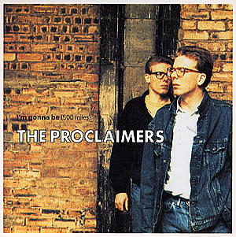

```{r}
#| include: false
#| warning: false
#| message: false

knitr::opts_chunk$set(echo = TRUE, warning = FALSE, message = FALSE,
                      fig.retina = 3, fig.align = 'center',
                      fig.asp = 0.75, fig.width = 8)
library(knitr)
library(tidyverse)
# 
# options(htmltools.preserve.raw = FALSE)
theme_update(text = element_text(size = 20))
```

::::: columns
::: {.column .center width="60%"}
{width="90%"}
:::

::: {.column .center width="40%"}
<br>

[Different Classes in `R`]{.custom-title}

<br> <br> <br> <br> <br>

[Grayson White]{.custom-subtitle}

[Stat 241 <br> Week 7 \| Fall 2026]{.custom-subtitle}
:::
:::::


------------------------------------------------------------------------


### Annoucements 

::: {.fragment .nonincremental}


- **Welcome** to the admitted students!!

:::

::: {.fragment .nonincremental}

- [DataFest 2026 @ Willamette](https://my.willamette.edu/site/computer-science/data-fest)
    - Great opportunity to meet folks and show off your data science skills! 
    
:::

::: {.fragment .nonincremental}

- Surveys
    - [General check-in (names/emails **NOT** collected)](https://forms.gle/2jMBRoWVqnZFbUFW7)
    - [Project 1 check-in (names/emails collected)](https://forms.gle/d1UKZRL521Vj9VoG6)

:::


------------------------------------------------------------------------

## Week 7 Goals

:::: {.columns}

::: {.column width='50%' .nonincremental .fragment}

**Mon Lecture**

* Learn more about strings, factors, dates, and times in `R`!


:::

::: {.column width='50%' .nonincremental .fragment}

**Wed Lecture**

* Project 1 work day


:::

::::


------------------------------------------------------------------------

### Project 1 Check-In

* If you haven't already, make sure to read over the "Tips for getting started" section of the Project 1 instructions.
* Everyone should have access to their project group repo.
* Make sure to come by office hours with questions or to talk out your plan for your dashboard!

------------------------------------------------------------------------

### Timeline

* **3/2**: Receive project groups released
* **3/4**: Receive project instructions and invite to your group's GitHub repo.
    + Please use your assigned Stat 241 GitHub repo for this project.
* **3/18 (noon)**: Post a working draft of your dashboard to [https://www.shinyapps.io/](shinyapps.io/)
    <!-- + Working draft must: -->
    <!--     + Make use of at least one real-world dataset. -->
    <!--     + Have at least one user input. -->
    <!--     + Have at least one reactive graph (or map) and at least one reactive table. -->
    <!--     + Have relevant text so that your peers can navigate around the dashboard independently. -->
    <!-- + Only one group member needs to post the group's app to shinyapps.io. -->
* **3/18 (noon)**: Post the link to the group's dashboard to [this spreadsheet](https://docs.google.com/spreadsheets/d/1syq0LKBqLVZDkp2qKqD1DGom_Rsmvvrn8s49BOqvzWw/edit?usp=sharing).
* **3/18 - 3/20**: Peer feedback period
    + Each person will provide feedback on the dashboards of **two** groups.
    + More guidance on providing feedback will be given in class that week.
    + Peer feedback is due 3/20 at 10pm.
* **4/3 10pm**: Link for the final version of dashboard should be added to [this spreadsheet](https://docs.google.com/spreadsheets/d/1syq0LKBqLVZDkp2qKqD1DGom_Rsmvvrn8s49BOqvzWw/edit?usp=sharing) and PDF of your data scientist's statement should be submitted on Gradescope.
* **4/5 10pm**: Group member feedback form due.

------------------------------------------------------------------------

### Projects and Git/GitHub

* Github Repo = `RStudio` Project / Positron folder

* This means you need to create a new `RStudio` project that is synced with your group's GitHub repo that I created.
    + Quick video tutorial available [here](https://drive.google.com/file/d/1Hb3SxZ808UkXTDOYsAf_CJk2FHfy8ldf/view?usp=sharing)


------------------------------------------------------------------------

### Workflow

Once your GitHub repo and RStudio project are synced, here's your workflow:

* **Pull** the most recent version of the repo from GitHub to your RStudio project.

* Do some work on your project in RStudio.

::: {.fragment .nonincremental}

* **Commit** that work.
    + Committing takes a snapshot of all the files in the project.
    + Look over the **Diff**: which shows what has changed since your last update.
    + Include a quick note, **Commit Message** to summarize the motivation for the changes.
    
:::

* **Push** your commit to GitHub from RStudio.

------------------------------------------------------------------------

### Git Collaboration: Merge conflicts

* What if my collaborators and I both make changes?
    + **Scenario**: Your collaborator makes changes to a file, commits, and pushes to GitHub. You also modify that file, commit and push.
    + **Result**: Your push will fail because there's a commit on GitHub that you don't have.
    + **Usual Solution**: Pull and *usually* git will merge their work nicely with yours. Then push. If that doesn't work, you have a **merge conflict**. Let's cross that bridge when we get there.

* How to avoid merge conflicts?
    + First, **always pull** when you are going to work on your project.
    + Then, **always commit and push** when you are done even if you made small changes.

------------------------------------------------------------------------

## Collaboration: Git Style

::: {.nonincremental}

* **Projects**: Can use to create to do lists and stay organized.

* **Issues**: Useful method to communicate with your group members.

* **Branches**: A tool for taking a detour from the main stream of development.

:::

------------------------------------------------------------------------

### Git Branches

* Branch = Detour from main stream of development.

::: {.fragment .nonincremental}

* Workflow:
    + Create a new branch.
    + Checkout (switch) to that branch.
    + Commit the work for that branch.
    + Merge it into the main branch.
        + Can also be done on GitHub via a Pull Request.
        
:::

* If you have Git experience or want to try out branches, check out [Ch 22 in Happy Git with R](https://happygitwithr.com/git-branches.html#git-branches).

* For novices, I recommend staying on the main branch.


# Now: dates and times in `R` with `lubridate`


```{r}
#| echo: false
#| out-width: '37%'
knitr::include_graphics("img/lubridate.png")
```


------------------------------------------------------------------------

### Why do we need to talk about dates and times?

**Question:** When did the crashes happen?

```{r}
#| output-location: column
library(tidyverse)
crashes <- read_csv("data/pdx_crash_2018_page1.csv")

crashes %>%
  count(CRASH_DT) %>%
  ggplot(mapping = 
           aes(x = CRASH_DT,
               y = n)) +
  geom_point()
```

------------------------------------------------------------------------

### Dates

```{r}
head(crashes$CRASH_DT)
class(crashes$CRASH_DT)
```

::: {.fragment}

What class should it be?

:::

------------------------------------------------------------------------

### Converting Strings to Dates

::: {.nonincremental}

* Identify the order of year, month, day, hour, minute, second

* Pick the `lubridate` function that replicates that order.

:::

::: {.fragment}

```{r}
class(crashes$CRASH_DT)
head(crashes$CRASH_DT)

```

:::

::: {.fragment}

```{r}
library(lubridate)

crashes <- crashes %>%
  mutate(crash_date_time = mdy_hms(CRASH_DT),
         crash_date = date(crash_date_time))

class(crashes$crash_date)
head(crashes$crash_date)
```

:::

------------------------------------------------------------------------

### Why do we need to talk about dates and times?

**Question:** When did the crashes happen?

```{r}
#| output-location: column
crashes %>%
  count(crash_date) %>%
  ggplot(mapping = 
           aes(x = crash_date,
               y = n)) +
  geom_point()
```

* Hard to see daily patterns. Switch time interval?

------------------------------------------------------------------------


### Why do we need to talk about dates and times?

**Question:** When did the crashes happen?

```{r}
#| output-location: column
crashes %>%
  mutate(month = month(crash_date, label = TRUE)) %>%
  count(month) %>%
  ggplot(mapping = 
           aes(x = month,
               y = n)) +
  geom_col() + 
  labs(title = "Number of car crashes per month",
       subtitle = "Portland, OR (2018)",
       x = "", y = "") + 
  theme_bw()
```

* Better! Chart junk?

------------------------------------------------------------------------

### Let's Look at [Portland's Biketown Data](https://www.biketownpdx.com/system-data)

All check-outs for July - August of 2017

```{r}
biketown <- read_csv("data/biketown.csv") %>%
  filter(Distance_Miles < 1000)

biketown_dt <- biketown %>%
  select(StartDate, StartTime, EndDate, EndTime, Distance_Miles,
         BikeID)

glimpse(biketown_dt)
```

------------------------------------------------------------------------

### Let's Look at [Portland's Biketown Data](https://www.biketownpdx.com/system-data)

::: {.nonincremental .fragment}

* Fix the class of the date columns.
* Create date-time columns.

:::

::: {.fragment}

```{r}
library(lubridate)
biketown_dt <- biketown_dt %>%
  mutate(StartDate = mdy(StartDate),
         EndDate = mdy(EndDate)) %>%
  mutate(StartDateTime = ymd_hms(paste(StartDate, StartTime, sep = " ")),
         EndDateTime = ymd_hms(paste(EndDate, EndTime, sep = " "))) 

glimpse(biketown_dt)
```

:::

------------------------------------------------------------------------

### Grabbing Components

```{r}
biketown_dt$StartDateTime[1000]

year(biketown_dt$StartDateTime[1000])

month(biketown_dt$StartDateTime[1000], label = TRUE)

day(biketown_dt$StartDateTime[1000])
```

------------------------------------------------------------------------

### Grabbing Components

```{r}
week(biketown_dt$StartDateTime[1000])

wday(biketown_dt$StartDateTime[1000], label = TRUE)

hour(biketown_dt$StartDateTime[1000])

minute(biketown_dt$StartDateTime[1000])
```

------------------------------------------------------------------------

### Grabbing Components

```{r}
#| output-location: column-fragment
ggplot(data = biketown_dt, 
       mapping = 
         aes(month(StartDateTime,
                   label = TRUE))) +
  geom_bar()
```

------------------------------------------------------------------------

### Grabbing Components

```{r}
#| output-location: column-fragment
ggplot(data = biketown_dt, 
       mapping = aes(wday(StartDateTime,
                          label = TRUE))) +
  geom_bar()
```

------------------------------------------------------------------------

### And if you are in R and want to know the current date/time:

```{r}
today()
now()
```

# Topic Shift!

## Factors with `forcats`

```{r, echo=FALSE, out.width='40%'}
knitr::include_graphics("img/forcats.png")
```

------------------------------------------------------------------------

### Motivation: Imposing Structure on Categorical Variables

```{r}
library(pdxTrees)
pdxTrees <- get_pdxTrees_parks()

five_most_common <- c("Douglas-Fir", "Norway Maple",
                      "Western Redcedar", "Northern Red Oak",
                      "Pin Oak")

pdxCommon <- pdxTrees %>%
  filter(Common_Name %in% five_most_common)
```

------------------------------------------------------------------------

### Motivation: Imposing Structure on Categorical Variables

```{r}
#| output-location: column
ggplot(data = pdxCommon,
       mapping = aes(x = Common_Name)) + 
  geom_bar() +
  coord_flip()
```

How might we want to restructure this graph?

------------------------------------------------------------------------

### Levels and Class

::: {.fragment .nonincremental}

* Why does `Common_Name` have no levels?

```{r}
levels(pdxCommon$Common_Name)
```

:::

::: {.fragment}

```{r}
class(pdxCommon$Common_Name)

pdxCommon <- mutate(pdxCommon, Common_Name = factor(Common_Name))

levels(pdxCommon$Common_Name)
class(pdxCommon$Common_Name)
```

* How is `R` deciding the order of the levels?

:::

------------------------------------------------------------------------

### What Are the levels/categories?

```{r}
fct_unique(pdxCommon$Common_Name)

unique(pdxCommon$Common_Name)
```

------------------------------------------------------------------------

### Reorder the Levels

```{r}
#| output-location: column
pdxCommon %>%
  mutate(Common_Name = 
           fct_infreq(Common_Name)) %>%
  ggplot(mapping = aes(Common_Name)) +
  geom_bar() +
  coord_flip()
```

+ Note: This code didn't permanently change the order in `pdxCommon`. **Why?**

+ How might we want to restructure this graph?

------------------------------------------------------------------------

### `rev`erse the Levels

```{r}
#| output-location: column
pdxCommon %>%
  mutate(Common_Name = 
           fct_infreq(Common_Name),
         Common_Name = 
           fct_rev(Common_Name)) %>%
  ggplot(mapping = aes(Common_Name)) +
  geom_bar() +
  coord_flip()
```


------------------------------------------------------------------------

### Or, If You Love the Pipe...

```{r}
#| output-location: column
pdxCommon %>%
  mutate(Common_Name = 
           fct_infreq(Common_Name) %>%
           fct_rev()) %>%
  ggplot(mapping = aes(Common_Name)) +
  geom_bar() +
  coord_flip()
```

------------------------------------------------------------------------

### Reorder the Levels

```{r}
#| output-location: column
pdxCommon %>%
  mutate(Common_Name = 
           fct_relevel(Common_Name, 
                       five_most_common)) %>%
  ggplot(mapping = aes(x = Common_Name)) + 
  geom_bar() +
  coord_flip()
```

* Can also relevel manually

------------------------------------------------------------------------

### Reorder the Levels

```{r}
#| output-location: column
pdxCommon %>%
  mutate(Common_Name = 
           fct_relevel(Common_Name,
                       "Norway Maple",
                       "Pin Oak")) %>%
  ggplot(mapping = aes(x = Common_Name)) + 
  geom_bar() +
  coord_flip()
```

* Or maybe I just want to bring one or two category to the front

------------------------------------------------------------------------

### What Have We Wrangled Here?

```{r}
DBH_by_name <- pdxCommon %>%
  group_by(Common_Name) %>%
  summarize(mean_DBH = mean(DBH),
            lb_DBH = mean_DBH - 1.96*sd(DBH)/sqrt(n()),
            ub_DBH = mean_DBH + 1.96*sd(DBH/sqrt(n()))) 
DBH_by_name
```

------------------------------------------------------------------------

### Reordering by Another Variable

```{r}
#| output-location: column
ggplot(data = DBH_by_name, 
      mapping = aes(y = mean_DBH,
                    x = Common_Name)) +
  geom_point() +
  geom_errorbar(mapping =
                  aes(ymin = lb_DBH,
                      ymax = ub_DBH),
                width = 0.4)
```

* How might we want to reorder `Common_Name`?

------------------------------------------------------------------------

### Reordering by Another Variable

```{r}
#| output-location: column
DBH_by_name %>%
  mutate(Common_Name =
           fct_reorder(Common_Name,
                       -mean_DBH)) %>%
  ggplot(mapping = aes(y = mean_DBH,
                       x = Common_Name)) +
  geom_point() +
  geom_errorbar(mapping =
                  aes(ymin = lb_DBH,
                      ymax = ub_DBH),
                width = 0.4)
```

------------------------------------------------------------------------

### Reordering by Other Variables

```{r}
#| output-location: column
ggplot(data = pdxCommon,
       mapping = 
         aes(x = DBH,
             y = Total_Annual_Services,
             color = Condition)) +
  geom_smooth()
```

* How might we want to reorder `Condition`?

------------------------------------------------------------------------

### Factors

Other useful functions in `forcats`:

* `fct_collapse()`: Collapse some levels together
* `fct_drop()`: Remove levels (useful after a `filter()`!)
* `fct_recode()`: Change names of levels

# And now:

## Strings with `stringr`!

```{r, echo=FALSE, out.width='40%'}
knitr::include_graphics("img/stringr.png")
```

------------------------------------------------------------------------

### Language

::: {.fragment}

**String**


```{r}
x <- "lemur"
```

:::

::: {.fragment}

**Character vector**


```{r}
x <- c("capybara", "lemur", "pigeon")
```

:::

::: {.fragment}

**Factor vector**


```{r}
x <- factor(x)
levels(x)
```

:::

------------------------------------------------------------------------

### String Manipulation with [Stringr](https://cran.r-project.org/web/packages/stringr/vignettes/stringr.html)

* Learn how to handle character vectors!
    + Character manipulation
    + Pattern matching

* Let's look at some of the functionalities of `stringr` using a character vector of song lyrics.

------------------------------------------------------------------------

### Our Toy Lyric

```{r}
lyric <- c("But I would walk 500 miles,",
              "And I would walk 500 more,",
              "Just to be the man who walks a 1000 miles,",
              "To fall down at your door")
lyric
```

* Song?
* Artist?

::: {.fragment}

```{r, echo=FALSE, out.width='20%'}

```

:::

------------------------------------------------------------------------

### String Length


```{r}
length(lyric)
```

::: {.fragment}

```{r}
library(stringr)
str_length(lyric)
```

:::

- Most `stringr` functions start with `str_`

------------------------------------------------------------------------

### Accessing and Replacing

```{r}
str_sub(string = lyric[1], start = 18, end = 20)
```

::: {.fragment}

```{r}
str_sub(string = lyric[1], start = 18, end = 20) <- "2"
```

:::

::: {.fragment}

```{r}
lyric
```

:::

------------------------------------------------------------------------

### Change Cases

```{r}
str_to_upper(lyric)
```

<br>

```{r}
str_to_title(lyric)
```

<br>

```{r}
str_to_lower(lyric)
```

------------------------------------------------------------------------

### Sorting

```{r}
str_sort(lyric)
```

------------------------------------------------------------------------

### Pattern Matching

* Learn to:
    + Detect pattern
    + Extract pattern
    + Replace pattern
    + Split pattern

------------------------------------------------------------------------

### Common Goal: Match a particular pattern

I want to match the pattern `500` from `lyric`.

```{r}
lyric
```

<br>

::: {.fragment}

```{r}
str_view_all(string = lyric, pattern = "500")
```

:::

<br>

::: {.fragment}

or:


```{r}
str_view(string = lyric, pattern = "500")
```

:::


------------------------------------------------------------------------

### Let's make it more general.

I want to locate all the numbers.

```{r}
lyric
```

<br>

::: {.fragment}

```{r}
str_view_all(lyric, "500|1000|2")
```

:::

------------------------------------------------------------------------

### Trivia Time!

Name the artist and song title for each of the following!

```{r}
lyrics <- c("But I would walk 500 miles",
            "Yeah, 360. When you're in the mirror, do you like what you see?", 
            "I have loved you for a 1000 years, I'll love you for a 1000 more",
            "Where 2 and 2 always makes a 5",
            "17-38, ay",
            "I'm so 3008, You so 2000 and late")
```

------------------------------------------------------------------------

### How should we modify the code to locate all the numbers from these lyrics of various songs?


```{r}
lyrics
```

```{r}
str_view_all(lyrics, "500|1000|2")
```

------------------------------------------------------------------------

### How should we modify the code to locate all the numbers from these lyrics of various songs?

```{r}
lyrics
```

```{r}
str_view_all(lyrics, "500|1000|2|360|5|17|38|3008|2000")
```

------------------------------------------------------------------------

### Need for More Sophisticated Pattern Matching

But now imagine you had a very long vector and you want to locate any number?

```{r, eval=FALSE}
str_view_all(lyrics, "1|2|3|4...")
```

* Not a good approach!

* Next time: **Regular Expressions**!

