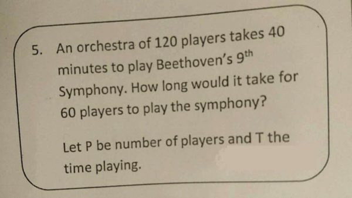
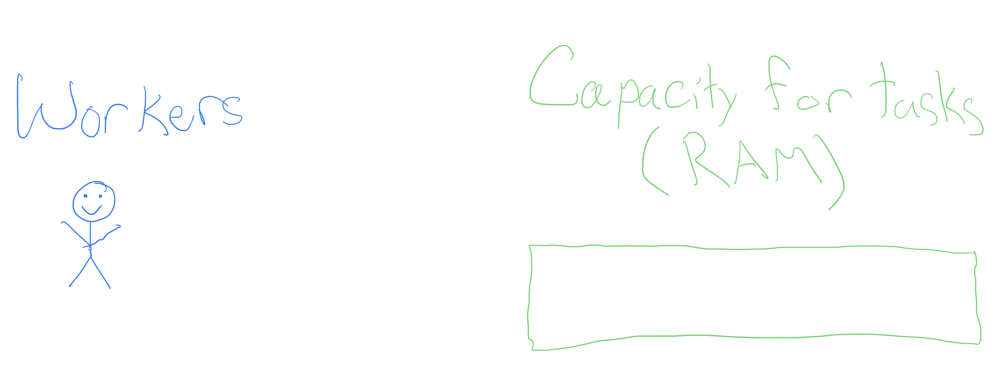
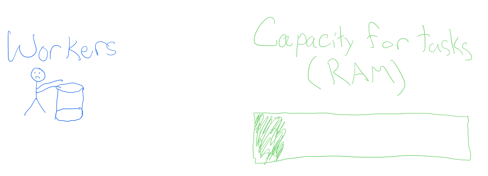
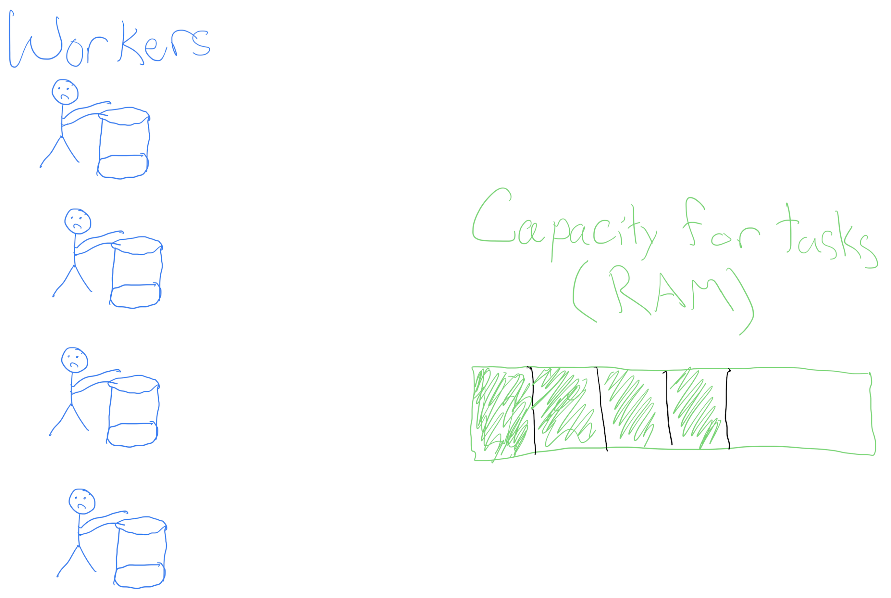
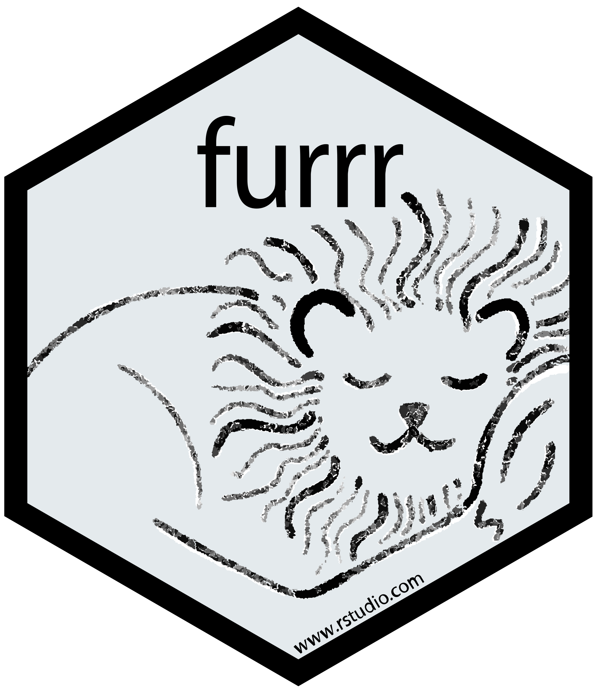
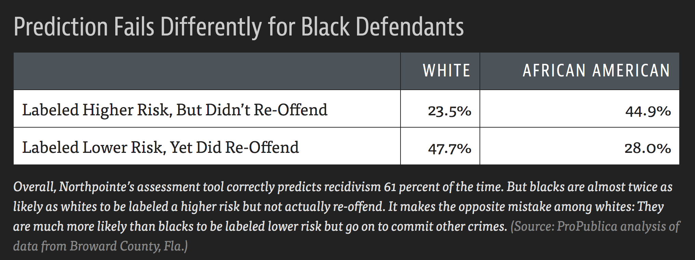

```{r}
#| include: false
#| warning: false
#| message: false

knitr::opts_chunk$set(echo = TRUE, warning = FALSE, message = FALSE,
                      fig.retina = 3, fig.align = 'center',
                      fig.asp = 0.75, fig.width = 8)
library(knitr)
library(tidyverse)
# 
# options(htmltools.preserve.raw = FALSE)
ggplot2::theme_update(text = ggplot2::element_text(size = 20))
```

::::: columns
::: {.column .center width="60%"}
{width="90%"}
:::

::: {.column .center width="40%"}
<br>

[Parallelism, Ethics, and AI]{.custom-title}

<br> <br>

[Grayson White]{.custom-subtitle}

[Math 241 <br> Week 10 \| Spring 2026]{.custom-subtitle}
:::
:::::


------------------------------------------------------------------------


## Week 10 Goals

:::: {.columns}


::: {.column .nonincremental}

**Monday Lecture**: 

- Iteration
    - `for()` and `while()` loops
    - Functional programming

:::


::: {.column .fragment .nonincremental}

**Wednesday Lecture**: 

- Parallelism
- Ethics
- AI

:::

::::


# Parallelism


------------------------------------------------------------------------

### Parallelism

- Last time, we learned how to **iterate** our code through `for()` loops and functional programming with `map_XXX()`.

- But sometimes, we'd like to iterate tasks that take a long time. 

- (Lots of iterations) + (Code that takes a long time to execute) = `r c(emo::ji("clock1"), emo::ji("clock2"), emo::ji("clock3"), emo::ji("clock4"), emo::ji("clock5"))`...


------------------------------------------------------------------------

### Parallelism

::: {.nonincremental}

- What if we could ask our computer to do some of those iterations at the same time as other iterations? 
    - **Example**: Instead of running 100 tasks that each take 1 minute sequentially (total: 100 minutes), do those same 100 tasks, but always be doing 4 at a time (total: 25 minutes)
    
:::

::: {.fragment}
    
```{r}
#| echo: false
#| out-width: '60%'

```

:::


------------------------------------------------------------------------

### Parallelism: Workers

- In order to think about parallel computing, we need to consider two components of your computer:

::: {.fragment}


{width='100%'}

:::


------------------------------------------------------------------------


### A task! 

::: {.nonincremental}

- Typically, we ask one worker to go do a task, e.g.,
    - Execute a particular R command, or

:::


{width='100%'}


------------------------------------------------------------------------


### A task! 

::: {.nonincremental}

- Typically, we ask one worker to go do a task, e.g.,
    - Execute a particular R command, or
    - churn 4 buckets of butter

:::


{width='100%'}


------------------------------------------------------------------------


### Churning butter, together

::: {.nonincremental}

- Churning butter is monotonous, but doesn't take one's full effort (see the RAM)

:::


{width='100%'}


------------------------------------------------------------------------


### Churning butter, together

::: {.nonincremental}

- What if, instead of waiting for the worker to finish the first bucket to go onto the next, we hired more workers? 

:::


{width='100%'}


------------------------------------------------------------------------


### Churning butter, together

::: {.nonincremental}

- What if, instead of waiting for the worker to finish the first bucket to go onto the next, we hired more workers? 

:::


{width='60%' fig-align='center'}


------------------------------------------------------------------------

### Churning butter, together

::: {.nonincremental}

- We get more butter faster! 

- **Not a free lunch**: have to pay the workers in RAM. 

:::


{width='60%' fig-align='center'}


------------------------------------------------------------------------


### Parallelized `for()` loops with `foreach` and `doParallel`

The `foreach` library provides functionality similar to `for()` loops, but with slightly different syntax

-   On it's own, it doesn't include parallel operations


::: {.fragment}

:::: {.columns}

::: {.column}

**Standard `for()` loop**

```{r}
vec <- rep(NA, 12)
for (i in 1:12) {
  vec[i] <- i * 10
}
vec
```

:::

::: {.column}

**Loop made with `foreach()`**

```{r}
library(foreach)
vec <- foreach(i = 1:12, .combine = 'c') %do% {
  i * 10
}
vec
```


:::

::::

:::


-   `.combine` tells `foreach()` how to combine the elements into `vec`. 
     - By default, we would get a `list()` back. 
     
-   Can set `.export` to load packages necessary for computation


------------------------------------------------------------------------

### Parallelized `for()` loops with `foreach` and `doParallel`

Combining functionality of `foreach` with `doParallel` let's us write loops in parallel! 

:::: {.columns}


::: {.column}

**Sequential**:

```{r}
#| cache: true
system.time({
  vec <- foreach(i = 1:12, .combine = 'c') %do% {
    Sys.sleep(1)  # Sleep for 1 second
    i * 10
  }
})

vec
```


:::


::: {.column .fragment}

**In parallel**:

```{r}
#| cache: true
library(doParallel)
detectCores(logical = FALSE) # my laptop has 12 cores
registerDoParallel(4) # Initialize 4 parallel processes

system.time({
  vec <- foreach(i = 1:12, .combine = 'c') %dopar% {
    Sys.sleep(1)  # sleep for 1 second
    i * 10
  }
})

stopImplicitCluster() # stop the parallel processes

vec
```

:::


::::

- The `system.time()` calls are just for illustrative purposes, and are uncessary for calling these loops. 


------------------------------------------------------------------------

### Parallelized `for()` loops with `foreach` and `doParallel`

:::: {.columns}


::: {.column}


Last time, we created a bootstrap distribution for the mean `DBH` for our sample of Portland trees:


```{r}
#| cache: true
pdxTrees <- pdxTrees::get_pdxTrees_parks()

boot <- tibble(avg = rep(NA, 100000))

system.time({
  for (i in 1:nrow(boot)) {
    boot[i, ] <- mean(sample(pdxTrees$DBH, replace = TRUE))
  }
})
```


:::

::: {.column .fragment}


Now, we can do this **in parallel**:


```{r}
#| cache: true
library(doRNG) # thread-safe RNG
pdxTrees <- pdxTrees::get_pdxTrees_parks()

registerDoParallel(10)

system.time({
  boot <- foreach(i = 1:100000, .combine = 'rbind') %dorng% {
    tibble(
      avg = mean(sample(pdxTrees$DBH, replace = TRUE))
    )
    
  }
})

stopImplicitCluster()
```

:::

::::


- Why only **~3 times faster** in parallel if we are using **10** workers??


# Parallelized `map_XXX()`ing with `furrr`

{width="20%"}

------------------------------------------------------------------------

### Parallelized `map_XXX()`ing with `furrr`


- The `furrr` packages enables functional programming in parallel, with syntax and functionality mimics `purrr`.


:::: {.columns}


::: {.column .fragment}

**Last time**: 

```{r}
#| cache: true
library(purrr)
boot_mean <- function(x) {
  mean(sample(x, replace = TRUE))
}

system.time({
  map_dbl(1:100000, ~ boot_mean(pdxTrees$DBH))
})
```

:::


::: {.column .fragment}


Now, **in parallel**:

```{r}
#| cache: true
library(furrr)
boot_mean <- function(x) {
  mean(sample(x, replace = TRUE))
}

future::plan(multisession, workers = 10)

system.time({
  future_map_dbl(1:100000, ~ boot_mean(pdxTrees$DBH), 
                 .options = furrr_options(seed = TRUE))
})
```

- `seed` option allows us to do thread-safe random number generation. 


:::


::::


------------------------------------------------------------------------

### Parallel computing: best practices and tips

- **Startup cost**: it is (time) costly to start up many R processes to do something that is a relatively fast computation.

- **Big data**: Try to limit your parallel computing to only include the necessary objects. Moving large objects across R sessions is (time) costly. 

- You must consider thread-safe random number generation.

- Parallel computing is a balance of **RAM**, **workers/cores**, and **costly operations** like moving big data around and worker startup cost. 

- An art and a science! Practice tends to make you better at balancing these things.


# Data Ethics: Algorithmic Bias

[The Americian Statistical Association's ["Ethical Guidelines for Statistical Practice"](https://www.amstat.org/ASA/Your-Career/Ethical-Guidelines-for-Statistical-Practice.aspx)]{.custom-subtitle}

------------------------------------------------------------------------

## Integrity of Data and Methods

> "The ethical statistical practitioner seeks to understand and mitigate known or suspected limitations, defects, or biases in the data or methods and communicates potential impacts on the interpretation, conclusions, recommendations, decisions, or other results of statistical practices."

> "For models and algorithms designed to inform or implement decisions repeatedly, develops and/or implements plans to validate assumptions and assess performance over time, as needed. Considers criteria and mitigation plans for model or algorithm failure and retirement."

------------------------------------------------------------------------

### Algorithmic Bias

**Algorithmic bias**: when the model systematically creates unfair outcomes, such as privileging one group over another.

**Example**: [The Coded Gaze](https://www.youtube.com/watch?v=162VzSzzoPs)

```{r, echo = FALSE, out.width='35%', fig.cap = "Joy Buolamwini"}
knitr::include_graphics("img/coded_gaze.png")
```

-   Facial recognition software struggles to see faces of color.

-   Algorithms built on a non-diverse, biased dataset.

------------------------------------------------------------------------

### Algorithmic Bias

**Algorithmic bias**: when the model systematically creates unfair outcomes, such as privileging one group over another.

**Example**: [COMPAS model](https://www.propublica.org/article/machine-bias-risk-assessments-in-criminal-sentencing) used throughout the country to predict recidivism

::: nonincremental
-   Differences in predictions across race and gender
:::

```{r, echo = FALSE, out.width='45%', fig.cap = "ProPublica Analysis"}

```

-   Cynthia Rudin and collaborators wrote [The Age of Secrecy and Unfairness in Recidivism Prediction](https://hdsr.mitpress.mit.edu/pub/7z10o269/release/7)
    -   Argue for the need for transparency in models that make such important decisions.

------------------------------------------------------------------------

## Ethical considerations of using LLMs...


:::: .columns

::: {.column}

**Ethical considerations**:

- Algorithmic bias

- Fair use / copyright considerations

::: {.fragment .nonincremental}

- Environmental concerns:
    - Water
    - Electricity
    - Carbon emissions
    
:::
    
- Others?
    - One of my biggest worries: **learning** 

:::

::: {.column .fragment}

::: {.nonincremental}

**Helpful context**: our readings for today

- [Explained: Generative AI’s environmental impact](https://news.mit.edu/2025/explained-generative-ai-environmental-impact-0117)

- [A software engineer's "typical" electricity useage from LLMs](https://www.simonpcouch.com/blog/2026-01-20-cc-impact/)

- [Gruelling, low-paid human work behind generative AI curtain](https://www.ctvnews.ca/sci-tech/article/gruelling-low-paid-human-work-behind-generative-ai-curtain/)

:::

- Good for understanding environmental and human welfare concerns. **Algorithmic bias** and **fair use** on the other hand...


:::


::::


# Discussion time

------------------------------------------------------------------------

## Ethical considerations of using LLMs...


::: {.blockquote}

*Data Science* is a uniquely **humanistic** field situated behind a laptop. We have responsibility to understand and mitigate **algorithmic bias** by asking questions such as:

:::

<br>

- Who are represented in the sample? 

- Who are **not** represented in the sample? 

- What biases might my methods (including generative AI!) introduce? 

- How can I safeguard against those biases? 


------------------------------------------------------------------------


## Ethical considerations of using LLMs...


::: {.blockquote}

Generative AI tools are being used in horrific and unethical ways as we speak (e.g., [Flock cameras](https://www.youtube.com/watch?v=Pp9MwZkHiMQ)). Not to mentioned they are trained on people's intellectual content without their consent.

:::

<br>


::: {.fragment}

**My goals**: 

- Teach how to use generative AI as an ethical data scientist
    - Consider productive (and unproductive) use-cases for this technology

- Help you be **informed** on the current state of generative AI and large language models
    - Only informed people can help change policy.   
    

:::


# What is a large language model? `r emo::ji("thinking")`

------------------------------------------------------------------------


## What is a large language model?

- A large language model (LLM) is a **predictive model** designed to predict the next token of text, conditional on the given context.

- Just like any statistical model, one must **train** the model and you can use the model to **make new predictions**
    - Think: Linear regression. You **fit / train** your linear regression model to obtain $\hat{\beta}$'s that you can make new predictions with. 
    
- Companies like OpenAI, Anthropic, and Google host trained models on their servers, and charge users to use them. 

- Why can't you run these locally? 
    - You can! But only smaller models...
    - Trained LLMs are **large**. The "weight matrices" associated with a given training output take extremely large amounts of computing power to use. 
    - Need enough RAM + computing power to do matrix multiplication on these weight matrices. 
    
------------------------------------------------------------------------


## Local vs. cloud-based LLMs


:::: {.columns}


::: {.column}

**Local LLMs**:

::: {.fragment .nonincremental}

- Smaller.
    - Generally, 1GB RAM = 1 billion model parameters
:::

::: {.fragment .nonincremental}
    
- More secure.
    - You are not sending your data off to someone else's server.
    
:::

::: {.fragment .nonincremental}
    
- "Open" weights.
    - You host the weights matrix. 
    - All computing happens on your machine.

:::

::: {.fragment .nonincremental}

- Requires decent computing power. 

:::

:::

::: {.column .fragment}

**Cloud-based LLMs**:


::: {.nonincremental}

- Big!
    - Generally: larger model --> better predictions

:::


::: {.fragment .nonincremental}

- Less secure. 
    - If it is free, **you** are the product.

:::


::: {.fragment .nonincremental}

- Often closed-weights. 
    - Computing happens at a data center.

:::


::: {.fragment .nonincremental}

- Can use these on anything that can access the internet. 

:::


:::

::::

    
------------------------------------------------------------------------

## Local vs. cloud-based LLMs

- For our purposes, we will use a cloud-based LLM.

- I encourage you to explore what can be done with local LLM's if it interests you.
    - Start with: [Ollama](https://ollama.com/)


# LLMs from a Data Scientist's Perspective


{fig-align='center' width='20%'}

------------------------------------------------------------------------

## `ellmer`

An `R` package for interacting with LLMs in `R`

{.absolute height="250px" right="0" top="0" fig-alt="The ellmer hex sticker, a colorful elephant in a patchwork of fabrics."}

<br> <br> <br>

::: {.fragment}

Today, we'll use `ellmer` to do three different types of tasks one may want to with an LLM:

:::


1. Structured data

2. Tool calling

3. Coding

------------------------------------------------------------------------

## `ellmer`: Setup

In order to interact with LLMs hosted on a server, we need to first set up an API key.

- [Cerebras](https://www.cerebras.ai/) provides "free" access to some LLMs they host, but you still need to get an API key.
    - This "free" access has **rate limits**


::: {.fragment}

**Steps**:

1. Go to [https://www.cerebras.ai/](https://www.cerebras.ai/) and click "Get Started" to create an account. 

:::

::: {.fragment .nonincremental}

2. Once your account is created, find your API key and set it in your `R` environment:

```{r}
#| eval: false
# This will open a file called .Renviron
usethis::edit_r_environ()
```

Then add: 

`OPENAI_API_KEY=INSERT_YOUR_KEY_HERE`

to your .Renviron file. Save it. 


:::

3. Restart R.

------------------------------------------------------------------------


## `ellmer`: basics

```{r}
#| eval: false
library(ellmer)

chat <- chat_openai_compatible(
  base_url = "https://api.cerebras.ai/v1",
  model    = "qwen-3-235b-a22b-instruct-2507"
)

chat$chat("Who are you?")
#> Hello! I'm Qwen, a large-scale language model independently developed by the 
#> Tongyi Lab under Alibaba Group. I can assist you with answering questions, 
#> writing, logical reasoning, programming, and more. I aim to provide helpful and 
#> accurate information. Feel free to let me know if you have any questions or need
#> assistance!
```

{.absolute height="250px" right="0" top="0" fig-alt="The ellmer hex sticker, a colorful elephant in a patchwork of fabrics."}

::: {.fragment .nonincremental}

- "qwen-3-235b-a22b-instruct-2507" has the following rate limits:
    - up to 30 requests per minute,
    - 900 requests per hour, and
    - 14,400 requests per day.

:::
  
------------------------------------------------------------------------
  
## `ellmer`: Structured data
  
How would you extract name and age from this data?
  
```{r}
#| eval: false
prompts <- list(
  "I go by Alex. 42 years on this planet and counting.",
  "Pleased to meet you! I'm Jamal, age 27.",
  "They call me Li Wei. Nineteen years young.",
  "Fatima here. Just celebrated my 35th birthday last week.",
  "The name's Robert - 51 years old and proud of it.",
  "Kwame here - just hit the big 5-0 this year."
)
```

- Regular expressions?
  
------------------------------------------------------------------------
  
## `ellmer`: Structured data
  
LLMs are generally good at this sort of task

```{r}
#| eval: false
chat <- chat_openai_compatible(
  base_url = "https://api.cerebras.ai/v1",
  model    = "qwen-3-235b-a22b-instruct-2507",
)
chat$chat("Extract the name and age from each sentence I give you")
chat$chat(prompts[[1]])
#> **Name: Alex, Age: 42**
chat$chat(prompts[[2]])
#> **Name: Jamal, Age: 27**
chat$chat(prompts[[3]])
#> **Name: Li Wei, Age: 19**
```

------------------------------------------------------------------------
  
## `ellmer`: Structured data
  
But wouldn't it be nice to get an R data structure?

```{r}
#| eval: false
chat$chat(prompts[[3]])

# Want this:
#> list(
#>   name = "Li Wei",
#>   age = 19
#> )

# Instead of:
#> **Name: Li Wei, Age: 19**
```

<br>


::: {.fragment}

`ellmer` let's us do this with `chat_structured()`!
  
```{r}
#| eval: false
type_person <- type_object(
  name = type_string(),
  age = type_number()
)

chat$chat_structured(prompts[[1]], type = type_person)
#> List of 2
#>  $ name: chr "Alex"
#>  $ age : int 42
```

:::
  
------------------------------------------------------------------------
  
## `ellmer`: Structured data
  
`parallel_chat_structured()`: many prompts at once

```{r}
#| eval: false
chat <- chat_openai_compatible(
  base_url = "https://api.cerebras.ai/v1",
  model    = "qwen-3-235b-a22b-instruct-2507",
  params   = params(max_tokens = 500)
)
parallel_chat_structured(chat, prompts, type = type_person, rpm = 30)
#>     name age
#> 1   Alex  42
#> 2  Jamal  27
#> 3 Li Wei  19
#> 4 Fatima  35
#> 5 Robert  51
#> 6  Kwame  50
```

- Not parallel in the sense of parallelized R code: just sending many API calls at once. 

- Have to set `params` in order to avoid getting rate-limited automatically.

------------------------------------------------------------------------
  
## `ellmer`: Structured data
  
Can also send attach images or other files by pointing to their directory on your computer. 

```{r}
#| eval: false
paths <- dir("animals", full.names = TRUE)
images <- map(paths, ~ list(content_image_file(.x)))

type_animal_photo <- type_object(
  animal = type_string(),
  background_colour = type_string()
)

parallel_chat_structured(chat, images, type = type_animal_photo)
```


------------------------------------------------------------------------
  
  
## `ellmer`: Tool calling
  
<!-- LLMs don't have access to live data about the world -->

```{r}
#| eval: false
chat <- chat_openai_compatible(
  base_url = "https://api.cerebras.ai/v1",
  model    = "qwen-3-235b-a22b-instruct-2507"
)

chat$chat("What day is it?")
#> I don't have access to real-time information, so I can't tell you today's
#> date. You can check the current date on your device's calendar or by 
#> asking a voice assistant like Siri, Google Assistant, or Alexa.
```

------------------------------------------------------------------------
  
## `ellmer`: Tool calling
  
  
```{r}
#| eval: false
today <- tool(
  function() Sys.Date(),
  name = "today",
  description = "Get the current date",
  arguments = list()
)
chat$register_tool(today)
```

------------------------------------------------------------------------
  
## `ellmer`: Tool calling
  
<!-- Now the model can know what day it is -->
  
```{r}
#| eval: false
chat$chat("What day is it today?")
#> ◯ [tool call] today()
#> ● #> "2026-04-05"
#> Today is Sunday, April 5, 2026.
```


# Coding (agents)

## Coding agent = LLM calling tools in a loop

...usually giving models the ability to read and write state

------------------------------------------------------------------------

## Coding agents

```{r}
#| eval: false
chat <- chat_openai_compatible(
  base_url = "https://api.cerebras.ai/v1",
  model    = "qwen-3-235b-a22b-instruct-2507"
)
chat$chat("Delete the csv files in my working directory")
#> I **cannot** delete files from your computer or working directory. I don't have 
#> access to your file system for security reasons.
#> 
#> However, here are safe ways you can delete CSV files in your working directory 
#> depending on your environment:
#> 
#> ### Option 1: Using Python
#> If you're using Python and want to delete all `.csv` files in the current 
#> directory:
#> ...
```

------------------------------------------------------------------------

## Coding agents

```{r}
#| eval: false
chat <- chat_openai_compatible(
  base_url = "https://api.cerebras.ai/v1",
  model    = "qwen-3-235b-a22b-instruct-2507"
)
chat$chat("Delete the csv files in my working directory")
#> To delete all CSV files in your current working directory, you can use one of the
#> following methods depending on your operating system:
#> 
#> ### **Method 1: Using Command Line / Terminal**
#> 
#> #### **On Windows (Command Prompt):**
#> ```cmd
#> del *.csv
#> ```
#> 
#> #### **On macOS or Linux (Terminal):**
#> ```bash
#> rm *.csv
#> ```
#> 
#> > ⚠️ **Warning**: This permanently deletes all `.csv` files in the current 
#> directory. Make sure you don’t need any of them!

```

Needs to be able to:
  
* Find files (read state)
* Delete files (write state)

------------------------------------------------------------------------

## Coding agents

The LLM needs to be able to **read** our working directory:
  
```{r}
#| eval: false
chat$register_tool(tool(
  function() dir(),
  name = "ls",
  description = "Lists the files in the current directory"
))
```


<br>
  
::: {.fragment}

And be able to remove files:
  
```{r}
#| eval: false
chat$register_tool(tool(
  function(path) unlink(path),
  name = "rm",
  description = "Delete one or more files",
  arguments = list(
    path = type_array(type_string())
  )
))
```

:::
  
  
------------------------------------------------------------------------
  
## Coding agents
  
Create some dummy `.csv` files

```{r}
file.create(c("a.csv", "a_please_dont_delete_me.csv", "b.csv"))
dir()
```

------------------------------------------------------------------------

## Coding agents

Now ask it to delete csv's that 

```{r}
#| eval: false
chat$chat("Delete all the csv files in the current directory, unless they ask to not be deleted.")
#> ◯ [tool call] ls()
#> ● #> a_please_dont_delete_me.csv
#>   #> a.csv
#>   #> b.csv
#>   #> custom.scss
#>   #> data
#>   #> …
#> ◯ [tool call] rm(path = c("a.csv", "b.csv"))
#> ● #> 0
#> The CSV files `a.csv` and `b.csv` have been deleted.  
#> 
#> The file `a_please_dont_delete_me.csv` was not deleted, as it appears to be a 
#> file you wish to keep based on its name.  
#> 
#> Let me know if you'd like to keep or remove any other files!
```

```{r}
#| echo: false
unlink("a.csv")
unlink("b.csv")
```

<br>

::: {.fragment}

```{r}
dir()
```

:::


------------------------------------------------------------------------

### Next week

::: {.nonincremental}

- We'll explore how folks have expanded `ellmer` into some even more helpful tools for data science

- We'll start to learn how to write our own R packages!

:::


