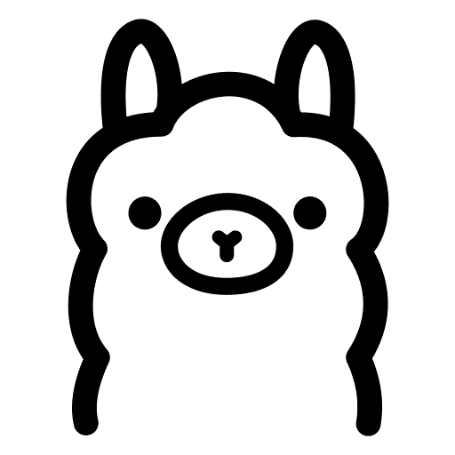
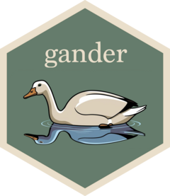
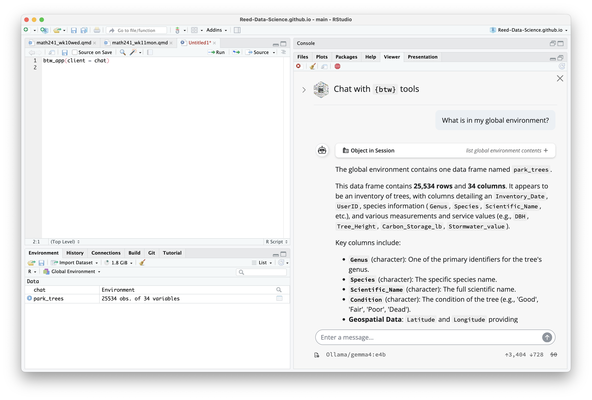

```{r}
#| include: false
#| warning: false
#| message: false

knitr::opts_chunk$set(echo = TRUE, warning = FALSE, message = FALSE,
                      fig.retina = 3, fig.align = 'center',
                      fig.asp = 0.75, fig.width = 8)
library(knitr)
library(tidyverse)
# 
# options(htmltools.preserve.raw = FALSE)
ggplot2::theme_update(text = ggplot2::element_text(size = 20))
```

::::: columns
::: {.column .center width="60%"}
{width="90%"}
:::

::: {.column .center width="40%"}
<br>

[Local LLMs and `ellmer` Extensions]{.custom-title}

<br> <br>

[Grayson White]{.custom-subtitle}

[Stat 241 <br> Week 11 \| Fall 2026]{.custom-subtitle}
:::
:::::


------------------------------------------------------------------------

## Announcements

::: {.nonincremental}

* Fill out [this form](https://forms.gle/6FBbcMFmbSpyEeHM7) to help me create the Project 2 groups.
    + Groups and project instructions will be assigned on Monday.

:::


------------------------------------------------------------------------


## Week 11 Goals

:::: {.columns}


::: {.column .nonincremental}

**Monday Lecture**: 

- Practice with Local LLMs
- Extensions of `ellmer`

:::


::: {.column .fragment .nonincremental}

**Wednesday Lecture**: 

- Intro to writing `R` packages

:::

::::


# Local LLMs


------------------------------------------------------------------------

## Local LLMs

- Last time, we discussed the **ethics** of LLMs and showed some examples of using LLMs for data science.

- We considered **local** vs **cloud-based** implementations of LLMs

:::: {.columns}

::: {.column .fragment .nonincremental}

- Local LLMs have a lot of **advantages**:
    - More secure
    - Smaller and less power intensive (not sending compute requests to data centers)
    - No rate limits
    
:::

::: {.column .fragment .nonincremental}
    
- ...But they also have their **disadvantages**:
    - Can take longer to run depending on your hardware
    - Not as "good" as larger models

:::

::::


- Today, we'll explore the data science use-cases of local LLMs.
    - and use them to power `ellmer` and `ellmer` extensions!

------------------------------------------------------------------------

## Ollama

:::: {.columns}

::: {.column width='40%'}



:::

::: {.column width='10%'}

:::

::: {.column width='50%'}


- [Ollama](https://ollama.com/) is the primary host of open-weights models

- You can download these models, and then connect them to `ellmer` with `chat_ollama()`

- You can also access cloud-based models through `ollama`, but these get rate-limited. 

:::

::::

- Now, let's talk about how to **install** Ollama and local models with it. 


------------------------------------------------------------------------

## System check 

- In order to know what sorts of models your computer can handle, you'll need to look see **how much RAM** your computer has.

::: {.fragment .nonincremental}

- Check RAM:

```{r}
# install.packages("memuse")
memuse::Sys.meminfo()
```

:::


- 24gb RAM --> (approximately up to) 24 billion parameter model
    - "24 billion parameters" is often abbreviated with 24B. 
    - Not always best to run the biggest model your computer can handle: will slow down other processes (and often be slow itself!)

- As long as you have 8gb+ you will be okay for today! 16gb+ is ideal. 

------------------------------------------------------------------------

## Install Ollama

- Ollama is the **service** that allows us to easily download models
    - **Installing Ollama** is analogous to **installing `git`**, 
    - The **Ollama website** is analogous to **GitHub.com**, and
    - The **models** are hosted just like **repos** are hosted on GitHub.com. 

::: {.fragment .nonincremental}    

- To install Ollama, paste this in your terminal:

```
curl -fsSL https://ollama.com/install.sh | sh
```

:::

<br>

::: {.fragment}

After installation, if you run

```
which ollama
```

in your terminal, you should see something like:

```
/usr/local/bin/ollama
```

:::


# Install our first local model

Let's navigate to [ollama.com](https://ollama.com/) and install a model.

::: {.fragment}

<br>

Install models by running the following in your terminal:


`ollama pull {model_name}`


e.g.,


`ollama pull gemma4:e4b`


:::


------------------------------------------------------------------------

## Connect local models with `ellmer`

```{r}
library(ellmer)
chat <- chat_ollama(model = "gemma4:e4b")
```


------------------------------------------------------------------------


## Connect local models with `ellmer`


**Your turn**:

Complete the task from last time: parse names and ages (but now with a local LLM of your choice)

```{r ellmer1}
#| cache: true
#| output-location: column-fragment
type_person <- type_object(
  name = type_string(),
  age = type_number()
)

prompts <- list(
  "I go by Alex. 42 years on this planet and counting.",
  "Pleased to meet you! I'm Jamal, age 27.",
  "They call me Li Wei. Nineteen years young.",
  "Fatima here. Just celebrated my 35th birthday last week.",
  "The name's Robert - 51 years old and proud of it.",
  "Kwame here - just hit the big 5-0 this year."
)

parallel_chat_structured(
  chat,
  prompts,
  type = type_person
)

```

- Sometimes, really small models (like `gemma4:e4b`) really are sub-par...


```{r}
#| echo: false
countdown::countdown(10)
```


------------------------------------------------------------------------

## The `system.time({})` factor...

On my M4 Pro Macbook Pro with 24GB RAM, 

```{r}
chat_local <- chat_ollama(model = "gemma4:e4b")
```


```{r systime1}
#| cache: true
system.time({
  parallel_chat_structured(
  chat_local,
  prompts,
  type = type_person
)
})
```

<br>

- When not rate-limited, this request on a **cloud-based** LLM should only take ~1 second. 


------------------------------------------------------------------------

## Review

- Now, we can chat with **cloud-based** and **local** LLMs in `R` via `ellmer`

- We can even structure the type of data we'd like to get back! 

- And create tools, which let the LLMs perform specific tasks related to our computer or `R` session.

- To make this even more powerful: need to give the LLMs more **context** about our `R` environment. 
    - Ideas? 
    - We could write a **bunch** of a tools...
    - Or...


# `ellmer` Extensions

------------------------------------------------------------------------

## `ellmer` Extensions

- A team at Posit has been working to make interesting `R` packages that allow you to interact with LLMs in `R`

- Today, we'll explore a couple of these `R` packages

:::: {.columns .fragment}

::: {.column}

{fig-align='center'}


:::

::: {.column}


{fig-align='center'}

:::

::::


------------------------------------------------------------------------


## `btw`: Provide **context** to LLMs

{.absolute height="250px" right="0" top="0"}
<br>

<br>

<br>


- `btw` provides context about your `R` environment to LLMs through a variety of mediums: 
    - Quickly copy context to your computer's clipboard,
    - Through an interactive chat in your IDE, and
    - In `ellmer` or `ellmer`-like chats.
    

------------------------------------------------------------------------

## `btw`: copy-paste context


Provide **context for a data.frame**:

```{r}
park_trees <- pdxTrees::get_pdxTrees_parks()

# install.packagaes("btw")
library(btw)


btw(park_trees)
#> ✔ btw copied to the clipboard!
```


<br>

::: {.fragment}


Provide context for a data.frame, **and documentation**:

```{r}
btw(park_trees, ?pdxTrees::get_pdxTrees_parks)
#> ✔ btw copied to the clipboard!
```

:::


<br>


::: {.fragment}

Even provide the **question** you'd like to ask.


```{r}
btw(park_trees, ?pdxTrees::get_pdxTrees_parks, "What does the Crown_Width_NS variable measure? And in what units?")
#> ✔ btw copied to the clipboard!
```


:::


------------------------------------------------------------------------

## Pass context to `ellmer` chats with `btw`


```{r btw1}
#| cache: true
chat <- chat_ollama(model = "gemma4:e4b")

chat$chat(
  btw(park_trees, 
      ?pdxTrees::get_pdxTrees_parks, 
      "What does the Crown_Width_NS variable measure? And in what units?")
)
```


- Passing the direct context you'd like to reference can be really helpful for getting quick responses from local LLMs,

- But if want `btw` to automatically find your context...


------------------------------------------------------------------------

## Provide context in `ellmer` with `btw`


```{r}
#| eval: false
chat <- chat_ollama(model = "gemma4:e4b")

chat$register_tools(
  btw_tools("env")
  # alternatively, call:
  # btw_tools()
  # to allow btw to use all of its built-in tools
)

chat$chat("What is in my global environment?")
#> ◯ [tool call] btw_tool_env_describe_environment(`_intent` = "list global environment
#> contents")
#> ● #> ## Context
#>   #>
#>   #>
#>   #> park_trees
#>   #> ```json
#>   #> …
#> The global environment contains one data frame named `park_trees`.
#> 
#> This data frame contains **25,534 rows** and **34 columns**. It appears to be an inventory of
#> ...
```

- Providing a tool group (in this case: "env") stops the local model from getting overwhelmed by too much context.

- Let's take a look at the documentation for `btw_tools()`.


------------------------------------------------------------------------

### There's also an interactive IDE chat

```{r}
#| eval: false
chat <- chat_google_gemini()
btw_app(client = chat)
```

::: {.fragment}

{fig-align='center' width='80%'}

:::


------------------------------------------------------------------------


## `gander`

{.absolute height="250px" right="0" top="0"}

- ...also provides **context** to LLMs in `R`

<br> <br> 

::: {.fragment}

> gander is a higher-performance and lower-friction chat experience for data scientists in RStudio and Positron–sort of like completions with Copilot, but it knows how to talk to the objects in your R environment. 

:::


::: {.fragment}

> The package brings ellmer chats into your project sessions, automatically incorporating relevant context and streaming their responses directly into your documents.

:::


- Let's take a look!


------------------------------------------------------------------------

## Installing `gander`

```{r}
#| eval: false
# first, install `gander`:
install.packages("gander")
```


::: {.fragment .nonincremental}

Next, pick a model to power `gander`:


(a): for your **current `R` session**,

```{r}
options(gander.chat = ellmer::chat_ollama(model = "gemma4:e4b"))
```

<br>

or (b): as your **default for all `R` session**:

```{r}
#| eval: false
usethis::edit_r_profile()
# and then paste: 
# options(gander.chat = ellmer::chat_ollama(model = "gemma4:e4b"))
# into the loaded file. Restart R for this to take effect.
```


:::

------------------------------------------------------------------------

## Installing `gander`


::: {.nonincremental}

Finally, set up a shortcut to `gander`:

(a): **In RStudio**, navigate to `Tools > Modify Keyboard Shortcuts > Search "gander"`. The package authors suggest `Ctrl+Alt+G` (or `Ctrl+Cmd+G` on macOS), or 

<br>

(b): **In Positron**, you'll need to open the command palette, run "Open Keyboard Shortcuts (JSON)", and paste the following into your `keybindings.json`:

```
    {
        "key": "Ctrl+Cmd+G",
        "command": "workbench.action.executeCode.console",
        "when": "editorTextFocus",
        "args": {
            "langId": "r",
            "code": "gander::gander_addin()",
            "focus": true
        }
    }
```


:::


# `gander` demo

------------------------------------------------------------------------

## Some thoughts

- Local models provide a more secure (and more ethical?) way to interact with LLMs in `R`

- In their current state, local models are still slow, especially when given excessive of context.

- Providing **context** to LLMs (local or cloud-based) through tools like `btw` and `gander` can make them much more useful in a data science workflow.

- In Problem Set 6, you'll get to reflect on LLM-usefulness for debugging, compared to the other debugging approaches we've learned so far.


# Your turn!

In groups of 2 - 3, go through the activity for today. 

```{r}
#| echo: false
countdown::countdown(30)
```


------------------------------------------------------------------------


### Next time

::: {.nonincremental}

- Learn to write our own R packages!

:::


