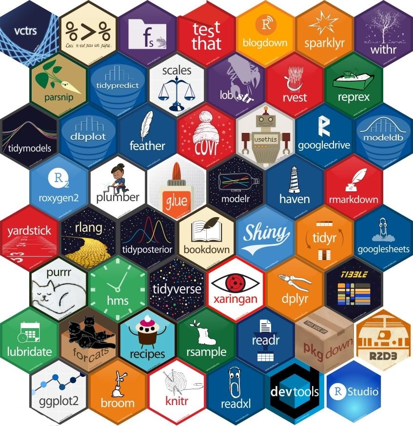
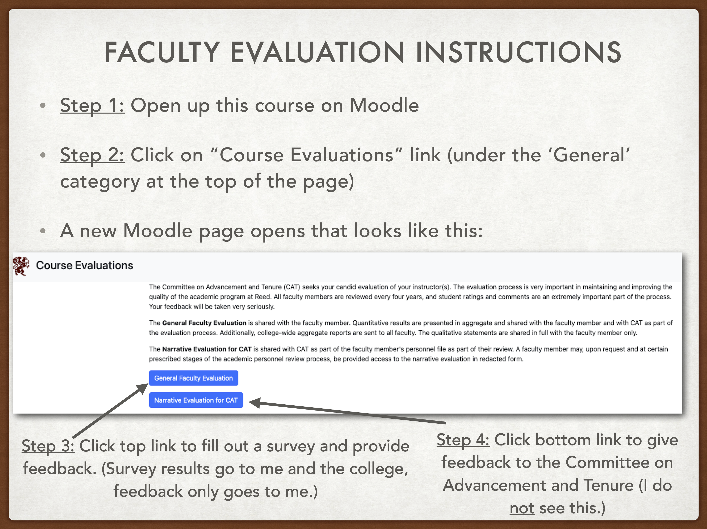

```{r}
#| include: false
#| warning: false
#| message: false

knitr::opts_chunk$set(echo = TRUE, warning = FALSE, message = FALSE,
                      fig.retina = 3, fig.align = 'center',
                      fig.asp = 0.75, fig.width = 8)
library(knitr)
library(tidyverse)
# 
# options(htmltools.preserve.raw = FALSE)
ggplot2::theme_update(text = ggplot2::element_text(size = 20))
```

::::: columns
::: {.column .center width="60%"}
{width="90%"}
:::

::: {.column .center width="40%"}
<br>

[R Packages: docs and testing]{.custom-title}

<br> <br>

[Grayson White]{.custom-subtitle}

[Stat 241 <br> Week 12 \| Fall 2026]{.custom-subtitle}
:::
:::::


------------------------------------------------------------------------

## Week's Goals

:::: {.columns}

::: {.column width='50%' .nonincremental}

**Mon Lecture**

* `R` package documentation and metadata

:::

::: {.column width='50%' .nonincremental}

**Wed Lecture**

* `R` package testing

* `R` package dissemination:
    - Vignettes, and
    - package websites

:::

::::


# First: some logistics.

------------------------------------------------------------------------

{width='70%' fig-align='center'}


# Let's go through the Project 2 instructions.

------------------------------------------------------------------------

## Project 2

::: {.nonincremental}


In this project, your group will create an `R` package and give a 10 minute presentation about your package. You have two options for your package: 

* **Option 1**: a package that primarily shares a suite of functions but also includes data for demoing functionality.
* **Option 2**: a package that primarily shares a dataset or dataset(s) but also includes a couple functions that help the user interact with the data effectively.

:::

------------------------------------------------------------------------

## Project 2 {.smaller}

:::: {.columns}

::: {.column width='50%' .nonincremental}

**Requirements specific to Option 1**:

* At least 4 functions.
* At least 8 unit tests.
* A dataset for demonstrating how to use the functions in the package.
    + There are no requirements on the size of the dataset.
* A 400 - 800 word vignette with at least 1 example that showcases a problem that your package is designed to solve.
    + Note: It is completely fine to use additional packages and functions in the vignette.

:::

::: {.column width='50%' .fragment .nonincremental}

**Requirements specific to Option 2**:

* A dataset with at least 8 variables and at least 30 observations.
* At least 2 functions, such as ones that carry out common operations of interest on the dataset.
    + At least 1 of these functions should create a polished, well-constructed graph.
* At least 2 unit tests.
* A 600 - 1000 word vignette with at least 3 examples that showcase the questions you can answer with the provided dataset and functions.
    + Note: It is completely fine to use additional packages and functions in the vignette.

:::

::::

------------------------------------------------------------------------

## Project 2 {.smaller}

::: {.nonincremental}

**Requirements for Both Options**:

* Package contains 
    + A complete and informative `DESCRIPTION` file.
    + A README (both the `Rmd` and `md`) which answers the questions: Why should I use this package? How do I access the package? How do I use the package?
        + The README should include 1-2 brief examples. Place more extended examples in the vignette.
    + An R documentation file for each function and each dataset.
    + A reasonable name that is not already in use on CRAN or GitHub.  
* A ten minute presentation about the package, with slides. Similar to the README, the presentation should motivate the viewer to use the package and should include an example of how to use the package.
* A `data-raw` folder for handling data wrangling, that allows for going from raw data to the polished data you include in the package.
* A `data` folder for holding the finalized, polished dataset.

:::

::: {.nonincremental .fragment}

**Extra Credit**:

* A hex sticker that contains the package name and a design that relates to the package in some way.

:::

------------------------------------------------------------------------

## Project 2

::: {.nonincremental}


**R Package Ideas**:

* Functions for learning the concepts in Math 141 or some other course.
* Functions that facilitate common tasks you do in your research.
* Functions that pull open data and allow the user to easily create useful visuals and compute relevant summary statistics.
* Functions that pull in data from an API and then convert the data into useful `R` objects, like `data.frame()`s.
* Wrapper functions for common, useful tasks.
* Wrapper functions for cumbersome, difficult to use functions.

:::

------------------------------------------------------------------------

## Project 2 {.smaller}

::: {.nonincremental}

**Tips for getting started**:

* As a group, brainstorm ideas and decide whether you want to focus more on functions (Option 1) or data (Option 2) in your package.
* Remember to use class resources:
    + The Week 10 & Week 11 lecture slides
    + The [Creating an R Package handout](../in_class/R_Package.qmd) which outlines the initial steps.
    + The [`pdxHoles` package](https://github.com/Reed-Data-Science/pdxHoles) we live-coded in lecture.  (Note: `pdxHoles` is still mostly the skeleton of a package.)
* Check out well-written and well-documented `R` packages.  Here are some examples:
    + [https://reprex.tidyverse.org/](https://reprex.tidyverse.org/) and the [`reprex` GitHub repo](https://github.com/tidyverse/reprex)
    + [https://glue.tidyverse.org/](https://glue.tidyverse.org/) and the [`glue` GitHub repo](https://github.com/tidyverse/glue)
    + [https://allisonhorst.github.io/palmerpenguins/](https://allisonhorst.github.io/palmerpenguins/) and the [`palmerpenguins` GitHub repo](https://github.com/allisonhorst/palmerpenguins)
* Create a `sandbox` folder and add it to the `.Rbuildignore`.  Use this folder for exploring different ideas and creating MVPs.

:::

------------------------------------------------------------------------

## Project 2

::: {.nonincremental}

**Timeline**:

* 4/20: Receive project instructions, [group assignment](../projects/proj02_groups.qmd), and invite to your group's GitHub repo.
* 4/27: Come to class for a project work day instead of lecture.
* 5/13 (noon): Make sure the final version of your package is in your GitHub repo.
* 5/13 (1pm): Give a 10 minute presentation of your package during our final exam time slot, in Library 389 (our classroom).
* 5/13: Decide as a group whether or not you want to make your GitHub repo (and so `R` package) public.  
    + If at least one group member does not want to make the repo public, you must leave it private.
    + Email me with your decision.
    + Your grade on this project does not at all depend on this decision. 
    
:::


# Now: `R` packages

------------------------------------------------------------------------

### `R` Packages

**Recap**:

::: {.nonincremental}

* Provides a useful structure for organizing your work:
    + `R` folder: Code
    + `tests` folder: Testing functions
    + `data-raw` folder: Wrangling data
    + `data` folder: Storing data
* Lots of helper functions in other packages to automate parts of the process.

:::

------------------------------------------------------------------------

#### Ou`R` Package: `pdxHoles`

* Share the [Portland reported potholes dataset](http://www.arcgis.com/apps/webappviewer/index.html?id=1606bfad51a34a99a5d11d8016bd78ae&extent=-13669360.545%2C5682909.4098%2C-13595980.9978%2C5723803.2199%2C102100), along with documentation.
* Includes, `plot_holes()`, a function that plots the location of the potholes along with their status.
* Working copy can be found at [https://github.com/Reed-Data-Science/pdxHoles](https://github.com/Reed-Data-Science/pdxHoles)


:::: {.columns}

::: {.fragment .nonincremental .column width='65%'}

**Most Common Confusion When Moving from Scripts/R Markdowns to Package Writing**

* Requires new ways of working with functions in other packages.
    * `DESCRIPTION` file to declare dependencies.
    * Use `package_name::function_name()`.
    * Can't use `library(package_name)`.
    * Want to avoid unnecessary dependencies.
    
:::

::: {.column .fragment width='35%'}

<br>

<br>

<br>

**Other questions so far?**

:::

::::


# Let's go through some of the important components of the package more slowly now.

------------------------------------------------------------------------

### Package States

#### Five states:

:::: {.columns}

::: {.column}

::: {.fragment .nonincremental}

* **Source**
    + Directory of files with a specific structure
    + State of [`pdxHoles` on GitHub](https://github.com/Reed-Data-Science/pdxHoles)
    
:::

::: {.fragment .nonincremental}

* **Bundled**
    + Compressed into a single file "source tarball" (`.tar.gz`)
    + Available for CRAN packages: [https://cran.r-project.org/web/packages/forcats/index.html](https://cran.r-project.org/web/packages/forcats/index.html)

:::

:::

::: {.column}

::: {.fragment .nonincremental}


* **Binary**
    + For distribution and handled by CRAN
    + Are platform specific (Note: CRAN doesn't compile Linux binaries. Why?)

:::    

::: {.fragment .nonincremental}

* **Installed**
    * `install.packages()`
    * `devtools::install_github()`
    * `devtools::install()`
    
:::

::: {.fragment .nonincremental}

* **In-memory**
    * `library()`
    
:::

:::

::::

------------------------------------------------------------------------

### Ignoring Files in the Build

::: {.fragment .nonincremental}

* `.Rbuildignore`
    + To add to the file: `usethis::use_build_ignore()`

:::

::: {.fragment .nonincremental}

* What to add to `.Rbuildignore`
    + Files that help generate contents programmatically
        + Ex: `DATASET.R`
    + Files that help with the package development that aren't standard (by CRAN terms)
        + Ex: `pkgdown` files

:::

------------------------------------------------------------------------

### The Package Name

**Hard Rules**:

1. The name can only consist of letters, numbers, and periods.
    + No `_` allowed!
    + But don't use periods.
    


2. It must start with a letter.


3. It cannot end with a period.


------------------------------------------------------------------------

### The Package Name

**Other Guidelines**

* Pick a unique name.
* Check if it is already in use.


::: {.fragment}

```{r avail}
#| cache: true
available::available("pdxHoles", browse = FALSE)
```

:::

------------------------------------------------------------------------

### The Package Name

**Other Guidelines**

::: {.fragment .nonincremental}

* Ask for suggestions (but maybe not from `available`):

```{r}
available::suggest("Potholes in Portland, OR")
available::suggest("Potholes Portland")
```

:::

<br> 

- Sometimes, you decide you want to re-name your `R` package. Check out Nick Tierney's [blog post](https://www.njtierney.com/post/2017/10/27/change-pkg-name/) on finding all the places in the package where the name will need to be updated.


------------------------------------------------------------------------

### The Package Name

**Other Guidelines**

:::: {.columns}

::: {.column}

::: {.fragment .nonincremental}

* Avoid using both upper and lower case for readability.
    + If choosing between `GGLM` and `gglm`, go lower-case.
    
:::

::: {.fragment .nonincremental}

* Find a name that rolls off the tongue.
    + `purrr`

:::

::: {.fragment .nonincremental}

* Don't include a version number:
    + `ggplot2`

:::
    
:::

::: {.column}

::: {.fragment .nonincremental}

* Capture the goal of the package in the name:
    + `forcats` is an anagram of factors, which we use for categorical data.
    + `lubridate` makes dates and times easier.

:::

::: {.fragment .nonincremental}

* Maybe tack on an `r`.
    + `stringr`

:::

::: {.fragment .nonincremental}

* Include a hint if your package provides extensions to an existing package or follows a certain philosophy.
    + `gglm`
    + `tidytext`

:::

:::

::::


------------------------------------------------------------------------

### DESCRIPTION

* Provides overall metadata about your package.
* If a folder has a `DESCRIPTION` file, then RStudio assumes it is a package (and so gives you a `Build` pane).

::: {.fragment}

```{r, eval=FALSE}
Package: Insert the package name
Title: What the Package Does (One Line, Title Case)
Description: One paragraph. If your description spans multiple lines, each line must be no more
      than 80 characters wide. Indent subsequent lines with 4 spaces.
Authors@R: c(
    person("First", "Last", , "first.last@example.com", role = c("aut", "cre")),
    person("First", "Last", , "first.last@example.com", role = "aut"))
```

:::

::: {.fragment .nonincremental}

* `cre` = maintainer
* `aut` = an author
* `ctb` = contributors
* `cph` = copyright holders
* `fnd` = funder

:::

------------------------------------------------------------------------

### DESCRIPTION -- `License`

* `License` is a required field and must be given in a standard form.
* If you don't have a license, no one is allowed to copy your code with your permission.

::: {.fragment .nonincremental}

* Make sure your license:
    + Declares how you want your code to be used.
    + Respects the license of code and data that your package uses.
    
:::


------------------------------------------------------------------------

### DESCRIPTION -- `License`

**General categories**:

* **Permissive**: code can be freely copied, modified, and published but the license must be preserved.
    + EX: `usethis::use_mit_license()`
* **Copyleft**: code can be freely copied and modified but if then published, it must use the same license as the original code.
    + EX: `usethis::use_gpl_license()`
* **Data**: provide data with minimal restrictions
    + EX: `usethis::use_cc0_license()`
* **Data with attribution**: provide data but require attribution
    + EX: `usethis::use_ccby_license()`

------------------------------------------------------------------------

### DESCRIPTION

* `Imports`: List all the packages that your package depends on.
* `Suggests`: List all packages that are needed for development tasks or for optional functionality.
* `Version`: Communicate where your package is in its lifecycle
* `LazyData: true`: Makes data more immediately available.
* Provides most of the information displayed on a package's CRAN page: [https://cran.r-project.org/web/packages/forcats/index.html](https://cran.r-project.org/web/packages/forcats/index.html)

------------------------------------------------------------------------

### NAMESPACE

* You won't edit this directly.
* Specifies the functions your package makes available to the user.
    + `export(plot_holes)`

------------------------------------------------------------------------

### Documentation -- Rd Files

::: {.fragment .nonincremental}

* `.Rd` stands for R documentation
    + Syntax based loosely on LaTeX
    + Don't edit directly.
    + Instead add `roxygen2` comments above the code for each function.

::: 

<br>

::: {.fragment .nonincremental}

**Workflow**:

* Add `roxygen2` comments to your `.R` scripts.
* Run `devtools::document()` to create/update the `.Rd` files.
* Preview the document with `?function_name` (after running `devtools:load_all()`).

:::

------------------------------------------------------------------------

### Documentation -- Rd Files

:::: {.columns}


::: {.column width='35%'}

**Language**:

* **Block**: The `roxygen2` comments above a function.
* **Tag**:
    + `@tagName tagValue`
* **Introduction**: Text before the first **tag**.
* **Description**: Next paragraph

:::

::: {.column width='65%'}

```{r, eval=FALSE}
#' Plot the potholes reported in Portland, Oregon
#'
#' A really nice description of the function functionality.
#'
#' @param colors A character vector of length 3 that indicates the color of 
#' "Closed", "In Progress", and "Open" potholes, respectively.
#' @param alpha A numeric value between 0 and 1 that indicates the transparency
#' of the points.
#'
#' @details The argument `alpha` takes value 0 for fully transparent points.
#' 
#' @returns A `ggplot` of the potholes in Portland, colored by status.
#'
#' @examples
#' # example code
#' plot_holes()
#' 
#'
#' @export
```

:::

::::

------------------------------------------------------------------------

### Documentation -- Rd Files

:::: {.columns}

::: {.column width='35%'}

::: {.fragment .nonincremental}

* `@param`: Succinct summary of the allowed inputs and what the parameter does.
    + Most important component of the function documentation
    + Provide defaults.
    + If there is a fixed set of values, list them.
    
:::

* `@inheritParams`: Allows you to inherit argument documentation from another function.

:::

::: {.column width='65%'}

```{r, eval=FALSE}
#' Plot the potholes reported in Portland, Oregon
#'
#' A really nice description of the function functionality.
#'
#' @param colors A character vector of length 3 that indicates the color of 
#' "Closed", "In Progress", and "Open" potholes, respectively.
#' @param alpha A numeric value between 0 and 1 that indicates the transparency
#' of the points.
#'
#' @details The argument `alpha` takes value 0 for fully transparent points.
#' 
#' @returns A `ggplot` of the potholes in Portland, colored by status.
#'
#' @examples
#' # example code
#' plot_holes()
#' 
#'
#' @export
```

:::

::::

------------------------------------------------------------------------


### Documentation -- Rd Files

:::: {.columns}

::: {.column width='35%'}

* `@details`: Provides a place to put more niche specifics about the parameter inputs or the function itself.

* `@returns`: Describe the output object (possibly even its dimensions)

* `@examples`: Showcase the most important features with self-contained code.

:::

::: {.column width='65%'}

```{r, eval=FALSE}
#' Plot the potholes reported in Portland, Oregon
#'
#' A really nice description of the function functionality.
#'
#' @param colors A character vector of length 3 that indicates the color of 
#' "Closed", "In Progress", and "Open" potholes, respectively.
#' @param alpha A numeric value between 0 and 1 that indicates the transparency
#' of the points.
#'
#' @details The argument `alpha` takes value 0 for fully transparent points.
#' 
#' @returns A `ggplot` of the potholes in Portland, colored by status.
#'
#' @examples
#' # example code
#' plot_holes()
#' 
#'
#' @export
```

:::

::::

------------------------------------------------------------------------

### Documentation -- Rd Files

For data files:

* `@format` gives an overview of the dataset.
    + Describe each variable.
        + Include units when it makes sense.
        + Include possibly categories for categorical variables with only a few categories.
* `@source` provides details on where you got the data, often a URL.
* Never `@export` a data set.

------------------------------------------------------------------------

### Documentation -- The Readme

* Why should I use this package?
* How do I access the package?
* How do I use the package?

* Let's look at some excellent Readmes:
    + [`palmerpenguins`](https://github.com/allisonhorst/palmerpenguins)
    + [`stringr`](https://github.com/tidyverse/stringr)
    + [`gganimate`](https://github.com/thomasp85/gganimate)

------------------------------------------------------------------------

### Documentation -- The Readme

* To get started, run `usethis::use_readme_rmd()`.

::: {.fragment}

**Workflow**:

:::

* Edit the `README.Rmd`, not the `README.md` file so that you can include `R` chunks.
* To update the `README.md`, run `devtools::build_readme()`.
* Commit and push changes so that the Readme (landing page) of your package on GitHub is up-to-date!


------------------------------------------------------------------------


### Package Development

**Next time**:

* Unit testing
* More documentation
    + Vignettes!
* Dissemination
    + A website!


