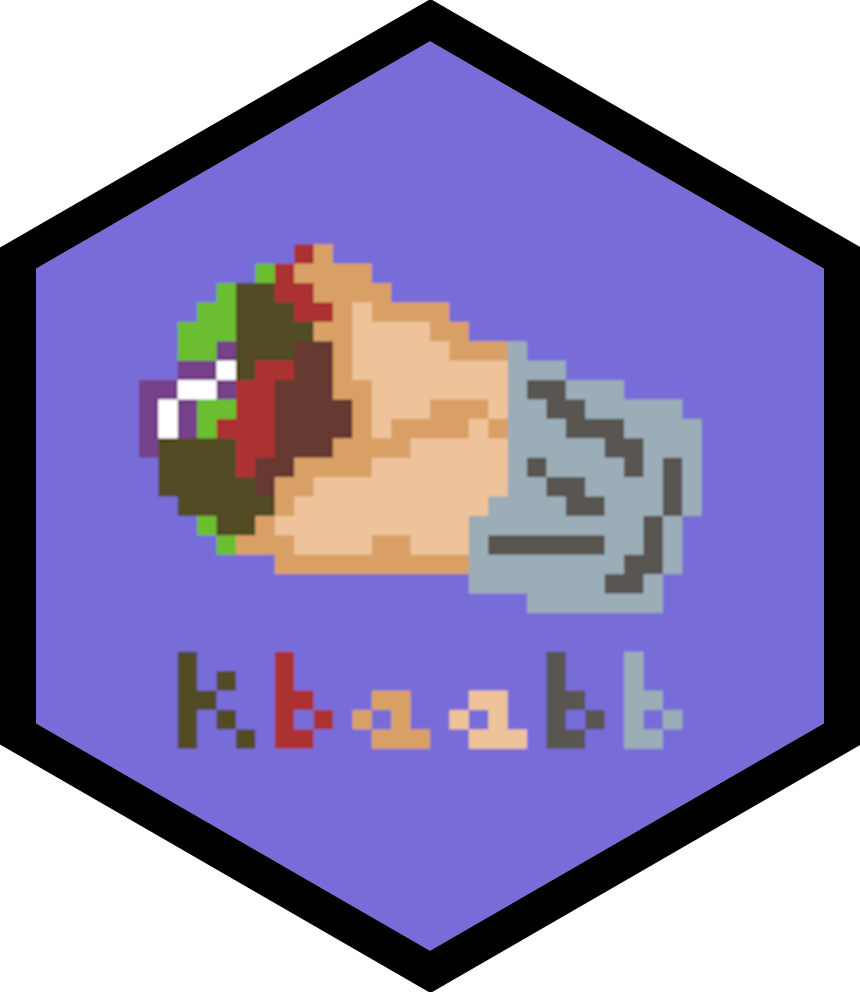
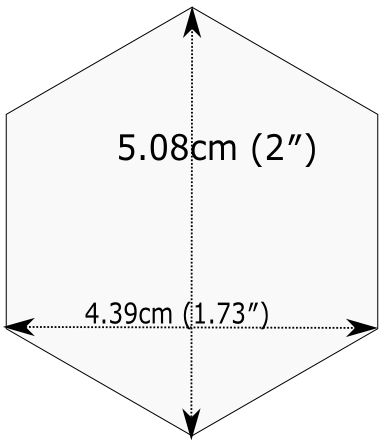

```{r}
#| include: false
#| warning: false
#| message: false

knitr::opts_chunk$set(echo = TRUE, warning = FALSE, message = FALSE,
                      fig.retina = 3, fig.align = 'center',
                      fig.asp = 0.75, fig.width = 8)
library(knitr)
library(tidyverse)
# 
# options(htmltools.preserve.raw = FALSE)
ggplot2::theme_update(text = ggplot2::element_text(size = 20))
```

::::: columns
::: {.column .center width="60%"}
{width="90%"}
:::

::: {.column .center width="40%"}
<br>

[R Packages: vignettes + dissemination]{.custom-title}

<br> <br>

[Grayson White]{.custom-subtitle}

[Math 241 <br> Week 12 \| Spring 2026]{.custom-subtitle}
:::
:::::


------------------------------------------------------------------------


## Week's Goals

:::: {.columns}

::: {.column width='50%' .nonincremental}

**Mon Lecture**

* `R` package documentation and metadata

:::

::: {.column width='50%' .nonincremental}

**Wed Lecture**

* `R` package testing

* `R` package dissemination:
    - Vignettes, and
    - package websites

:::

::::


------------------------------------------------------------------------

#### Recap Ou`R` Package: `pdxHoles`

* Share the [Portland reported potholes dataset](http://www.arcgis.com/apps/webappviewer/index.html?id=1606bfad51a34a99a5d11d8016bd78ae&extent=-13669360.545%2C5682909.4098%2C-13595980.9978%2C5723803.2199%2C102100), along with documentation.
* Includes, `plot_holes()`, a function that plots the location of the potholes along with their status.
* Working copy can be found at [https://github.com/Reed-Data-Science/pdxHoles](https://github.com/Reed-Data-Science/pdxHoles)


<br>

<br>

- **Other questions so far?**

------------------------------------------------------------------------

# Testing

------------------------------------------------------------------------

### Testing -- Informally

**Return to our first function**:

```{r}
coef_of_var <- function(x, na.rm = FALSE, trim = 0){
  stopifnot(is.numeric(x))
  sd(x, na.rm = na.rm) / mean(x, na.rm = na.rm, trim = trim)
}
```

<br>

::: {.fragment}

Ran so many tests!

```{r, error=TRUE, message=TRUE, warning=TRUE}
coef_of_var(x = rnorm(n = 10000, mean = 1, sd = 4))
```

:::

------------------------------------------------------------------------

### Testing -- Informally

Ran so many tests!

```{r, error=TRUE, message=TRUE, warning=TRUE}
library(pdxTrees)
pdxTrees <- get_pdxTrees_parks()
DBH_new <- c(pdxTrees$DBH, Inf)
coef_of_var(DBH_new)

coef_of_var(pdxTrees)
```

------------------------------------------------------------------------

### Testing -- Informally

Ran so many tests!

```{r, error=TRUE, message=TRUE, warning=TRUE}
coef_of_var(pdxTrees$Condition)

coef_of_var(c(TRUE, FALSE, FALSE))
```


# How should we **formally** test our package functions?

::: {.fragment}

{width='30%'}

:::

------------------------------------------------------------------------

### Testing our Package Functions


**Standard workflow in package development**:

1. Write/revise the function in an `.R` script.
    + (Also write documentation using `roxygen2`)
2. Load the function with `devtools::load_all()`
3. Experiment with the function, giving it different inputs.
4. Repeat.

<br>


- Step 3 likely involves similar **informal** testing as we were doing for our functions outside an `R` package.

- Good to transition to **automated** testing (also called unit testing) using `testthat`!


------------------------------------------------------------------------

### Why Automated Testing?

* Fewer bugs.
    + Describe the behavior of your function in both the code and the test. Check against each other.
    + When adding a new feature to a function, you reduce the chances it breaks the existing features.

* Can help motivate more refactoring of your code.
    + Functions that are easier to test are usually easier to understand.

------------------------------------------------------------------------

### `testthat`

::: {.fragment .nonincremental}

* Within your package RStudio Project, run the following to get started:

```{r, eval=FALSE}
usethis::use_testthat()
```

:::

::: {.fragment .nonincremental}

* Modifies your `DESCRIPTION` file:

```{r, eval=FALSE}
Suggests: testthat (>= 3.0.0)
Config/testthat/edition: 3
```

:::

* Creates the `tests/testthat` folder.

* In particular, we now have a `testthat.R` file that will initiate all your tests every time you run `devtools::check()`.

------------------------------------------------------------------------

### Test File Structure

::: {.fragment .nonincremental}

* For every `insert_function_name.R` function in the `R` folder that you want tests for, create an `test-insert_function_name.R` for storing your tests.
    + You can automate this process with:

```{r, eval=FALSE}
usethis::use_test("plot_holes")
```

:::

* Each test file holds one or more `test_that()` tests for a particular function in your package.

::: {.fragment .nonincremental}

* Each test:
    + Describes what it is testing.
    + Has one or more expectations.

:::


------------------------------------------------------------------------

### Test File Structure


```{r, error=TRUE}
library(testthat)
test_that("multiplication works", {
  expect_equal(2 * 2, 4)
})
```

<br>

::: {.fragment}

```{r, error=TRUE}
test_that("multiplication works", {
  expect_equal(2 * 2, 5)
})
```

:::


------------------------------------------------------------------------

### Expectations

**Expectation**: Expected result of a computation

* Start with `expect_---()`

* Two main arguments:
    + 1st: Actual result
    + 2nd: What you expect
    
<br>

:::: {.columns .fragment}

::: {.column width='50%'}

```{r, error=TRUE}
expect_equal(2 * 2, 4)
```

:::

::: {.column width='50%'}

```{r, error=TRUE}
expect_equal(2 * 2, 5)
```

:::

::::

* They automate the visual checking of results in the console.

------------------------------------------------------------------------

### Expectations

**Expectation**: Expected result of a computation

<br>

**Key Questions**:

* Does it have the correct value(s) or dimensions?
* Does it have the correct class?
* Does it produce an error when it should?


# Let's explore some of the `expect_*()` functions in `testthat`!


------------------------------------------------------------------------

### Testing Equality

```{r, error=TRUE}
expect_equal(2 * 2, 4)
expect_equal(2 * 2, 4 + 0.0000001)
expect_equal(2 * 2, 4 + 0.00000001)
expect_identical(2 * 2, 4 + 0.0000001)
expect_equal(2 * 2, 4L)
expect_identical(2 * 2, 4L)
```

------------------------------------------------------------------------

### Testing Class

Check the class of your output:

```{r, error = TRUE}
library(pdxHoles)
test_that("check class", {
  expect_s3_class(plot_holes(), "data.frame")
})
```

<br>

::: {.fragment}

```{r, error = TRUE}
test_that("check class", {
  expect_s3_class(plot_holes(), "ggplot")
})
```

:::


------------------------------------------------------------------------

### Testing Errors

* Remember to use defensive coding in your function and then check them with your tests.

::: {.fragment}

```{r, error=TRUE}
test_that("errors when it should", {
  expect_error(plot_holes(colors = c("green", "red")))
})
```

:::

* Need to put better checks in `plot_holes()`.

* There are similar functions for warnings and messages: `expect_warning()`, `expect_message()`

------------------------------------------------------------------------

### Testing Guidelines

* Focus on outputs and behaviors of your functions.
    + The defensive code in your functions focuses on the inputs.
* Test each behavior in one test.
* If you find a bug, write a test!

------------------------------------------------------------------------

### Running Tests -- Three Options

**Option 1**: Refine a specific test

```{r, eval=FALSE}
# Load the function
devtools::load_all()

# Write the body test
expect_equal(2 * 2, 4)

# Run the test
test_that("multiplication works", {
  expect_equal(2 * 2, 4)
})
```

------------------------------------------------------------------------

### Running Tests -- Three Options

**Option 2**: Run all tests on a function

```{r, eval=FALSE}
testthat::test_file("tests/testthat/test-plot_holes.R")
```

<br>

**Option 3**: Run all tests on all functions

```{r, eval=FALSE}
devtools::test()
# OR
devtools::check()
```

* Will error out if any of the tests don't pass.

------------------------------------------------------------------------

# Vignettes

> "The vignette format is perfect for showing a workflow that solves that particular problem, start to finish. Vignettes afford you different opportunities than help topics: you have much more control over the integration of code and prose and it's a better setting for showing how multiple functions work together." -- Hadley Wickham and Jenny Bryan

<br>

```{r, eval=FALSE}
browseVignettes()
```

------------------------------------------------------------------------

### Vignettes Set-up

To get started, run:

```{r, eval=FALSE}
usethis::use_vignette("pdxHoles")
```

Which

* Creates the `vignettes` folder.
* Updates the `DESCRIPTION` with new dependencies.
* Provides a template in the file `pdxHoles.Rmd`.
* Updates your `.gitignore`.

------------------------------------------------------------------------

### Vignettes Workflow

* Run `devtools::load_all()` to make sure you have access to the data and functions in the package.
* Edit the narrative and code chunks.

::: {.fragment .nonincremental}

* To render the vignette using a temporarily installed, development version of your package, run

```{r, eval=FALSE}
devtools::build_rmd("vignettes/pdxHoles.Rmd")
```

:::

* Inspect the output file.
* Repeat!

------------------------------------------------------------------------

### Vignettes Workflow

Eventually,

::: {.fragment .nonincremental}

* To make the current state available locally with an install of the package:

```{r, eval=FALSE}
devtools::install(dependencies = TRUE, build_vignettes = TRUE)
```

:::

::: {.fragment .nonincremental}

* To get vignettes when installing a package from GitHub:

```{r, eval=FALSE}
devtools::install_github(dependencies = TRUE, build_vignettes = TRUE)
```

:::

::: {.fragment .nonincremental}

* Vignettes are always built when you submit to CRAN:

```{r, eval=FALSE}
devtools::submit_cran()
```

:::

------------------------------------------------------------------------

### Suggestions for Writing a Good Vignette

* Think of your vignette as an instructive tutorial.
* First, identify (for yourself) what you want the vignette to accomplish.
* Be careful with the curse of knowledge.
* Break up the code with concise but clear narrative that motivates the next block of code.
* Hyper-link to other relevant packages and functions.

<br>

::: {.fragment .nonincremental}

**Important Note**:

* Any package used in a vignette must be listed in the `DESCRIPTION` file under either `Imports` or `Suggests`.

:::


# Website for Your Package with `pkgdown`

------------------------------------------------------------------------

### Create the Site

Run:

```{r, eval=FALSE}
usethis::use_pkgdown()
```

* Creates `pkgdown.yml`: The configuration file for your package.
* Adds the correct files to the `.Rbuildignore`.
* Creates the `docs` folder which will store all the pages for the website.

------------------------------------------------------------------------

### Build the Site

To create the site, run:

```{r, eval=FALSE}
pkgdown::build_site()
```

* The site is only as good as the documentation included in your package.
    + But, if you have created useful help files, an informative Readme, a complete `DESCRIPTION` file, and a vignette, then your default `pkgdown` site will be pretty great!

------------------------------------------------------------------------

### Deploy the Site

To set it up so that your site can be published to a GitHub pages, run (just once):

```{r, eval=FALSE}
usethis::use_pkgdown_github_pages()
```

* Creates a branch in GitHub that will store the files for your website.
* Turns on GitHub Pages for your repo
    + Let's GitHub know where to find the files for the website.
* Adds the URL for the site to the appropriate files.

------------------------------------------------------------------------

### Deploy the Site

**Big Wrinkle**: Can't deploy on our private GitHub Organization.

* Have to deploy through a repo tied to your individual account

* Requires changing a GitHub Action setting!

* Not a requirement of Project 2!

------------------------------------------------------------------------

### Hex Sticker

:::: {.columns}

::: {.column width='50%'}

<br>

* A strong tradition in the `R` community.

* Fun way to remember and advertise a package.

:::

::: {.column width='50%'}

```{r, echo=FALSE, out.width='40%'}

```

:::

::::

:::: {.columns}

::: {.column width='50%'}


:::

::: {.column width='50%'}


:::

::::

------------------------------------------------------------------------

### Hex Sticker

:::: {.columns}

::: {.column width='50%' .nonincremental}

<br>

* A strong tradition in the `R` community.

* Fun way to remember and advertise a package.

:::

::: {.column width='50%'}

```{r, echo=FALSE, out.width='40%'}
knitr::include_graphics("img/forested.png")
```

:::

::::

:::: {.columns}

::: {.column width='50%'}


:::

::: {.column width='50%'}


:::

::::

------------------------------------------------------------------------

### Hex Sticker

:::: {.columns}

::: {.column width='50%' .nonincremental}

<br>

* A strong tradition in the `R` community.

* Fun way to remember and advertise a package.

:::

::: {.column width='50%'}

```{r, echo=FALSE, out.width='50%'}
knitr::include_graphics("img/gglm.gif")
```

:::

::::

:::: {.columns}

::: {.column width='50%'}


* But there are rules...

:::

::: {.column width='50%' .fragment}

```{r, echo=FALSE, out.width='40%'}

```

:::

::::

------------------------------------------------------------------------

## Next week

- The final week of classes... `r emo::ji("sad")`

- Some project work time (Monday)

- Building your data science profile (Wednesday)


