```{r}
#| include: false
#| warning: false
#| message: false

knitr::opts_chunk$set(echo = TRUE, warning = FALSE, message = FALSE,
                      fig.retina = 3, fig.align = 'center',
                      fig.asp = 0.75, fig.width = 8)
library(knitr)
library(tidyverse)
# 
# options(htmltools.preserve.raw = FALSE)
ggplot2::theme_update(text = ggplot2::element_text(size = 20))
```

::::: columns
::: {.column .center width="60%"}
{width="90%"}
:::

::: {.column .center width="40%"}
<br>

[Building a Data Science Portfolio]{.custom-title}

<br> <br>

[Grayson White]{.custom-subtitle}

[Math 241 <br> Week 13 \| Spring 2026]{.custom-subtitle}
:::
:::::


------------------------------------------------------------------------


## Announcements 


- Project 2 reminders:
    - Final presentations will be during our final exam time slot. Make sure to get here on time! 
    - We will not use the full 4 hours. 
    
- Next week:
    - No official office hours, but **email me** if you'd like to find a time to meet about Project 2.


------------------------------------------------------------------------

## Agenda 


- GitHub profile building

- Publish your personal website with GitHub and Quarto

------------------------------------------------------------------------


## But first...

::: {.fragment}

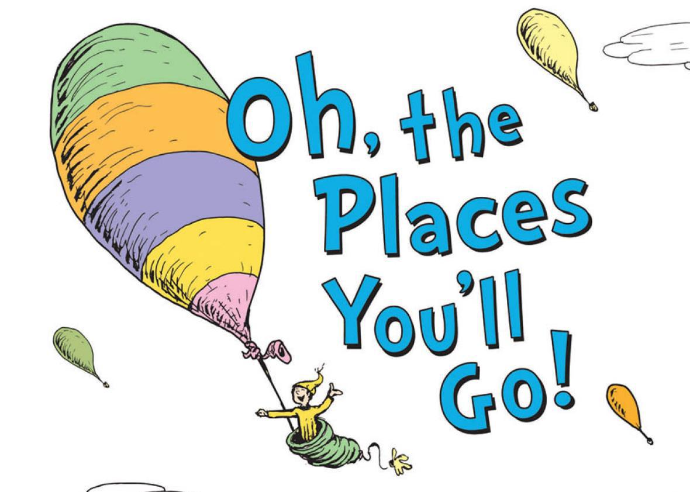{fig-align='center'}

:::


------------------------------------------------------------------------

## But first...


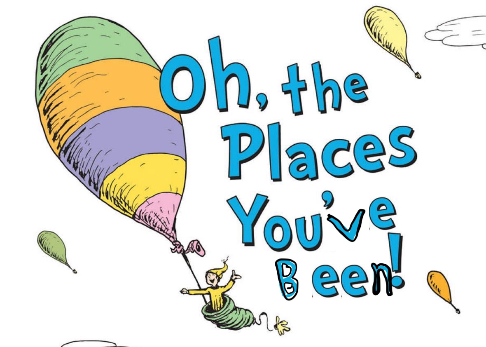{fig-align='center'}


------------------------------------------------------------------------

## Goal: Wrangle and interact with a variety of data types {.smaller}


Requires expanding our understanding of **data structures** in `R`.


::: {.nonincremental}

* Most common data structure = `data.frame`/data set/spreadsheet

* Example: Portland Biketown bike rental data.

:::

```{r, eval = TRUE, echo = FALSE}
library(tidyverse)
biketown <- read_csv("data/biketown.csv")
biketown %>%
  select(BikeID, Duration, PaymentPlan, StartTime, EndTime) %>%
  as.data.frame()
```

------------------------------------------------------------------------

## Variable types: Dates and Times


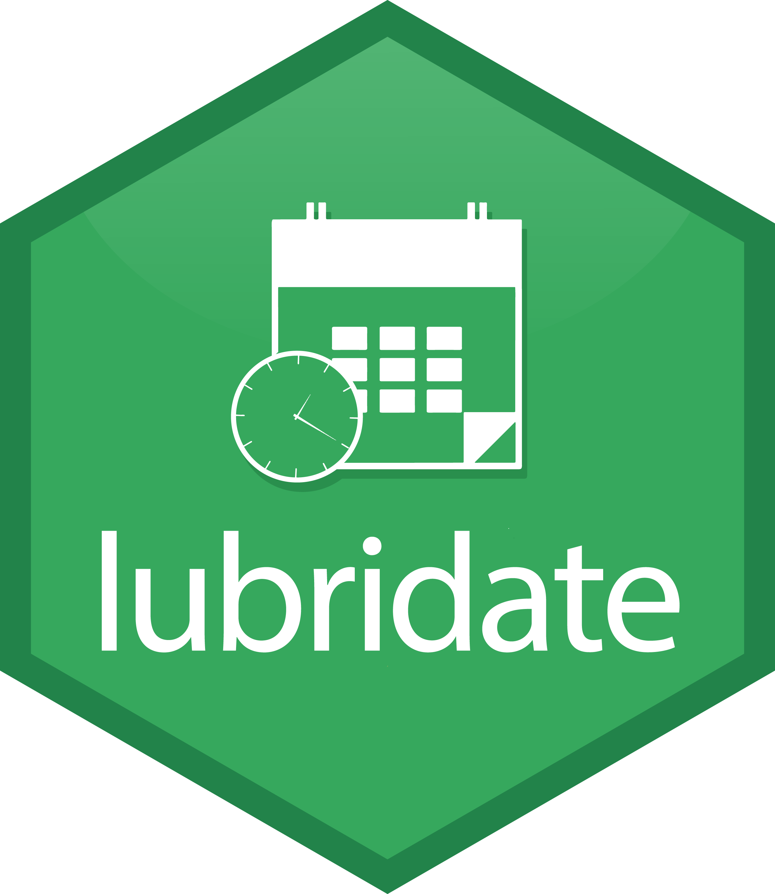{width="10%" style="float:left; padding:25px"}

<br> 
<br>


* We learned to use the `lubridate` package to wrangle dates and times.


------------------------------------------------------------------------

## Variable types: Factors and Characters 

:::: {.columns}

::: {.column width="50%" .nonincremental}

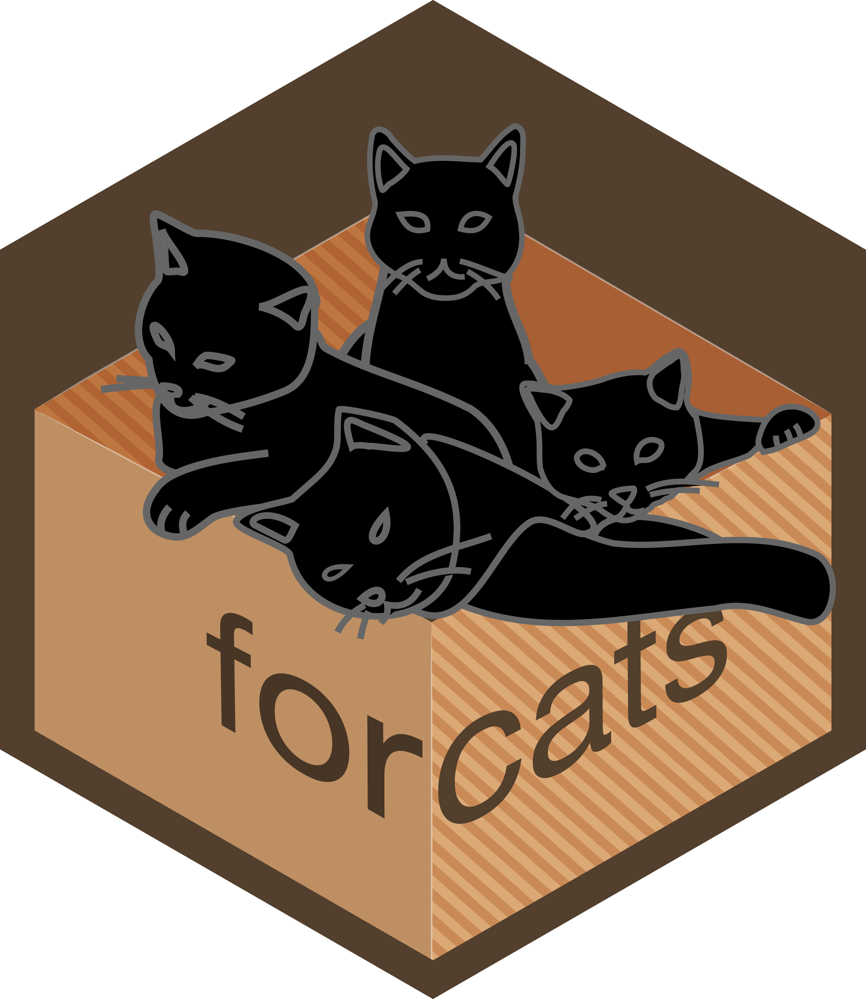{width="20%" style="float:left; padding:25px"}

<br> 
<br>

* We learned to use the `forcats` package to wrangle `factor`s.

:::

::: {.column width="50%" .nonincremental}

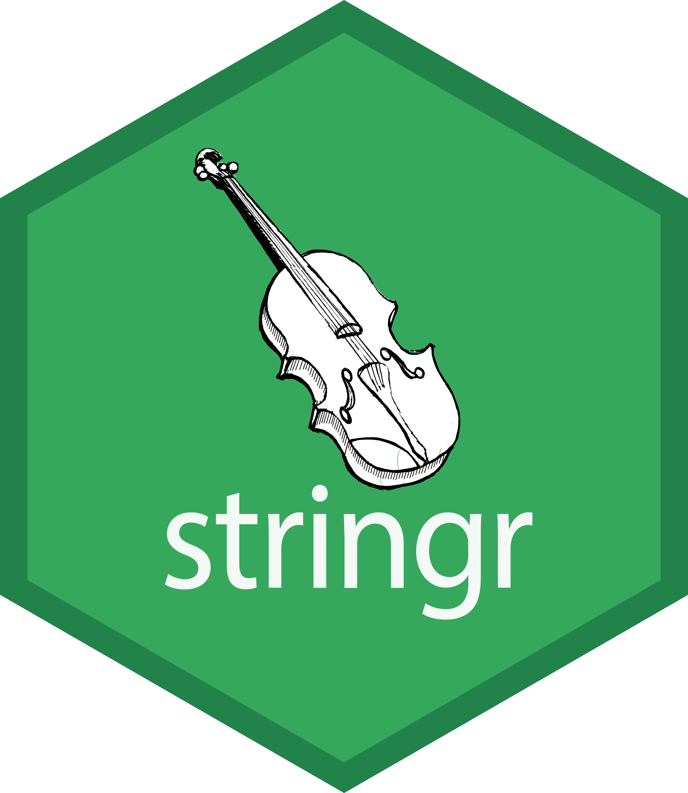{width="20%" style="float:left; padding:25px"}

<br> 
<br>

* We learned to use the `stringr` package to wrangle `character`s/strings/text.

:::

::::


------------------------------------------------------------------------


## Other Data Structures: Spatial Data Frames {.small}

::: {.nonincremental}

- From **points** to **polyons** to **rasters**, and more! We learned how to interact with spatial data in `R`!

:::

```{r, echo = FALSE, fig.width= 6}

api_key <- "ff47b8f510c3db70501a7463b61e1298db1db97d"

library(tidycensus)
options(tigris_use_cache = TRUE)
or <- get_acs(state = "OR",  geography = "county", 
                  variables = "B19013_001", geometry = TRUE, 
              key = api_key) 
options(scipen = 999)
ggplot(data = or, mapping = aes(geometry = geometry,
                                fill = estimate)) + 
  geom_sf() +
  coord_sf() +
  scale_fill_viridis_c() + theme_void()
```


{width="13%" style="float:left; padding:25px"}

{width="13%" style="float:right; padding:25px"}


<br> 
<br>

::: {.nonincremental}

* We used `sf` and `terra` to interact with spatial data

:::

------------------------------------------------------------------------

## Other Data Structures: Lists {.small}

```{r, echo = FALSE}
library(purrr)
library(repurrrsive)
got <- list(got_chars[[1]][3:5], got_chars[[2]][3:5])
```

:::: {.columns}

::: {.column width="50%"}

`List`s are a more flexible structure for storing data!

```{r}
got
```

:::

::: {.column width="50%"}


::: {.fragment .nonincremental}


{width="20%"}

* We learned to use the `purrr` package to converting nested `list`s into `data.frame`s.


:::


:::

::::

<br>

::: {.fragment}

```{r}
map_dfr(got, `[`, c("name", "gender", "culture")) 
```

:::


# Learning Goals: Data Viz

## Goal: Create **static** data visualizations of multivariate data with `ggplot2`

{width="10%" style="float:left; padding:25px"}

```{r, echo = FALSE, fig.width= 9, fig.asp= .6}
library(babynames)
babynames_stat108 <- babynames %>%
  filter(name %in% c("Grayson", "Michael", "Megan",
                     "Lenny")) %>%
  group_by(year, name) %>%
  summarize(n = sum(n))

p <- ggplot(data = babynames_stat108, 
       mapping = aes(x = year, y = n)) +
  geom_line(aes(color = name), size = 2) + 
  theme(legend.position = "bottom", text = element_text(size=20)) +
  guides(color = guide_legend(nrow = 2)) +
  labs(y = "Number of Births", x = "Year", color = "Baby Name")
p
```

------------------------------------------------------------------------

## Goal: Create **animated** data visualizations of multivariate data with `gganimate`

```{r, echo = FALSE, fig.width= 9, fig.asp= .6}
library(gganimate)
p_animate <- p +
  transition_reveal(along = year)
animate(p_animate, fps = 5, end_pause = 20, height = 4,
  width = 6.5, units = "in", res = 100)
```

------------------------------------------------------------------------

## Goal: Create **interactive** data visualizations of multivariate data with `plotly` and `shiny`

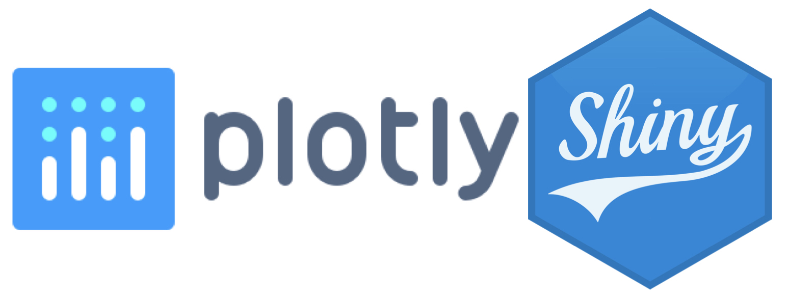{width="30%" style="float:left; padding:25px"}

```{r, echo= FALSE}
library(plotly)
ggplotly(p)
```


# Learning Goals: Disseminating your work and reproducible workflow


##  Example: [US Forest Inventory and Analysis Program](https://www.fia.fs.fed.us/about/about_us/) {.small}

:::: {.columns}

::: {.column width="25%"}

{width="45%"}

:::

::: {.column width="75%"}

> Mission: "Make and keep current a comprehensive inventory and analysis of the present and prospective conditions of and requirements for the renewable resources of the forest and rangelands of the US."

:::

::::

<br>

:::: {.columns}

::: {.column width="45%" .fragment}

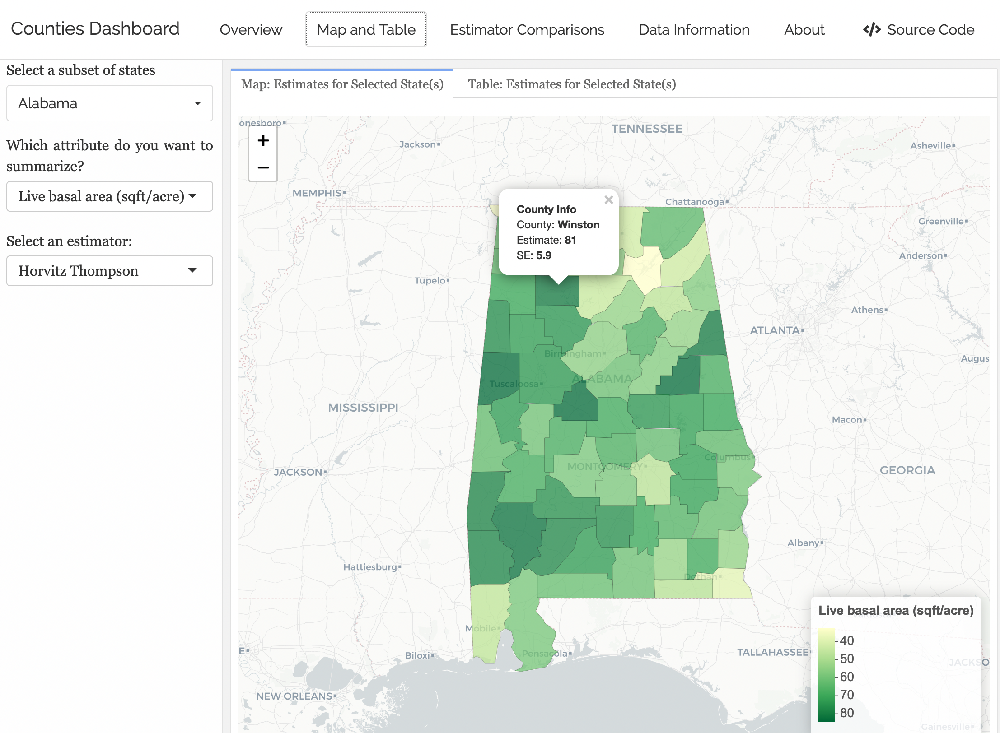

:::

::: {.column width="55%"}

<br> <br> <br> <br>

* Very common now that any FIA work I do also includes a [corresponding dashboard](https://ncasi-shiny-tools.shinyapps.io/Counties/)

:::

::::


------------------------------------------------------------------------

## Goal: Create interactive dashboards with `shiny` for Project 1


{width="50%"}

------------------------------------------------------------------------

### Goal: Learn to create an `R` package with `devtools` for Project 2

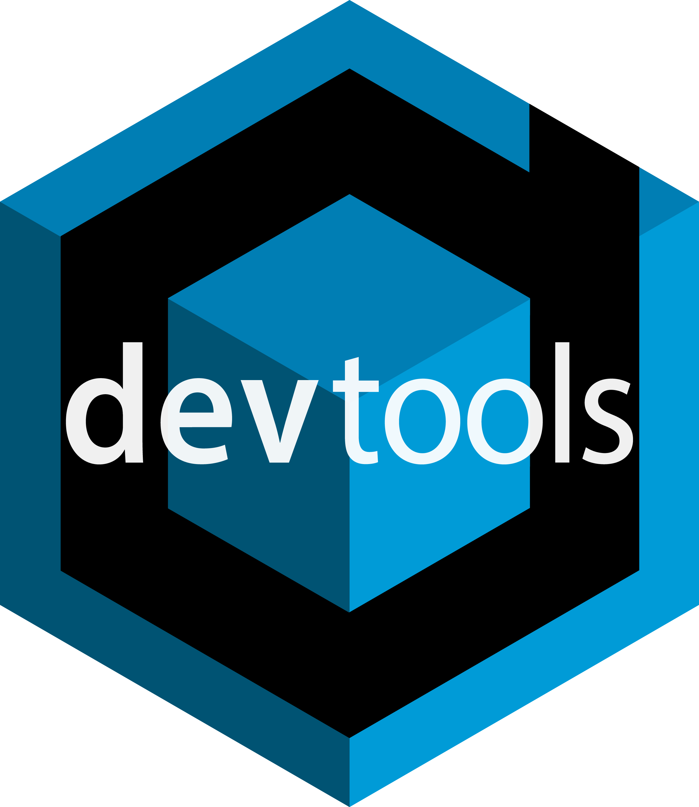{width="15%" style="float:left; padding:10px"}

<br> <br>

::: {.fragment .nonincremental}

I have a few `R` packages on the [Comprehensive R Archival Network](https://cran.r-project.org/):

* `gglm`: Produces diagnostic plots for linear models with the `ggplot2` package as its back-end.
* `forested`: A data package that contains US Forest Service data in Washington state.

:::: {.columns}

::: {.column width="50%" .fragment}

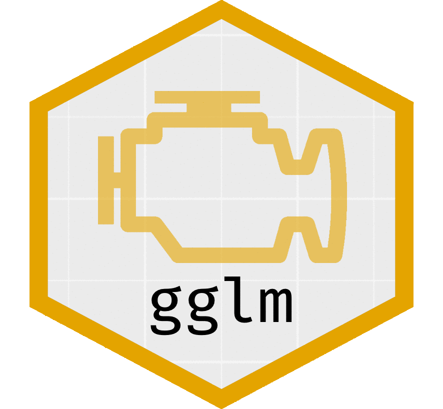{width="30%"}

:::

::: {.column width="50%" .fragment}

{width="30%"}

:::

::::


:::

------------------------------------------------------------------------

## Goal: Develop a collaborative, version controlled workflow using git and GitHub


:::: {.columns}

::: {.column width="50%"}

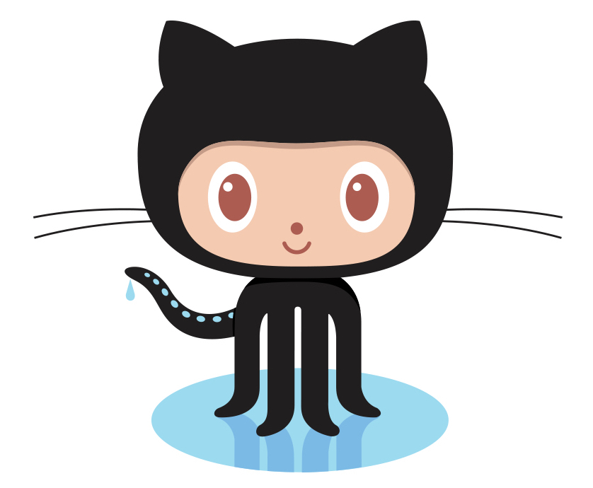{width="30%"}

* I hope you are feeling more comfortable with `git` as we move into the thick of Project 2!

:::

::: {.column width="50%" .fragment}

{width="50%"}

:::

::::

------------------------------------------------------------------------

## Goal: Utilize a reproducible workflow for all `R` work!

:::: {.columns}

::: {.column width="50%"}

::: {.fragment .nonincremental}

* Store `R` work in `R` scripts and `Quarto` documents.

{width="50%"}

:::

:::

::: {.column width="50%"}

::: {.fragment .nonincremental}

* Create reproducible coding examples so it is easy to ask and answer coding questions.

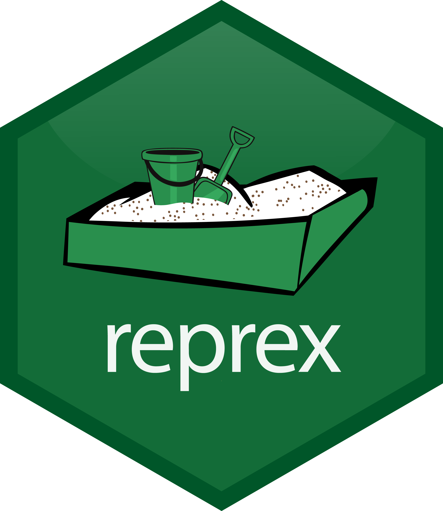{width="50%"}

:::

:::

::::


------------------------------------------------------------------------

## (Today's) Goal: Learn how to create a website with `quarto`


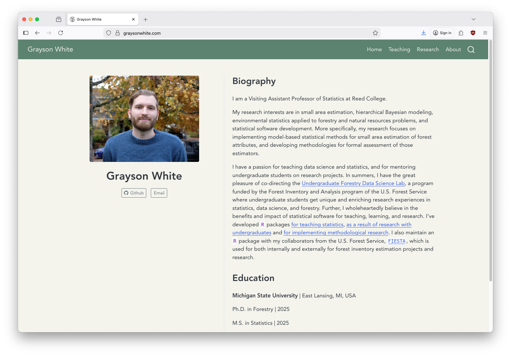{width="60%" fig-align="center"}

------------------------------------------------------------------------


## First: Building your (public-facing GitHub) profile

::: {.fragment}

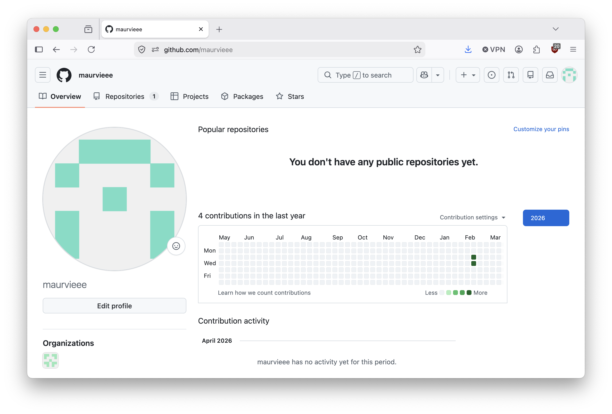{width='75%' fig-align='center'}

:::


------------------------------------------------------------------------

## A `r emo::ji("sparkles")` special `r emo::ji("sparkles")` repo


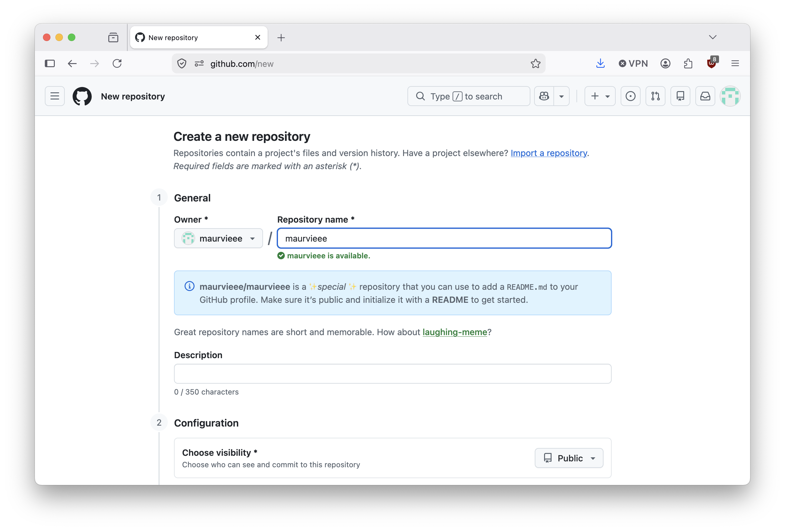{width='75%' fig-align='center'}


------------------------------------------------------------------------

## Create and edit `README.md` 


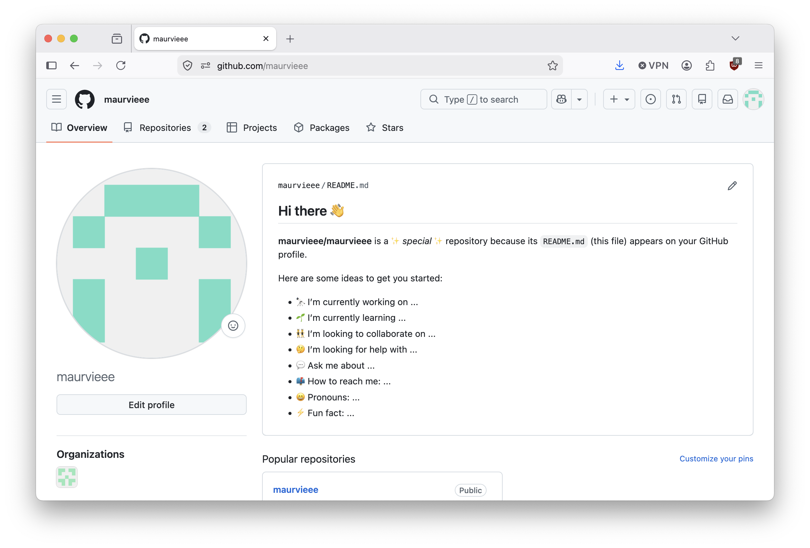{width='75%' fig-align='center'}


------------------------------------------------------------------------

## Profile polishing


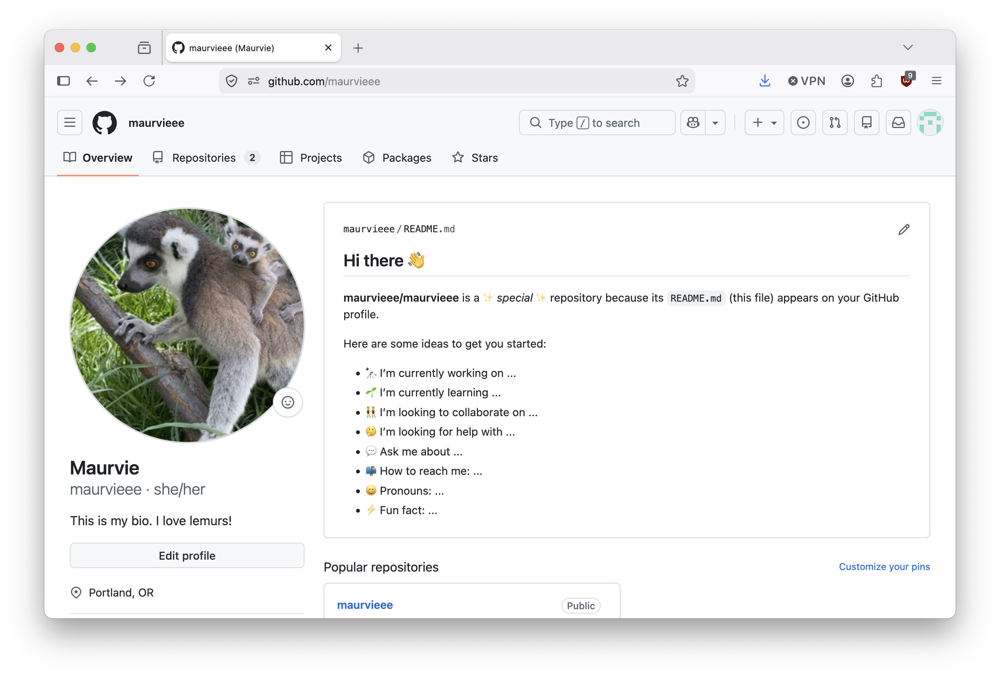{width='75%' fig-align='center'}


------------------------------------------------------------------------


## My profile


{width='75%' fig-align='center'}


# Creating a Quarto website

Inspired by Charlotte Wickham's talk: *From Zero to Website in 20 Minutes*

------------------------------------------------------------------------


## Step 1: Create another `r emo::ji("sparkles")` special `r emo::ji("sparkles")` repo


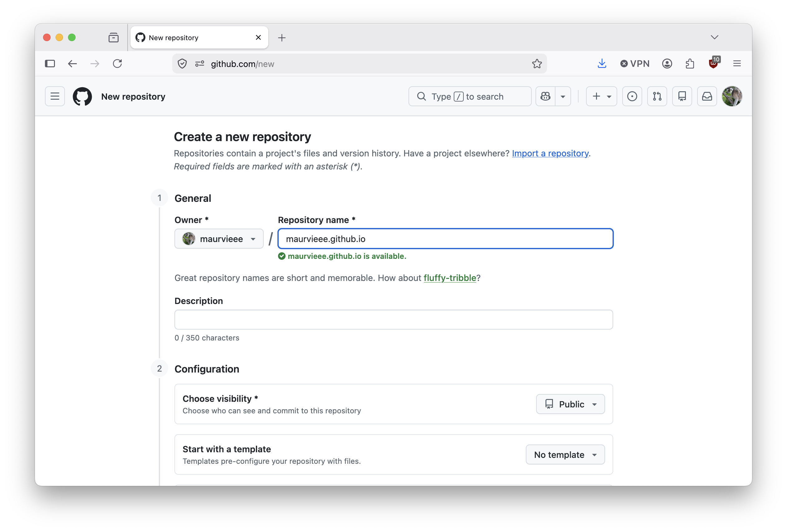{width='75%' fig-align='center'}


------------------------------------------------------------------------

## Step 2: Grab a basic template to get you started

After cloning your repo, run the following in terminal:

<br>

``` 
quarto use template cwickham/minimal-website
```

<br>

Important files created:

- `_quarto.yml`: control important site metadata and (some) formatting
- `index.qmd`: generates your site's landing page


------------------------------------------------------------------------


## Step 3: Make some important changes

In `_quarto.yml`: 

::: {.fragment .nonincremental}

- Specify correct output directory: 

```
project:
  type: website
  output-dir: docs
```

:::


<br>

In `index.qmd`: 

- Add some of your information and then press `Render`!

- Play around with `template:`. Options built in are jolla, trestles, solana, marquee, and broadside


------------------------------------------------------------------------

## Step 4: Admire


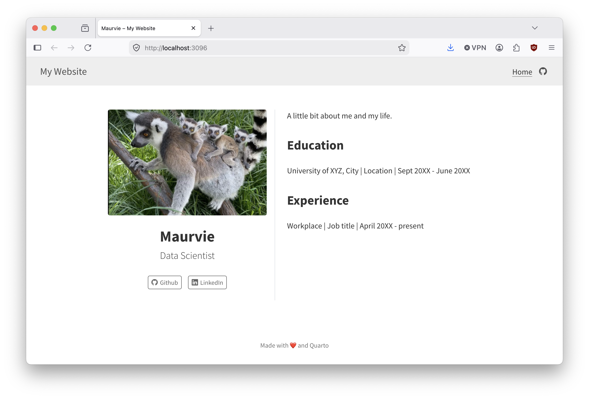{width='75%' fig-align='center'}


------------------------------------------------------------------------

## Step 5: Commit and push!


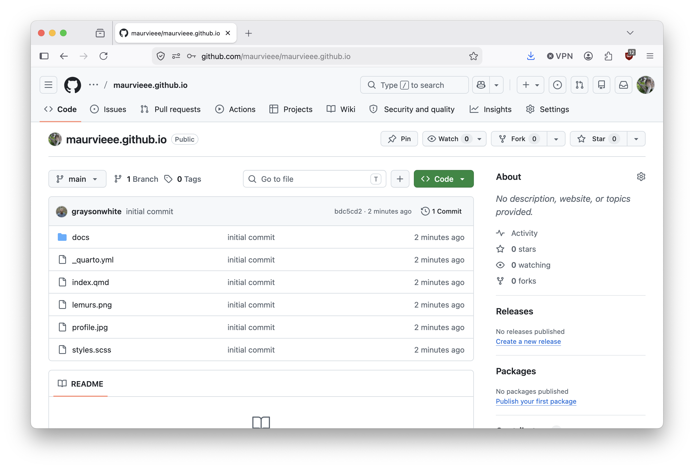{width='75%' fig-align='center'}


------------------------------------------------------------------------

## Step 6: Set up GitHub Pages

- In your repo, go to "Settings" and then, under the "Code and automation" subheader select "Pages"

- Change `Branch: None` to `Branch: main`, and `/ (root)` to `/docs`. Press `Save`.

- Navigate back to the GitHub repo page. You should see the following:

------------------------------------------------------------------------


## Step 6: Set up GitHub Pages


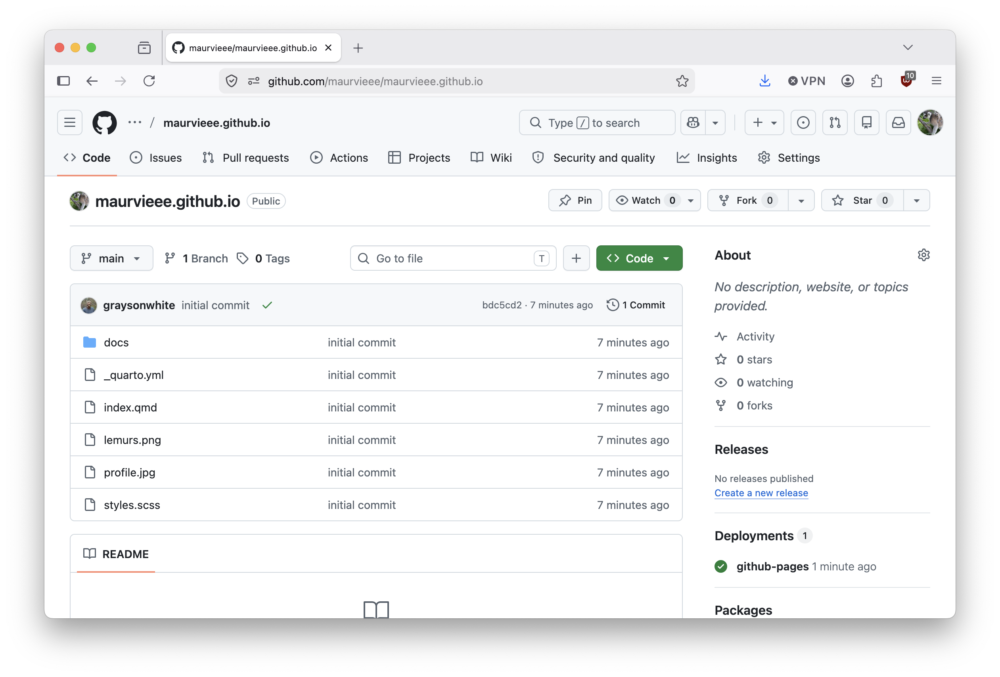{width='75%' fig-align='center'}


------------------------------------------------------------------------


## Step 7: Navigate to your website


- [https://maurvieee.github.io/](https://maurvieee.github.io/)


::: {.fragment}

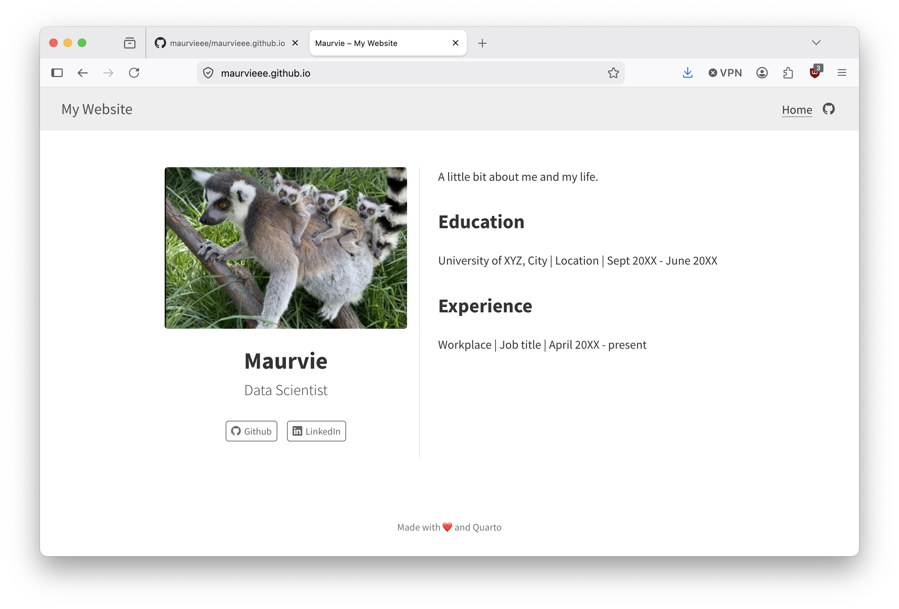{width='75%' fig-align='center'}

:::


------------------------------------------------------------------------


## Success!


:::: {.columns}


::: {.column}


- Your website is now hosted publicly thanks to Quarto and GitHub Pages!

- It's now time to add more pages, all the info you'd like to share, and to customize the aesthetics of your page!

- As long as you press "Render" from `index.qmd` before you push, your website will automatically update through the GitHub Action that was created when we set up GitHub Pages. 


:::

::: {.column}

{width="100%" fig-align='center'}

:::

::::


------------------------------------------------------------------------

## Adding pages 


- Each page of your website will be a `.qmd` file.

- To add a new page, create a new `.qmd` file!

- [My website](https://graysonwhite.com/) has [relatively simple pages](https://graysonwhite.com/teaching.html) throughout


------------------------------------------------------------------------


## Adding pages


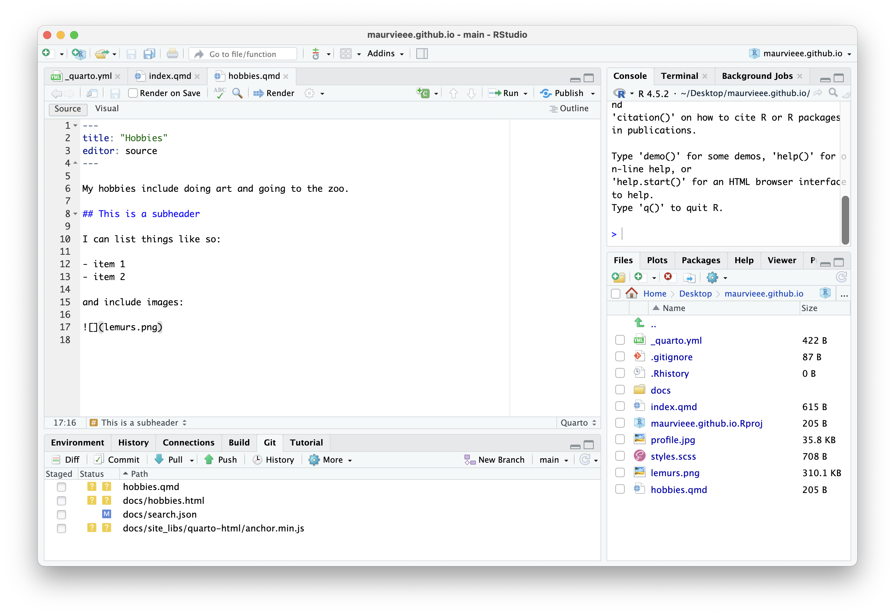{width='75%' fig-align='center'}


------------------------------------------------------------------------

## Adding pages

- You also need to make it easy for your user to find your pages!

- [Add navigation](https://quarto.org/docs/websites/website-navigation.html) in `_quarto.yml` 

::: {.fragment}

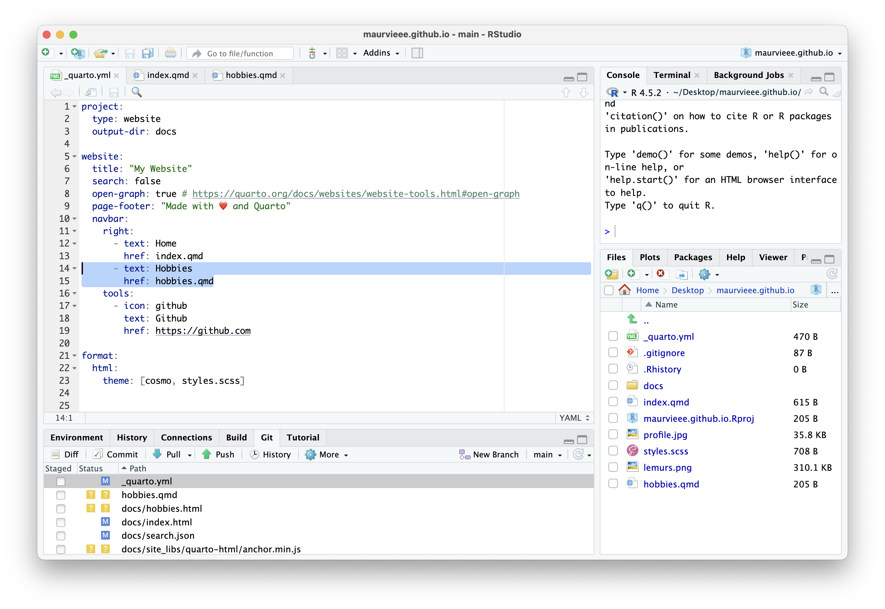{width='60%' fig-align='center'}

:::


# Listings

[https://quarto.org/docs/websites/website-listings.html](https://quarto.org/docs/websites/website-listings.html)


------------------------------------------------------------------------


## Adding "Listings"

- Good for blog posts, publications, software, etc. **Example**: 


::: {.fragment}

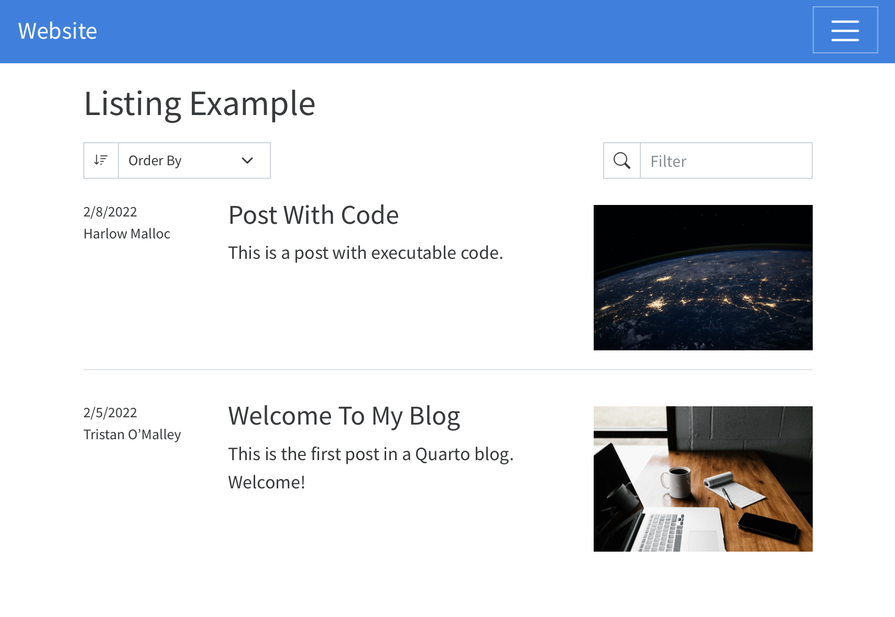{width='65%' fig-align='center'}

:::

------------------------------------------------------------------------


## Listings 

- There are a few ways to set these up, but I prefer to: 
    - Create a **folder** where each "listing" (one `.qmd` file for each listing) will live, and
    - Create a `.qmd` **file** in the **main directory** that points to that folder. 


------------------------------------------------------------------------

## Listings 

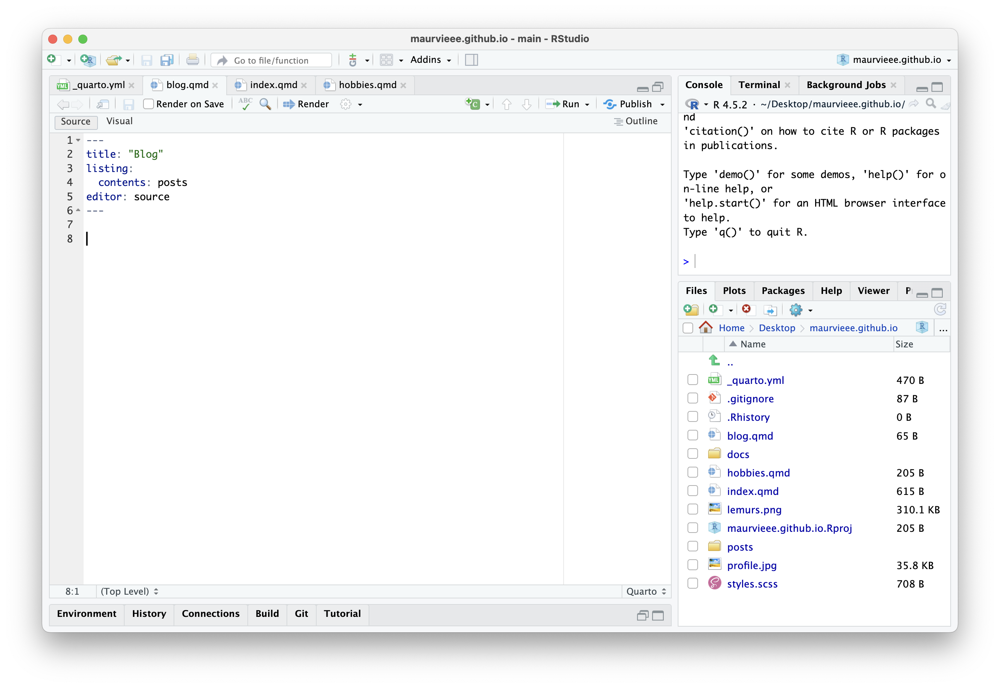{width='75%' fig-align='center'}


------------------------------------------------------------------------

## Listings 

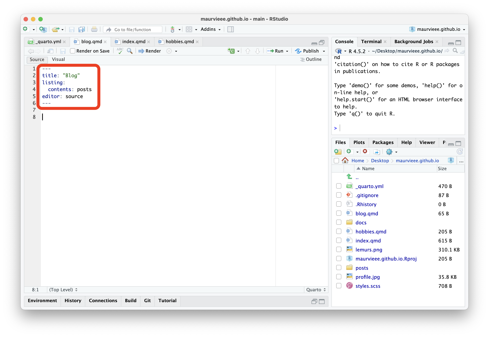{width='75%' fig-align='center'}


------------------------------------------------------------------------

## Listings 

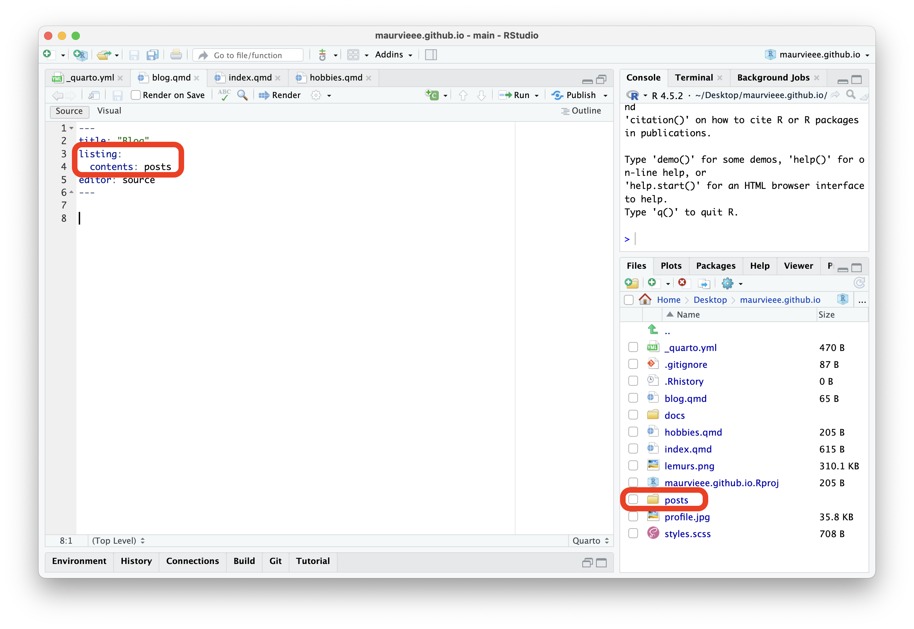{width='75%' fig-align='center'}


------------------------------------------------------------------------

## Listings 

- Now, put some blog posts (`.qmd` files) in the `posts` directory

- Setting the `date` in the YAML of each blog posts orders them. 

- Don't forget to add navigation to the `blog.qmd` page so your users can find your blog.


------------------------------------------------------------------------


## Listings 

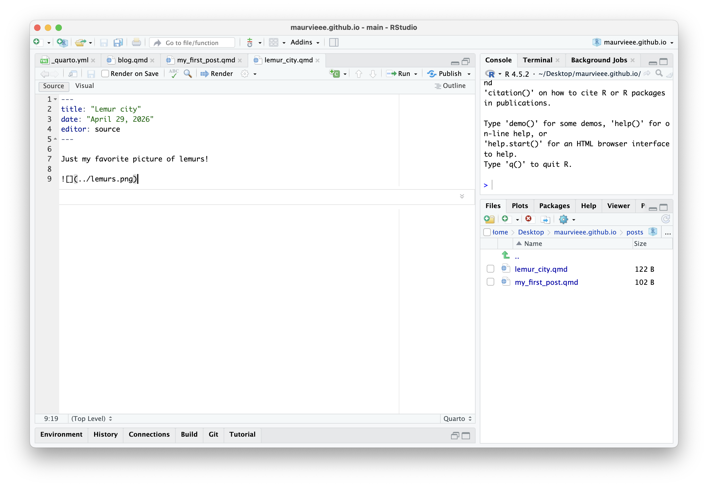{width='50%' fig-align='center'}

- You don't need to update `blog.qmd`, it will automatically populate when you add listings in the `posts` folder.


------------------------------------------------------------------------

## Listings 

Render your site and admire!

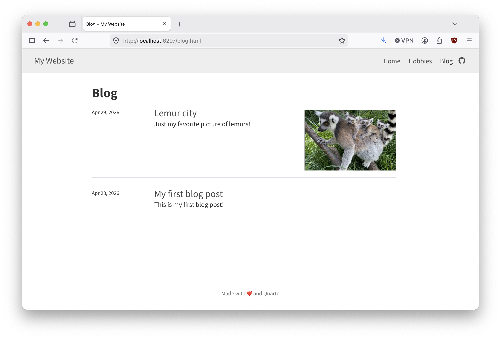{width='65%' fig-align='center'}


------------------------------------------------------------------------

## Listings 

- Lots of customization options [here](https://quarto.org/docs/websites/website-listings.html)
    - Setting `type:` to `default`, `table`, or `grid` changes how your blog posts appear. 
    
- Can also give a custom list of items to go in listings, rather than all the posts in a folder
    - Can set this up with a YAML file. See [Charlotte's slides](https://charlotte.quarto.pub/jsm2024/#/contents-can-be-a-yaml-file)


# Customization

[https://quarto.org/docs/output-formats/html-themes.html](https://quarto.org/docs/output-formats/html-themes.html)

------------------------------------------------------------------------


## Custom themes

::: {.nonincremental}

- There are a [ton of themes](https://quarto.org/docs/output-formats/html-themes.html) to pick from!
    - Set the theme in your `_quarto.yml` file
    - (Default theme: cosmo + your custom `.scss`)
    - Let's swap out cosmo for some other themes!
    
- The following screenshots removed the custom `.scss` to show fully what the theme changes. Our `custom.scss` overwrites some theme elements.
    
:::


------------------------------------------------------------------------

## Custom themes

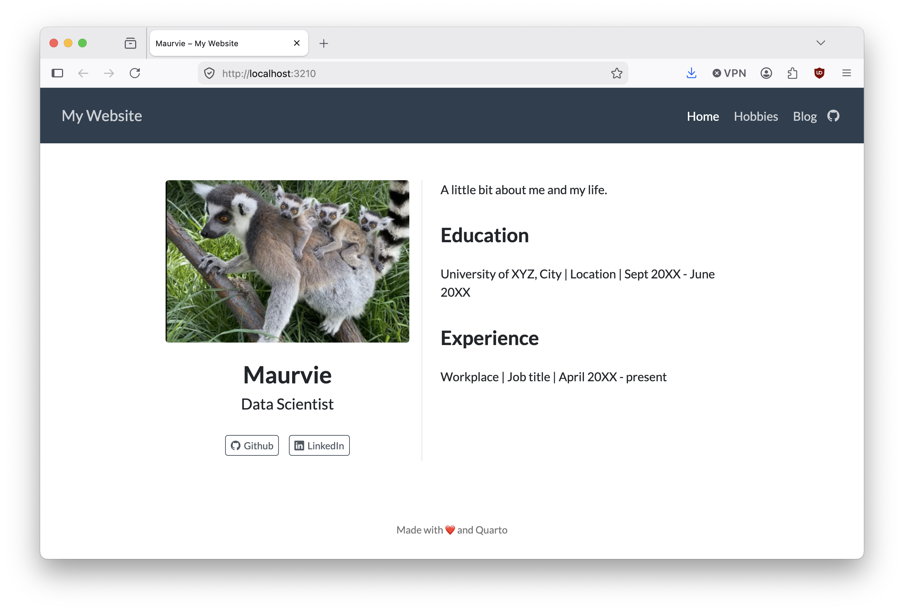{width='65%' fig-align='center'}


------------------------------------------------------------------------


## Custom themes

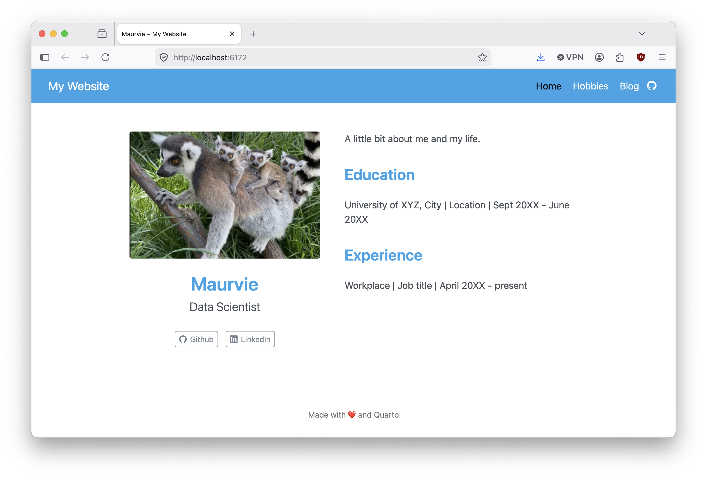{width='65%' fig-align='center'}


------------------------------------------------------------------------

## Total customization with `styles.scss`

- Gives you the ability to overwrite elements of your chosen theme

- Allows you to edit things like **font** and **color**


------------------------------------------------------------------------

## Total customization with `styles.scss`


Charlotte has set some values for us in her template:


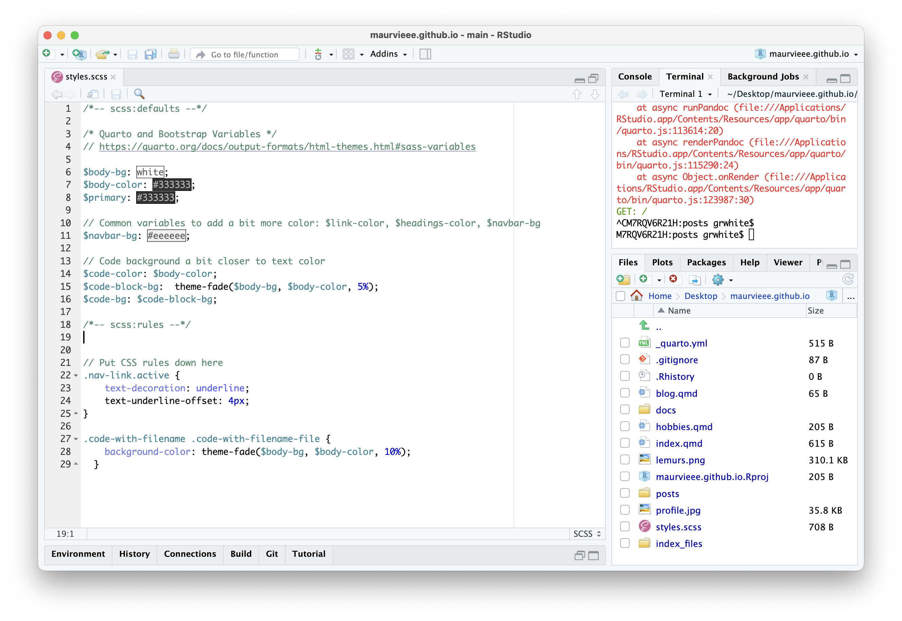{width='75%' fig-align='center'}


------------------------------------------------------------------------


## Total customization with `styles.scss`


Import fonts from Google Fonts (for free!):


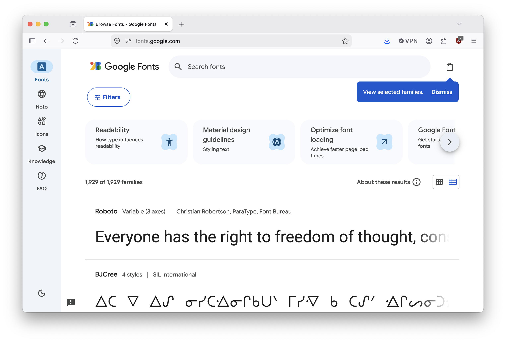{width='75%' fig-align='center'}


------------------------------------------------------------------------


## Total customization with `styles.scss`


When you've found the font you'd like to add, import the font by Clicking "Get Font" and then "Get Embed Code". 

::: {.fragment}

Then, copy the code with `@import`: 


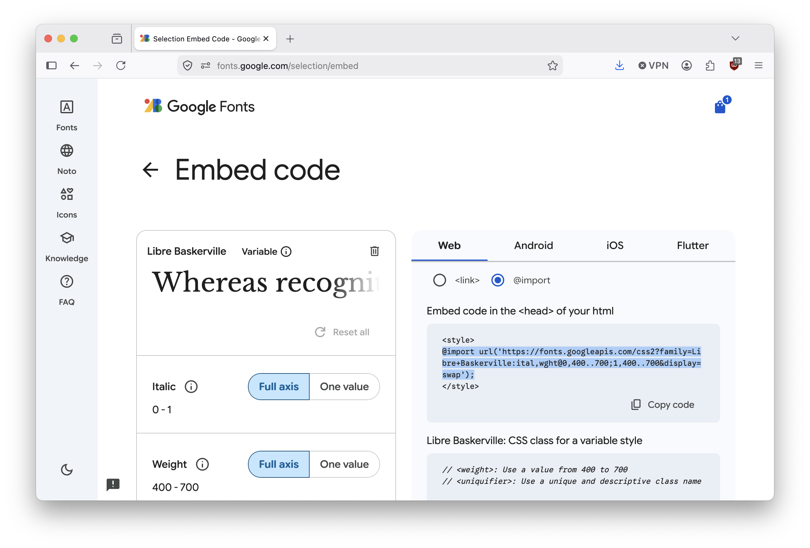{width='50%' fig-align='center'}

:::


------------------------------------------------------------------------


## Total customization with `styles.scss`


Paste

```
@import url('https://fonts.googleapis.com/css2?family=Libre+Baskerville:ital,wght@0,400..700;1,400..700&display=swap');
```

into `styles.scss`. 


------------------------------------------------------------------------


## Total customization with `styles.scss`


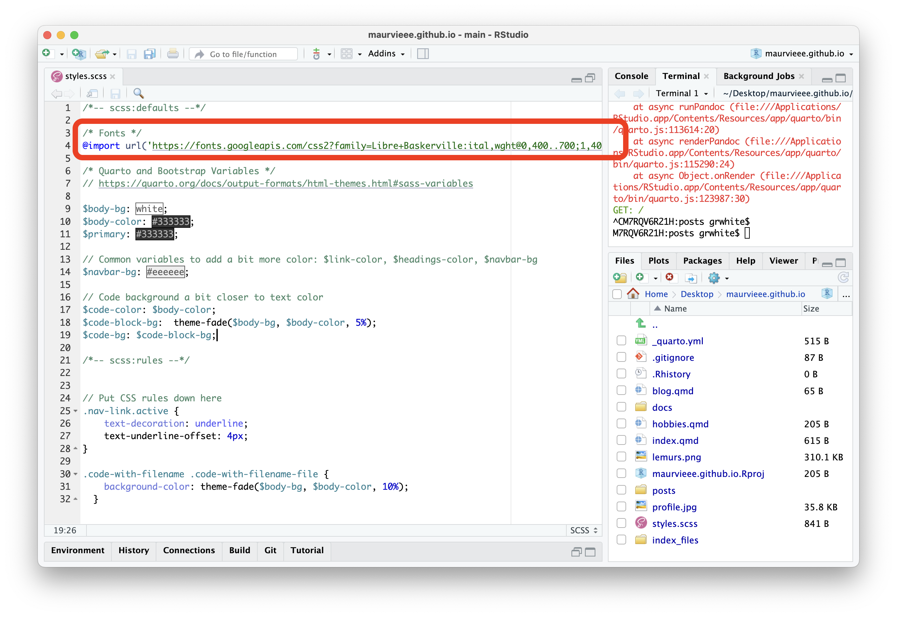{width='75%' fig-align='center'}


------------------------------------------------------------------------


## Total customization with `styles.scss`


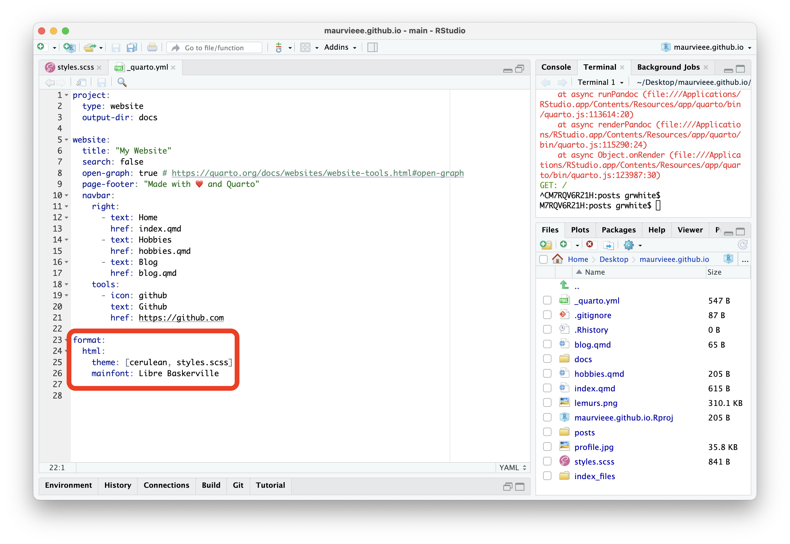{width='75%' fig-align='center'}


------------------------------------------------------------------------


## Total customization with `styles.scss`


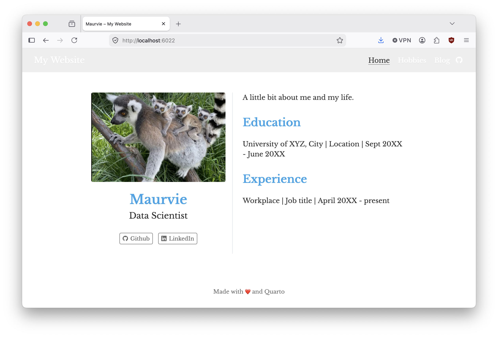{width='75%' fig-align='center'}


------------------------------------------------------------------------


## Total customization with `styles.scss`


Can also change **colors**! Let's play around with that. 

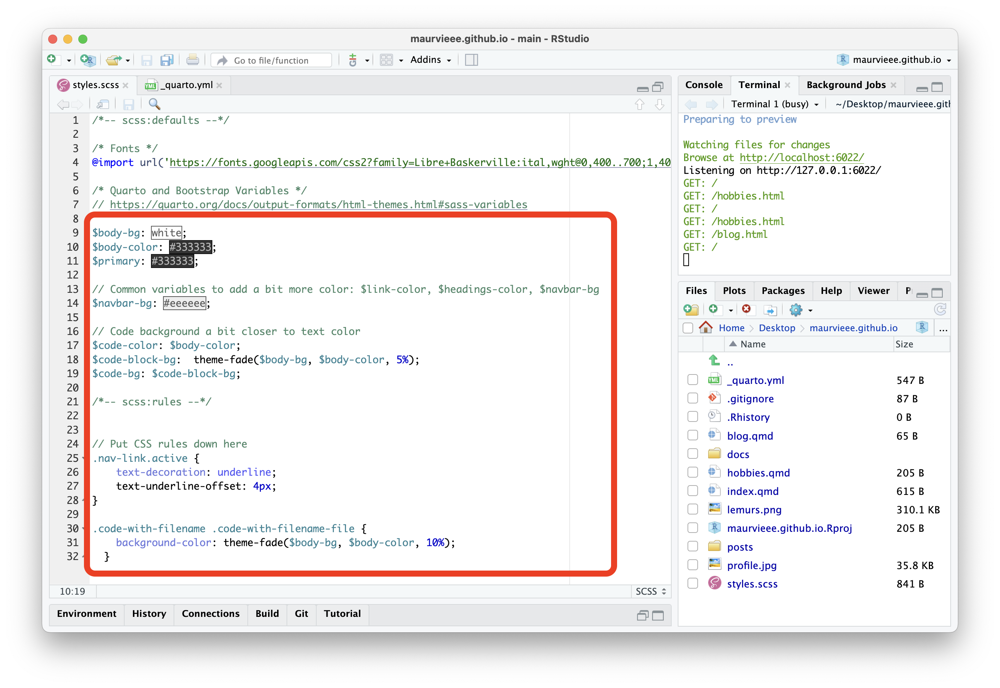{width='75%' fig-align='center'}


------------------------------------------------------------------------


## More customization resources

I am just scratching the surface when it comes to customizing your website. 

Some of my favorite resources for Quarto website customization: 

- [The Quarto.org HTML Themes Documentation](https://quarto.org/docs/output-formats/html-themes.html)

- For a **deep dive** into customization, see [Sam Shanny-Csik](https://samanthacsik.github.io/)'s slides on [Customizing Quarto Websites](https://ucsb-meds.github.io/customizing-quarto-websites/#/title-slide)
    - These are a great next step from where you are now if you want even more customization options!


# Thank you for a **wonderful** semester! 


<br>

You have all brought me **so much joy** this semester. 

I can't wait to see what you come up with for Project 2!

Enjoy your summer!


